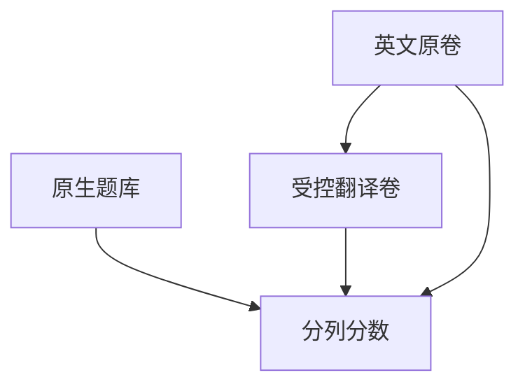

# 多语言基准

英文卷面的高分可以是英语互联网的记忆。换题面语言与知识分布，才能谈跨语言理解，而不是翻译考试。

<footer>—— 对照 Conneau 等 XNLI、Hu 等 XTREME；中文知识分布见 [CMMLU](/llm/mmlu)</footer>

[上一课](/llm/truthfulqa-hallucination)的诚实题以英语迷思为主。缺口是：同一套协议搬到其他语言时，失败模式会分叉——分词碎片、题库污染、文化考点、翻译腔。本课写多语言基准怎么读。后课 harness 默认：脚本能跑翻译题，不等于测到了目标语言能力。

## 问题

两条完全不同的题。一是**平行翻译**：把英文 MMLU / NLI 译过去，测的是跨语迁移与译文质量。二是**原生题**：CMMLU、区域史、地方法规、当地执业考试，测的是该语言世界的知识密度。只报第一类，会把「会不会做英译中之后的原题」写成多语言理解。

XTREME、XNLI 提供可复现的跨语套件，但题型偏分类与抽取，覆盖不了生成式助手。后续 MEGA、MMMLU、INCLUDE 一类把生成与更多语种补进来，仍然要问：选项是原文还是译文、few-shot 例题是哪一种语言。

分词器对低资源语言的字节碎片会系统性压低似然协议分数。这是编码效率，应与「不会这门课」分列，否则 bits/byte 课的教训会在多语言上重演。

## 方法

发布至少三列：英文原卷、官方或受控译文、目标语言原生卷。锁死：脚本语言、是否允许把题译回英文再答（那是翻译管道，不是模型内跨语）、聊天模板是否本地化。聚合时不要把 50 个语种平均成一个数——头部分数会被英语近邻语种抬起，尾部被淹没。

人评必须用该语言标注员。[人工对自动](/llm/human-vs-auto-eval) 已写明：英文 Arena 不能代理中文产品。

## 机制

跨语失败可以来自：子词切碎导致上下文预算被吃光；对齐阶段把非英文当越狱；预训练配比里该语言的专业文本接近零；译文把英文句法原样搬来，模型靠英文推理再映射。只有原生卷才能把第四种与前三种分开。污染在非英文题库站上往往更密，去污要含译本索引，见[污染检测](/llm/eval-contamination)。

## 边界

本课不列「应覆盖的全部语种」。产品声明覆盖哪些语言，基准就应有对应原生样本；其余语种保持「未测」而不是用英语分冒充。下一课把这些协议收进可复现的评测框架。

## 小结

- 译文卷测迁移，原生卷测该语言世界的知识；必须分列。
- 禁止用单标量平均淹没尾部语种。
- 分词碎片、拒答对齐、污染是三类不同的跌分。
- 出处：Conneau 等 XNLI；Hu 等 XTREME；CMMLU；后续多语生成套件按官方脚本。
