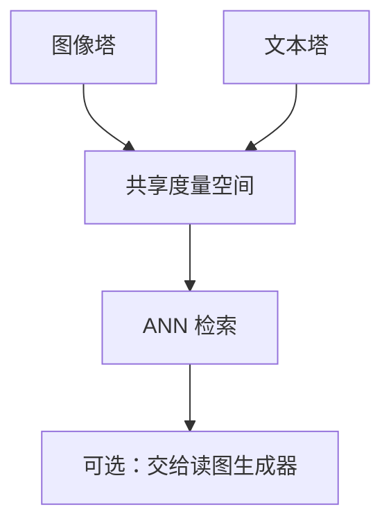

# 多模态嵌入

图与文进同一余弦空间，零样本就能用句子当分类器。那是双塔检索空间，不是对话 VLM 的早融合。

<footer>—— Radford 等 CLIP；后续 ImageBind / SigLIP 把模态接口拓宽</footer>

[上一课](/llm/long-doc-embedding)把文本长度钉住。检索还要图、有时要音。主干 [CLIP](/llm/clip) 已写图文对比；[早融合](/llm/early-late-fusion) 已警告不要把双塔叫成 LLaVA。本课在补层收成「多模态嵌入」：可预计算、可 ANN 的跨模态向量。单元到此结束。下一单元 RAG 工程默认：检索器可以是文本、图文或混合，阅读器仍是生成器。

## 问题

CLIP 双塔：图 $z_i$ 与文 $w_j$ 只在 InfoNCE 见面，推理时任一侧可先算后存。ImageBind 一类把更多模态绑到同一锚空间。SigLIP 把 softmax 对比换成 sigmoid，利于超大批。这些都是**晚融合度量空间**，服务检索与开放词汇分类。它们不绑定「图中第三列」——那要 VLM 早融合，本课程后一课才回到生成式多模态。

失败模式：标题偏物体名词，空间关系与细字弱；图文对噪声造成假正例。与文本难负例课同构，应用难负图文对。

把 CLIP 向量送进 LLM 当单 token，是连接器选择，不是嵌入检索。检索用的是余弦邻居，对话用的是序列绑定。

## 方法

索引：对图库算 $z_i$ 存 ANN；查询可以是文本 $w$ 或另一张图。多模态 RAG：检索到的是图或图文块，再交给能读图的生成器，而不是把 $z_i$ 当文字拼进提示。评测：图文召回、零样本分类、与文本 MTEB 分列。不要用 ImageNet 准确率签发检索质量。

## 机制

对比损失只约束全局向量近邻，不约束 patch 与词对齐。因此多模态嵌入擅长「找与这句话相近的图」，不擅长「这句话里的词对准哪个框」。定位是后一课程 grounding 的事。温度与批大小同 InfoNCE 课；跨模态假负例（同一物体不同角度被当负）同样会撕开流形。

## 边界

音频/视频嵌入还要时序池化，不能把整段波形平均成 CLIP 式全局向量就声称可检索。下一课查询改写：无论模态，用户的问题往往不是好查询。

## 小结

- 多模态嵌入是可缓存的跨模态余弦空间，来自双塔对比。
- 与 VLM 早融合分工：检索对绑定。
- 评测用图文召回，不用分类榜代理一切。
- 出处：CLIP；SigLIP；ImageBind 式多模态锚空间。
