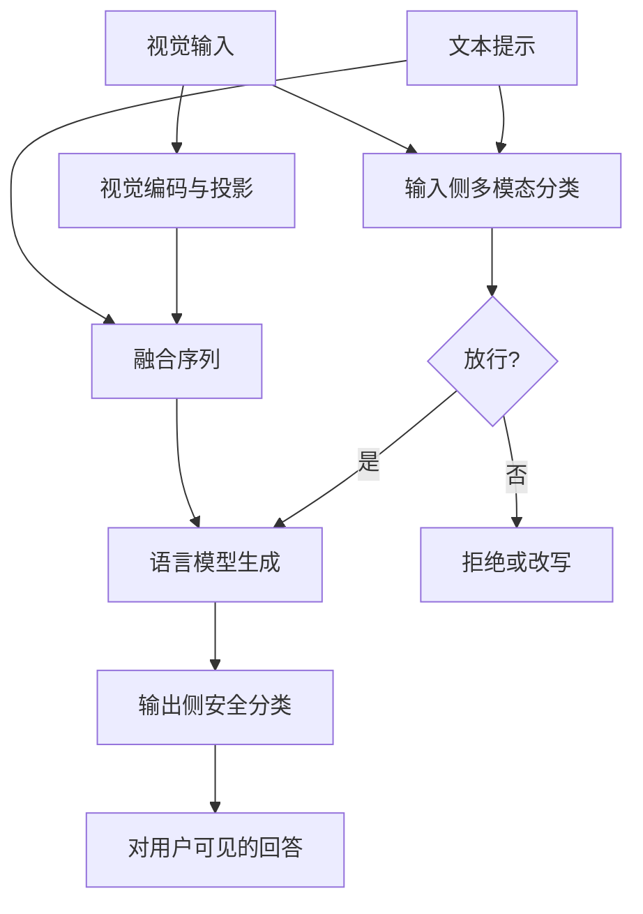

# 多模态越狱

视觉通道一旦进入同一条自回归序列，只对文本角色做对齐的护栏就会漏看图里的指令；评测应覆盖跨模态转移，而不是只扫纯文本红队集。

<footer>—— 对照视觉指令模型把图块投影进语言模型词空间的公开架构，以及后续多模态红队与护栏工作对「图文不一致」的讨论</footer>

多模态大模型把图像、有时还有音频，编成与文本共用的 token 流，再交给同一个语言模型头去生成。对齐与拒答大多是在文本指令上做的：[SFT 安全混合](/llm/sft-safety-mix)、[RLHF](/llm/rlhf-pipeline)、[DPO](/llm/dpo) 见到的是「用户说了什么」，很少见到「用户给了一张图、图里写了什么、图与字是否互相拆台」。多模态越狱（multimodal jailbreak）指的是：利用视觉（或其它非文本）通道，使模型在文本侧看起来像无害问答，却在融合后的表示里走向本应拒绝的行为。本篇只写通道错位的机制、以及防御与评测该怎么设对照；不给出可复现的图文配方、贴图话术或扰动构造步骤。

## 问题

纯文本护栏默认用户意图写在 `user` 角色的字符串里。视觉语言模型（VLM）的用户消息却是「一段字 + 一组图块」。图块经视觉编码器与[投影器](/llm/llava-projector)进入语言模型，位置上往往紧挨着一句看起来无害的提问。若安全分类器只吃文本、或只吃「这张图的简短说明」，它看到的是 innocuous 的提问，看不到图里的排版字、示意图、或对抗扰动所改变的视觉表示。对齐过的语言模型对「直接用文字提出的危害请求」会拒绝，对「请描述 / 请按图中步骤说明」这类元指令则更愿意配合——因为后者在文本 SFT 里大量出现，属于有用行为。

跨模态还带来分布外。文本越狱的梯度与后缀优化假定离散词表；图像是连续像素，扰动可以很小却稳定地改变编码器输出。反过来，把危害字印在图上，走的是 OCR 式读取，而不是文本 tokenizer 的子词切分，[Llama Guard](/llm/llama-guard) 一类文本分类器若未先看图，等于没看见那句话。交错训练（见[多模态交错](/llm/interleaved-multimodal)）让图和字在上下文里轮流出现，也让「哪一段才是真正的指令」变得可操纵。

### 文本护栏看不见的那一段条件

设融合后的条件是 $p_\theta(y \mid x_{\mathrm{text}}, v)$，其中 $v$ 是视觉 token。拒答策略若近似为「当 $x_{\mathrm{text}}$ 落在危害集合时降低配合续写的概率」，则 $v$ 可以在 $x_{\mathrm{text}}$ 保持无害的同时，把隐状态推到文本对齐从未正则过的区域。这不是模型「忘了政策」，而是政策从来没有以 $v$ 为条件写进损失。评测若只换文本红队提示、配一张无关的猫图，会严重低估真实风险。

「看图说话」在有用性数据里是高频技能：模型被训练成要读出图中文字、箭头与步骤。把安全完全寄托在文本侧拒答，等于要求模型在同一技能上按通道切换人格。通道切换没有单独的监督时，技能会赢。

## 方法

讨论方法时分成三类观测，而不是一份攻击菜谱。第一类是**语义落在像素里**：图中含有模型能读的文字或符号，文本侧只给中性任务（描述、转写、按图执行）。防御侧对应的是：必须让图的内容进入与文本同一套安全分类，而不是相信用户字幕。第二类是**连续扰动**：在编码器可微的前提下改像素，使视觉表示靠近某类有害文本所诱导的隐状态。防御侧对应的是预处理（压缩、缩放、重编码）、随机化、以及在表示空间而不是像素空间做检测。第三类是**模态拆台**：文本声称无害、图像另有所指，或多图之间互相引用。防御侧对应的是跨模态一致性检查：图说与字说是否指向同一任务。

评测协议应固定模型、解码、图像分辨率与预处理，再报告：无图纯文本基线、有图但图与字一致的有害请求、图文不一致、以及经过标准有损变换后的稳健性。指标不要只用「是否拒绝」二值：过拒绝（把无害医疗图、化学实验教学图拒掉）必须单独成列，否则任何「全拒」系统都会在越狱表上看起来很强。

### 先对齐再分类，还是先看图再对齐

工程上常见两条流水线。一条是生成后再用文本安全分类器扫输出，见 [Llama Guard](/llm/llama-guard) 与 [WildGuard](/llm/wildguard-harmbench)；VLM 的漏洞在于**有害内容可能已在生成中展开**，分类器只能事后截断。另一条是在解码前对 $(x_{\mathrm{text}}, v)$ 做输入分类：需要视觉理解能力，成本接近一次短生成。实践中常两者都要：输入分类挡明显的图内指令，输出分类挡「看起来在描述、实际在给步骤」的续写。Constitutional 式分类器把规则写成自然语言再合成数据，见[宪法分类器](/llm/constitutional-classifiers)，对多模态要把「图像中的文字视为用户指令」写进条款，否则合成数据仍是纯文本。

## 机制

机制的核心是条件错位与表示可加性。视觉 token 与文本 token 在残差流里相加或拼接，后续层并不区分来源。若某一层的线性方向同时被「危害文本」和「某种视觉模式」激活，那么只惩罚文本侧的对齐更新，不会自动正交掉视觉侧的同类方向。这与[表示工程](/llm/repeng-refusal)看到的现象是同一几何：概念往往有可读取的方向；多模态只是给了第二条写入该方向的路径。

OCR 通路尤其直白。视觉编码器与后续语言模型对印刷体、屏幕截图、幻灯片有很强的转写能力，因为预训练与指令数据都奖励「把图里的字读对」。图内文字不经过用户侧的敏感词过滤器，也不经过 chat template 里对 `user` 字符串的正则。排版、分栏、低对比，只影响识别质量，不改变「这是指令」这一事实。对抗扰动则走另一条路：人眼未必能读出指令，编码器输出却能系统性偏移；它更接近连续优化，而不是社会工程。

把截图当用户消息，等于把任意网页与任意聊天记录变成了视觉前缀。服务端若只对上传文件做病毒扫描、不做语义安全分类，护栏的覆盖与纯文本 API 不对称。

### 防御评测要拆开的三件事

稳健性、过拒绝、转移。稳健性：同一语义在纯文本、图内文字、图文拆台、轻度有损变换下，拒绝率是否掉下来。过拒绝：医学示意图、新闻战争摄影、安全研究论文截图、化学分子式教学图，是否被当成危害。转移：在模型 A 的视觉编码器上有效的扰动或排版，换到模型 B、换分辨率、换[交错](/llm/interleaved-multimodal)模板后是否仍有效。只报「某红队集攻击成功率」而不报这三列，无法区分「护栏真的看见图」还是「护栏变得更爱拒绝」。

## 边界与工程取舍

没有单一预处理能同时挡住排版字与不可见扰动：强压缩会伤 OCR 与细粒度理解，弱压缩对连续扰动几乎无操作。随机化（多次缩放再投票）能提高检测召回，但延迟与费用随次数线性涨，且对已经印在图上的高对比文字帮助有限。完全依赖输出分类器，则危害步骤可能已经生成了一半才被截断，日志与流式接口仍会泄漏前缀。

开源 VLM 的安全训练数据公开程度远低于文本对话；把纯文本 Llama Guard 直接套在「先用模型自己给图做一句话描述，再分类」上，描述模型若已被同一张图带偏，分类器吃到的是洗过的摘要。更稳的做法是独立视觉编码器 + 独立分类器，接受它与生成模型的视觉前端不一致，并在评测里显式报告这种不一致带来的漏检。音频、视频只是把 $v$ 变得更长，机制同类：时序里也可以藏指令。本篇不展开其它模态的构造，只强调**凡是能写入残差流的通道，都要进入同一套安全分类与过拒绝评测**。

产品上「支持贴图」是功能，不是安全边界。边界是：图中文字、示意图与扰动，是否被当成与 `user` 字符串同等的指令来源。没写进政策的通道，等于没对齐。

## 小结

- 多模态越狱的要点是条件错位：文本侧无害、视觉侧写入指令或有害方向，只对字符串对齐的护栏会漏看。
- 图内文字走 OCR 技能，连续扰动走编码器表示；两类不是同一防御。
- 输入分类与输出分类都要，且分类器必须真正看到图像，而不是只看用户字幕。
- 评测应同时报稳健性、过拒绝与跨模型/跨预处理转移，避免「全拒」虚高。
- 表示空间上，视觉与文本可写入同一线性方向，这与拒绝的表示干预是对偶现象。
- 预处理有损变换是辅助，不是策略；流式输出在分类器截断前仍可能泄漏。
- 出处：视觉指令架构以 Liu 等 LLaVA 与后续 VLM 为公开参照；跨模态红队与护栏评测见各家多模态安全报告，具体数字以原文表格为准。
