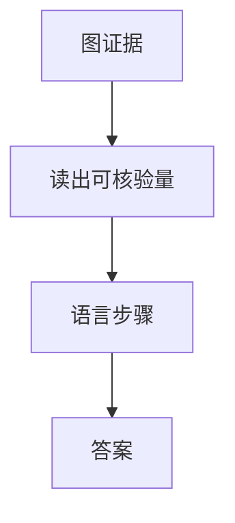

# 多模态推理

看见不等于推完。中间步骤若只在语言里走，视觉证据会在第一步之后被丢掉。

<footer>—— Zhang 等 Multimodal Chain-of-Thought；评测见 Lu 等 MathVista、Yue 等 MMMU</footer>

[上一课](/llm/long-video-understanding)把时间上的「看见」补齐。本课缺口是推理：用图（或帧）当证据做多步，而不是一句话描述完就猜答案。本单元理解侧到此收束；下一课 [DDPM](/llm/ddpm) 改问像素如何生成。

## 问题

文本 CoT 把计算写在 token 里。多模态题（几何图、试卷、图表计算、需要对照两处细节）若 CoT 不回看图，模型会在语言空间里编一条像样的证明。[CLIP](/llm/clip) 空间与指令数据都奖励流畅，不奖励中间步骤与像素一致。

Multimodal-CoT 把推理拆成：先基于图生成理性，再出答案，并允许两阶段都看见视觉特征。MathVista / MMMU 把题型铺开：有的是读数，有的是学科知识加图，有的是必须量角或数格子——混报一个准确率会让「会背题」与「会看图」分不开。

工具可以外挂：OCR、码解释器、检测框。那是代理，不是本课的内生多模态 CoT。本课钉的是：中间语言步骤有没有被视觉前缀约束。

## 方法

训练：含逐步视觉题解，而不是只有最终答案；鼓励「先读轴 / 先定位再算」。推断：让模型在 CoT 中显式引用区域或重述从图读到的量，再计算。视觉通路仍是 [ViT](/llm/vit-as-encoder) 与 [LLaVA 投影器](/llm/llava-projector) 那条连续前缀。评测分列感知题与知识题，并抽查 CoT 是否引用了图中不存在的条件。

## 机制

每一步解码仍只看已写 token 与视觉键值。若 CoT 把「设半径为 5」写成文本后不再查询 patch，后续算术与图脱钩——这是忠实性幻觉在视觉上的版本。强制中间量来自读图（或定位框），等于给推理链加视觉检查点。

## 边界

推理链不能补分辨率：刻度糊了，CoT 再长也读不出。理解单元到此：连续视觉 token、指令、幻觉、定位、GUI、图表、视频、推理。下一单元从噪声生成图。

## 小结

- 多模态推理要求中间步骤回看图，而不是纯语言 CoT。
- 基准要拆感知与知识，避免背题冒充看图。
- 视觉检查点比更长的空话链有用。
- 出处：Multimodal-CoT；MathVista；MMMU。
