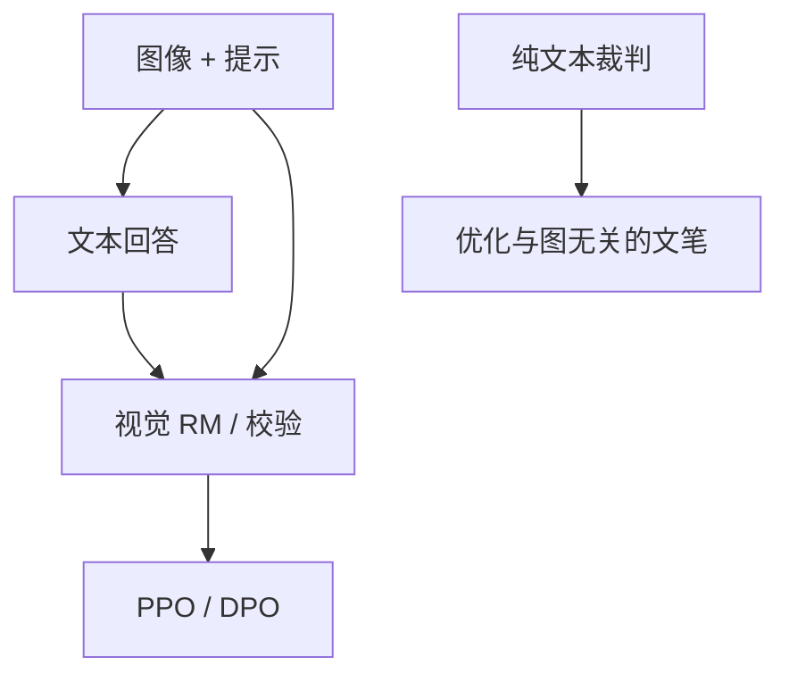

# 多模态 RLHF

比较现在发生在图文对上：奖励模型必须看见图像，否则策略会优化说明文字去骗一个盲的裁判。

<footer>—— 对照 InstructGPT 的文本 RLHF；LLaVA / InstructBLIP 的视觉指令；GPT-4V 一类产品的图文偏好</footer>

[上一课](/llm/honesty-calibration-training)的事实轴在纯文本上已难。配上图像，幻觉变成「描述了图里没有的物体」。缺口是：**[RLHF](/llm/rlhf-pipeline) 的 RM、PPO、DPO 都要改输入为 $(x_{\text{img}},x_{\text{txt}},y)$，比较协议也要防盲裁判。** 本课写多模态偏好，不重写视觉编码器。

## 问题

文本 RM 看不到图，会按说明文的流畅与长度打分。策略学会写华丽但与图无关的 $y$。必须：奖励器吃图像；或可验证轴（VQA 对错、定位框、OCR 核对）。人类比较要同时展示图与两条回答，标注员疲劳比文本高，偏差更大。

视觉指令微调（LLaVA 等）多数停在 SFT。RLHF 层更少公开细节。原则与文本相同：比较→可选 RM→在线优化；差别是模态对齐与代价。

### 盲裁判是静默故障

用纯文本 LLM 当 [LLM 裁判](/llm/llm-judge-reward) 评图文回答，等于上一课的盲 RM。必须用视觉裁判或把图转成不受策略控制的描述（仍有信息损失）。评测 MMMU 等有金标的题应走对错，不要走盲 Arena。

安全：图像可把有害请求藏进像素。拒绝训练要含图，纯文本安全 RM 不够。

## 方法

数据：同一图下两条回答排序；或 VQA 可验证 $R$。RM：视觉编码器 + 语言模型 + 标量头，初始化自视觉 SFT。PPO：动作仍是文本 token，状态含图前缀，KL 拴视觉 SFT。DPO：对上同样带图前向。多目标：描述忠实（可与图核对的轴）硬门，文笔加权。

诚实：对「图中是否有 X」用可核对标签；不知则说看不清。校准图与文本分轴报。

## 机制

梯度通过语言头回流；视觉编码器通常冻或小学习率，否则 RL 破坏感知。过优化表现为：过长 OCR 式罗列、或讨好盲评测的模板句。金标必须是看图的人或题。视频与多图是同一逻辑，序列更长，截断与过长过滤同样适用。

工具调用看图 API 时，RL 的 $R$ 应含工具返回是否被忠实转述，否则又编像素。

## 边界与工程取舍

无视觉 RM 预算时，只做视觉 SFT + 文本 RL，图文忠实会退步，应在评测里坦白。分辨率、裁剪、与训练时视觉预处理必须锁定，否则 RM 看见的图与策略看见的图不是同一张。下一课代码 SWE 环境是另一模态：状态是仓库与终端，不是像素，但「奖励必须看见环境」同一原则。

视觉预处理与 RM 入图分辨率要锁定。纯文本裁判评图文回答等于盲 RM，策略会写与像素无关的文笔。

## 小结

- 多模态 RLHF 的奖励器必须看见图像，否则策略骗盲裁判。
- 有金标的 VQA / OCR 走可验证；开放描述才走视觉比较。
- 视觉编码器多冻；过优化是罗列与模板句。
- 图像安全与拒绝要含像素输入。
- 出处：Ouyang 文本 RLHF 骨架；Liu 等 LLaVA；Dai 等 InstructBLIP；视觉评测基准作金标。
