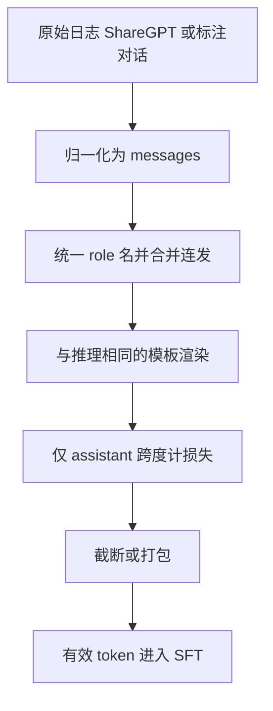

# 多轮对话数据格式

多轮不是把若干单轮拼在同一条字符串里；它规定了谁在说话、损失算在哪一段、截断时丢掉的是历史还是当前回答。

<footer>—— 对照 InstructGPT 的对话示范、ShareGPT 社区日志与后来 messages 式角色列表；渲染契约见 chat template，本篇只谈数据对象</footer>

单轮指令可以写成「题面—答卷」两个字段。多轮一旦出现，样本就变成一条有序的角色序列：系统约束、用户、助手、工具结果，可能再来一轮用户。Ouyang 等人的 InstructGPT 已经在示范数据里使用多轮对话，而不是只收集孤立问答；社区侧，ShareGPT 把用户从 ChatGPT 界面导出的整段会话存成交替发言，Vicuna 一类模型直接在这批日志上做监督。格式看起来是簿记问题，实际上决定三件训练时改不回去的事：条件前缀是什么、哪些 token 进损失、上下文满了先砍谁。词表上的分隔符怎么渲染，是 [chat template](/llm/chat-template) 的契约；本篇停在那一层之下的数据对象——字段、轮次、掩码与截断。

## 问题

预训练语料没有说话人。SFT 必须把「上一句是用户还是自己」写成可学习的事件，否则模型会在第二轮把用户问题续写成助手口吻，或把助手的上轮回答当成新的题面再答一遍。单轮格式（`instruction` / `input` / `output`）把历史压进一个字符串，历史内部的角色边界常常只靠冒号或 Markdown 标题，分词后既不是特殊 token，也不稳定。多轮一长，这种「伪多轮」会把角色泄漏进正文，损失又往往只打在最后一段，等于告诉模型：中间各轮只是背景小说，不必学会接话。

第二个问题是监督信号的位置。完整对话渲染后是一条长 token 序列，若对整句做因果语言建模，模型会学习预测用户会问什么，这既不是产品目标，也会记住标注员或真实用户的提问风格。正确的对象是条件分布 $p(y_{\mathrm{asst}}^{(t)}\mid \text{此前所有已渲染轮})$。实现上这要求每条样本带逐 token 的损失掩码，而掩码只能从结构化轮次来，不能从「最后一行是回答」这种启发式可靠地反推。

### 轮次是监督的原子，不是展示用的换行

一条多轮样本应看成 $[(r_i, c_i)]_{i=1}^{T}$，其中 $r_i$ 取有限角色集，$c_i$ 是该轮文本。角色集至少要能区分 `user` 与 `assistant`；产品对话再加 `system`，工具场景再加 `tool`。轮次一旦拆开，就可以规定：只对 $r_i=\mathrm{assistant}$ 的 token 计损失；`system` 永远是条件、永不进损失；中间的用户轮是条件、也不进损失。ShareGPT 早期字段用 `from`/`value`（`human` / `gpt`），OpenAI 风格用 `role`/`content`。二者信息等价，但混用而不做归一化，会在同一训练集里出现两套角色名，渲染成不同前缀，等于把一种任务标成两种。

「看起来像多轮」不够。把三轮对话扁平化成一段 Markdown，再只对最后一个助手段落计损失，模型学到的是单轮答题，中间轮次从未作为「自己说过的话」被强化。评测若用多轮，分数会掉，根因常是数据对象根本不是多轮。

## 方法

存储层应坚持消息列表，而不是自由文本。一份最小可用的记录是：`id`、`messages`（有序列表）、可选的 `source` 与 `language`。每条 message 含 `role` 与 `content`。从 ShareGPT 转入时，把 `human` 映射为 `user`、`gpt` 映射为 `assistant`，丢掉空轮、合并相邻的同一角色（导出日志里常见用户连发两条）。系统提示若存在，放在第零轮 `system`，不要复制进每一轮用户前缀——复制会在打包时浪费上下文，也会让「系统约束出现的位置」随截断而消失。

训练时的处理顺序应当固定：先按与推理相同的模板把 `messages` 渲染成 token，再根据角色跨度生成 0/1 掩码，最后做长度处理。掩码与模板绑定：ChatML、Llama 2 的 `[INST]`、Llama 3 的 header，角色跨度的起止不同，不能先按「第偶数段」切再渲染。工具调用把 JSON 参数当作助手轮的一部分计损失，把工具返回当作 `tool` 轮、只作条件。

长度策略要写进数据卡片。按样本右截断时，超长对话丢掉的是**末尾**，往往正是当前要学的回答，损失变成残缺句。按样本左截断时，丢掉最早的系统与第一轮，人设消失，后面的回答失去约束。更稳的做法是：保证最后一轮助手完整，从最早的用户轮开始丢历史；系统提示尽量保留。多条短对话打包进同一上下文时，样本之间必须有明确的结束符，且掩码不得跨样本：否则模型会把上一条的答案当成下一条的题面来抄。

### ShareGPT 外壳与 messages 外壳

ShareGPT 是社区会话的事实来源之一：真实用户、真实多轮、风格接近上线流量，但字段乱、夹杂 HTML、代码未闭合、中间插入「Continue」这类续写请求。它适合作为**来源**，不适合作为训练时的规范模式。OpenHermes 一类混合物则往往已经收成 `conversations` 或 `messages`，轮次较短、合成痕迹重，多轮深度不如 ShareGPT。对照应在数据卡上写清：来源是社区多轮还是合成单轮冒充多轮。清洗管道（见 [指令数据来源](/llm/sft-data-sources)）处理的是内容；本层处理的是结构——没有结构，清洗规则无法对准「哪一段是助手」。

InstructGPT 的示范由标注员按指南书写，多轮是任务设计的一部分（纠正、追问、改写），不是日志附带品。这类数据轮次少、角色干净、系统约束明确，适合当格式的金标准：用它来定义角色集与掩码，再用 ShareGPT 填覆盖面。不要反过来用未清洗的 ShareGPT 定义格式，再用金标准去迁就日志里的坏 HTML。

## 机制

因果目标在渲染后的序列 $x_{1:n}$ 上，损失为

$$
\mathcal{L}=-\sum_{t=1}^{n} m_t\log p_\theta(x_t\mid x_{<t}),
$$

其中 $m_t=1$ 当且仅当 $x_t$ 落在某个助手轮的内容跨度内（通常含该轮结束符，以使模型学会停）。$m_t$ 把多轮监督收成「在正确的历史条件下学接话」。第一轮助手与第三轮助手共享参数，但条件不同：后者的前缀包含自己的第一轮回答。这是多轮格式相对单轮的真正信息增量——模型必须学会延续自己已经承诺的事实与风格，而不是每次都重新人设。

截断改变的是条件，不是损失公式。丢掉系统轮，等于在另一种前缀下仍要求同样的回答，梯度会把「无约束时的默认口吻」推向有约束时的回答，推理时不写系统提示反而更像训练。丢掉中间用户轮，则助手的指代（「上面那份」「改成更短」）失去先行词，模型会学到在语义破碎的前缀下仍输出完整段落，这在评测上看起来像胡编。因此多轮格式的机制问题，常常以「幻觉」或「不听系统」的产品语言出现，根因是训练时的条件被截断策略改写了。

### 结束符、续写与轮次对齐

助手轮是否包含 EOS / 轮次结束标记，决定模型会不会在该停的地方停。多轮训练若从不写结束符、只靠下一段用户角色标记当隐式停止，推理单轮时没有「下一位用户」，模型会继续编用户问题。ShareGPT 里大量「Continue」「请继续」会教模型把未写完当成正常状态。清洗时应把真截断与真多轮分开：前者是残缺样本，应补结束或丢弃；后者是新的用户轮。角色标记本身必须进条件、通常不进损失（它们不是自然语言），否则模型会在内容里复读 `<|im_start|>assistant`。

打包时两条对话首尾相接，若中间没有 BOS/结束边界，注意力会把上一条的助手回答当成本条的 few-shot。掩码即便只打在本条助手上，键值里仍然住着上一条。多轮格式规范应规定样本分隔，而不是假设因果掩码能代替分隔。

## 边界与工程取舍

多轮格式不解决内容质量。结构正确的有害对话、谄媚对话、教师模型套话，仍会按掩码被学进去。格式层能做的上限是：角色可解析、掩码可复现、截断策略可描述。把 ShareGPT 的覆盖面吹成「真实用户分布」也不准确：能导出并公开的会话偏向愿意分享的用户、偏向当时 ChatGPT 的拒绝与口吻，语言与领域都偏。OpenHermes 等合成集则轮次浅，拿它当多轮评测的训练集，会高估单轮、低估追问。

工具轮与多模态轮会撑破最小角色集。不需要工具的模型不应在数据里留半截 function call，否则普通对话会被教成乱输出 JSON。需要工具时，参数 schema 必须与推理时的工具协议一致，这又回到模板层。本篇不把工具协议展开；只强调它们必须是一等角色，不能塞进 assistant 正文用 Markdown 假装。

评测协议要与格式一致。用单轮题面测一个只在多轮掩码下训练的模型，或反过来，都是在测分布外前缀。报告多轮分数时，应写清历史轮是否来自模型自己的先前输出（on-policy 历史）还是来自数据里的金历史（teacher-forced 历史）。后者更干净，也更乐观。

不要为了「看起来有多轮」而用模型把单轮扩写成假对话。假中间轮往往没有信息增量，只会让损失在重复套话上下降。真多轮应至少改写题面、纠正错误、或追加约束。LIMA 对高质量示范的强调，在多轮上同样适用：轮次深度不如轮次是否必要。

## 小结

- 多轮样本是角色化的消息列表，不是把若干问答用换行拼起来；监督原子是助手轮，不是整段对话。
- 损失只打在助手（及需要学习的工具参数）跨度上；系统与用户轮只作条件。
- ShareGPT 提供真实多轮来源，训练前应归一成 `messages`；OpenHermes 等合成集多轮更浅，不能互相代替。
- 渲染必须与推理模板一致，但模板属于 chat template；本层负责字段、掩码与截断。
- 截断应优先保住最后一轮助手与系统约束；打包必须有样本分隔，以免上下文串台。
- 假多轮没有信息增量；InstructGPT 式有目的的追问与纠正，才是多轮格式值得存在的原因。
- 出处：Ouyang 等，InstructGPT，NeurIPS 2022；社区多轮对照 ShareGPT；合成混合物对照 OpenHermes；渲染契约另见 chat template。
