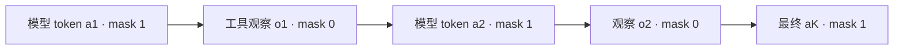

# 多轮对话 loss mask

    
response_mask 在模型自己采样的 token 上为 1，在工具观察与 padding 上为 0；策略梯度只应落在前者。

    <footer>—— verl AgentLoop 输出约定；对照 InstructGPT 只在助手轮计损失的监督实践</footer>

多轮 SFT 已经规定：不要预测用户会说什么，损失打在助手轮。见 [多轮对话数据格式](/llm/multiturn-format)。Agent RL 多了一类不是人写的 token：**工具与环境的观察**。它们出现在上下文里，条件着下一步动作，但不是 $\pi_\theta$ 的输出。若把整段序列当 completion 做 PPO，模型会学着模仿检索片段、SQL 结果或编译器日志，重要性比也在不可控「动作」上计算。VeRL 的 `AgentLoopOutput.response_mask`、OpenRLHF / slime 的 postprocess 钩子、Agent Lightning 的调用级样本，都是在落实同一条契约。本篇只写 **mask 的定义、与 token 级 API 的关系、以及归一化时 0/1 如何进分母**。不重讲 chat template 字段。

## 问题

单轮 RLVR 的序列是 `[prompt | completion]`，prompt 全 0，completion 全 1，终点奖励广播到 1 的位置。多轮 ReAct 变成

$$
p,\; a^{(1)},\; o^{(1)},\; a^{(2)},\; o^{(2)},\; \ldots,\; a^{(K)}
$$

其中 $a^{(k)}\sim\pi_\theta$， $o^{(k)}$ 由环境决定。正确的逐 token 掩码 $m_t\in\{0,1\}$ 满足 $m_t=1$ 当且仅当位置 $t$ 属于某段 $a^{(k)}$（且通常排除 padding）。策略目标是 $\sum_t m_t\cdot \ell_t$，其中 $\ell_t$ 是裁剪后的 PPO/GRPO 项。把 $m_t$ 在 $o^{(k)}$ 上设成 1，等于声称模型「选择了」搜索引擎返回的词。

实现层还有假 mask：先 decode 成文本、拼 messages、再 `apply_chat_template` 得到新 id，按角色启发式标助手为 1。启发式在工具角色名、system 注入、thinking 标签上会飘。唯一可靠的来源是生成时记下的 response id 边界。这就是 [AgentLoop](/llm/agentloop-server) 坚持 token-in-token-out 的原因，也是 [Agent Lightning](/llm/agent-lightning) v1.0 把 retokenization 列为训练事故的原因。

### 助手轮不等于模型采样轮

SFT 里「assistant」角色可能含教师示范的工具调用文本，那是监督，mask 为 1 合理。在线 RL 里，若 harness 把上一次模型输出改写（补 JSON、截断、插入规范字段）再写回历史，改写后的 token 已经不是 $\pi_{\mathrm{old}}$ 的动作。要么拒绝改写、用原始 id；要么把改写段标 0。静默改写却标 1，是离策略噪声，不是数据增强。

TRL 的 SFT/DPO 默认 mask 用户轮；工具观察要自己提供 completion mask。不要假设 `assistant` 字符串检测能覆盖 `tool` 角色。OpenAI 式 `tool` 消息在模板里可能被渲染成特殊 token 块，漏标就会在大块 JSON 上反传。

## 方法

记序列 $x_{1:T}$，掩码 $m_{1:T}$。PPO 的 token 项 $\rho_t \hat A_t$ 只在 $m_t=1$ 累加。组内标准化的 $\hat A$ 仍可按整段轨迹的标量奖励来，但**平均**时要决定分母是 $\sum_t m_t$ 还是样本数。DAPO / 某些 GRPO 实现用 token 级平均，长轨迹不会仅仅因为长就占更大梯度；若再在观察上标 1，分母被工具输出灌水，真正动作的梯度被稀释。正确做法：分母只计 $m_t=1$。Harnessed 设定下一次 rollout 拆成多次 LLM 调用时，还应在 rollout 级做优势，避免调用次数变成权重，见 Lightning v1.0。

构造 mask 的推荐流程：（1）引擎返回 `response_ids`；（2）Loop 把它们追加到序列，这些位置写 1；（3）工具文本在 **client 侧** tokenize 成 `obs_ids`，追加并写 0；（4）下一轮 generate 的输入是当前全部 id，不再经过文本往返。Padding 与截断位置写 0。若使用 packing，文档边界两侧不能把相邻样本的观察当成当前动作。

### 与 KL、价值头的接口

KL 项 $\log\pi_\theta-\log\pi_{\mathrm{ref}}$ 也只应在 $m_t=1$ 上算。对观察算 KL 没有定义：参考策略并不「生成」检索结果。价值头若逐步预测，可以看含观察的状态（那是条件），但训练 $V$ 的目标位置仍建议钉在动作 token 或步末，避免在工具 JSON 上学价值。GAE 沿时间回传时，观察步可以当 $\gamma$ 转移但不贡献策略项。实现若把观察也展开成「动作」时间，GAE 会把环境噪声当成策略方差。

DeepSeekMath 的 GRPO 把标准化后的 $\tilde r$ 赋给该输出的每一个 token。多轮时应读成「每一个**策略** token」，不是每一个物理 token。原文实验是单轮数学，迁移到工具轨迹时必须自己改赋值范围。

## 机制

Mask 是在声明 **可控集**。策略梯度定理针对的是 $\pi$ 的支持；环境 token 来自另一个分布。形式上可把观察并入状态更新 $s'=f(s,a,o)$，动作空间仍是词表上的模型输出。工程错误等于把 $o$ 标成 $a$。数值上，观察段往往更长（网页、traceback），错误的 1 会主导平均损失，训练看起来在降 loss，其实在拟合噪声文本。

Retokenization 破坏的是「这段文本对应的 id 就是当时的 $a$」。即使角色 mask 启发式碰巧全标在 assistant 上，id 已变，则 $\log\pi$ 与采样分布不一致，clip 区间失去意义。因此 mask 正确性以 **id 身份**为前提，不以角色字符串为前提。Server 级 token API、代理层记录 raw token，都是为这条前提服务。

### 归一化的三种错误

1. 按序列长度平均且观察标 1：工具越多梯度越小。  
2. 按 sample 平均而一次任务拆成很多 sample：调用越多权重越大（Lightning 指出的编码任务偏差）。  
3. 按 batch 全局 token 平均但各样本 mask 密度差数量级：密度低的任务被淹没。  

需要在配置里写死：token 平均只计 $m=1$，任务级权重按 rollout 或按题分组（GRPO 的 $G$）。改一处必须改日志里的 `grad_norm` 解读。

## 边界与工程取舍

不要把 mask 当成「少算一点算力」的优化开关。不要在可视化时只画文本高亮、不校验 id 边界。截断若从左边砍历史，必须保证剩下的前缀仍以合法 chat 状态开始，否则第一段 $a$ 的条件错误。多模态观察（图像 token）同样为 0；视觉编码器是否更新是另一条损失，不要和语言模型策略项混在一个 mask 里。

没有 token 级日志时，不要开异步 rollout：错 mask 会按吞吐放大。先在同步、单条轨迹上断言 $\sum m$ 等于模型生成长度之和。

Ouyang 等 InstructGPT 的示范损失在助手续写上。verl `response_mask`：文档 agent_loop。Jiang 等 VerlTool arXiv:2509.01055 强调观察 token。He 等 arXiv:2608.17528 强调重分词与 rollout 级归一化。Shao 等 DeepSeekMath / GRPO 原文是单轮赋值，迁移需显式改写。

## 小结

- 多轮 RL 的 loss mask：模型采样为 1，提示、工具观察、padding 为 0。
- Mask 必须标在生成时的 token id 上；文本再分词会使 0/1 对准错误位置。
- 平均与优势的分母、分组键要与 mask 一致，否则长观察或多次调用会扭曲梯度。
- 出处：verl AgentLoop 约定；InstructGPT；VerlTool；Agent Lightning v1.0。
