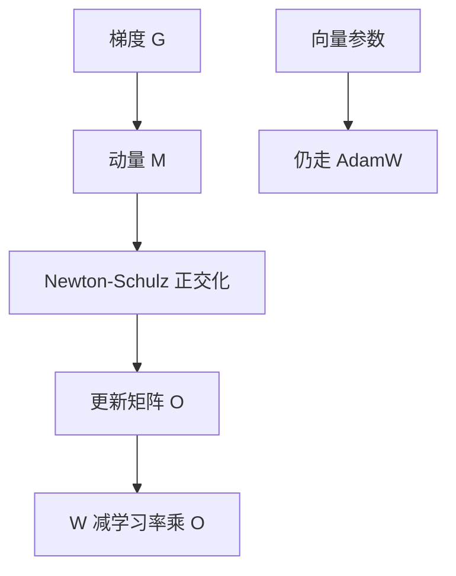

# Muon / 矩阵优化器

隐藏层的二维权重按矩阵来更新：先动量，再正交化，而不是按每个元素各自除以二阶矩。

<footer>—— Keller Jordan 等，Muon，2024</footer>

Adam 把权重看成一袋独立坐标，用每维的一阶、二阶矩决定步长。Transformer 里绝大多数参数却是矩阵：注意力的投影、FFN 的两块线性。Keller Jordan 等人 2024 年提出的 Muon，把这些二维参数的更新当成矩阵对象：对动量矩阵做正交化（实现上常用牛顿–舒尔茨迭代逼近正交极因子），再按学习率写回。它不是把 Adam 的 $\epsilon$ 换成另一个常数，而是换了更新所在的几何。最初以博客与参考实现传播，随后出现训练报告与变体；公开实验多在中小规模与特定代码库上，外推到任意千亿密集模型时，本文把不确定处单独标出。

## 问题

自适应优化器解决的是尺度：有的坐标梯度长期很小，有的很大，用同一学习率会一头炸、一头原地踏步。Adam 的办法是坐标级除以 $\sqrt{v}$。这对偏置、范数的仿射、词嵌入这类接近向量的对象很合适，对 $d\times d$ 的方阵却有一个结构性盲区：矩阵的作用是线性映射，真正决定一步走多远的是奇异值，不是某个 $(i,j)$ 位置上的标量幅度。

同一矩阵里，不同奇异方向的梯度可以差几个数量级。Adam 会把已经很小的奇异方向再除以更小的二阶矩，步长被抬得很大；大奇异方向则被压住。结果是更新在谱上看很歪。Shampoo 一类预条件方法用 Kronecker 因子去估矩阵级曲率，更接近这个问题，但每步预条件本身贵。Muon 要的是一种更便宜的矩阵级矫正：不估完整曲率，只强迫更新矩阵接近正交，让各奇异方向的步长同量级。

### 矩阵参数与向量参数不是一类对象

嵌入表、lm_head 的一维切片、RMSNorm 的 $\gamma$、所有偏置，形状不是「两个相当的轴」。对它们做正交化要么无定义，要么把词表维和隐藏维错误地当成一对对偶基。Jordan 等人的用法是：Muon 只管隐藏层的二维权重；其余仍走 AdamW。工程上这不是口味，而是对象类别不同。把词嵌入也正交化，等于假设「词与词之间的更新应彼此正交」，这个假设没有和语言建模的几何对齐。

「矩阵优化器」不是「只用矩阵乘法的优化器」。Adam 的实现同样是逐元素乘加。区别在于：Muon 的一步显式依赖整块权重的左右奇异空间；Adam 的一步在置换任意行列之后数值不变——它没有矩阵结构。

## 方法

对形状为 $m\times n$ 的权重 $W$，Muon 维护一份同形状的动量 $M$，典型为

$$
M_t = \mu M_{t-1} + G_t,
$$

其中 $G_t$ 是当前梯度（是否先做 Nesterov 式平移，以实现为准）。然后把 $M_t$ 映射成近似正交的更新 $O_t$，再

$$
W_t = W_{t-1} - \eta\, O_t.
$$

正交化的数学对象是极分解 $M = U P$ 里的正交因子 $U$（更常见的写法是对 $M$ 做 SVD，$U V^\top$ 即最近的正交矩阵，差一个矩形情形下的「半正交」）。完整 SVD 每步都做太贵。参考实现用低次牛顿–舒尔茨迭代在 GPU 上逼近这一因子：先把 $M$ 按 Frobenius 范数缩放到谱半径合适的区间，再重复若干次三次多项式迭代。多项式系数来自把函数 $x\mapsto x/\sqrt{x^\top x}$ 在 $[-1,1]$ 上做极小极大拟合，**具体数字以实现为准，不应把某一组常数写成定理**。

### Newton–Schulz 近似正交极因子

迭代发生在与 $W$ 同形状的小矩阵上，额外 FLOPs 是几次 $m\times n$ 与 $n\times n$（或 $m\times m$）的乘，通常远小于该层正向 GEMM。矩形矩阵取较矮的一边做对称乘，使正交化落在「瘦正交」而不是强行凑方阵。迭代次数太少，近似偏的是极因子而不是随机噪声；次数太多，收益迅速递减。公开实现常用五次量级，这是算力与近似误差的折中，不是从损失推出的最优次数。

权重衰减、学习率调度与梯度裁剪仍可叠在外层。Muon 不自带 Adam 那种每坐标的分母，因此峰值学习率的绝对数字不能从 AdamW 配置原样粘贴；需要按矩阵宽度与正交化后的范数量新标定。这一点与后文 μP 的「超参随宽度转移」是同一类问题，但 Muon 与 μP 的正式对齐在公开文献里仍不完整，下文机制里标为不确定。

## 机制

### 与 Adam 的更新几何不同

Adam 的一步在每个坐标上等价于用经验 RMS 把梯度除到 $O(1)$，再乘全局学习率。坐标基是任意的：把 $W$ 的行做正交变换，Adam 的更新一般不会跟着变成相应的共变形式。Muon 的 $O$ 接近 $UV^\top$，谱范数约为 1，Frobenius 范数约为 $\sqrt{\mathrm{rank}}$。一步在算子范数意义下被钉住，方向跟着动量的主奇异空间走。直觉上，这更像「在谱范数球面上的最陡下降」，而不是「对角预条件的 SGD」。有工作从模对偶、谱范数最陡下降解释这类正交化更新；把 Muon 严格等同于某一条定理，目前证据还不够，只适合当作几何图像。

和 Shampoo / SOAP 的差别也在这里。那些方法维护 Kronecker 结构的二阶统计，用它去白化梯度；Muon 几乎不存二阶统计，只对当前动量做一次「谱上的归一」。省内存、省计算，也丢掉了跨步的曲率记忆。若损失的条件数主要来自「矩阵作为算子」而不是「坐标尺度长期漂移」，Muon 会显得很值；若病态主要来自 embedding 与输出头，Muon 根本碰不到那些参数。

不要用「Muon 比 Adam 快」这种不含对象的句子。它快的是隐藏层矩阵在谱上的步长分配；词表、增益、偏置仍由 AdamW 负责。只换优化器、不检查哪些参数进了哪条流水线，等于没换。

### 学习率、动量与耦合 AdamW

实践中常见的拼接是：二维隐藏权重走 Muon，其余走 AdamW，两套学习率。Muon 一侧的 $\eta$ 往往看起来比 Adam 大，因为正交化已经把更新的谱范数压到常数级，不再享受 $\sqrt{v}$ 那一层自动缩小。动量 $\mu$ 仍像 SGD 动量那样平滑方向，不是 Adam 的 $\beta_1$。把 Adam 的 $\beta_1=0.9,\beta_2=0.95$ 抄到 Muon 上没有对应物。

与 μP 的关系：μP 要求宽模型里隐藏层的有效更新幅度不随宽度爆炸。Muon 的正交化已经把 $\|O\|_2$ 钉在常数附近，宽度转移时可能比 Adam 更「天生接近 μP」——这是一种有吸引力的猜测，不是已经完成的证明。是否还要按宽度除学习率、权重衰减如何跟 $\eta$ 解耦，公开实验并不一致。迁移超参时应以窄模型网格为准，不要默认「上了 Muon 就可以随便搬学习率」。

## 边界与工程取舍

Muon 的正交化假设更新值得被当成满秩矩阵。低秩适配器、已经被张量并行切成细条的分片、以及非常瘦的矩形（例如 $d\times 3d$ 的门控投影在 TP 切分之后），极因子的含义会变：你正交化的是分片，不是逻辑上的完整线性映射。张量并行下每张卡各做各的 Newton–Schulz，和「先聚集再正交化」不是同一算法；后者通信贵，前者是目前的默契。是否因此引入跨分片的偏差，公开讨论很少，应视为未决。

数值上，牛顿–舒尔茨需要输入已经被缩放到收敛盆地里。梯度爆炸、未裁剪的损失尖峰，会让迭代偏离极因子，更新不再正交。它不能替代梯度裁剪。混合精度下正交化内部常用较高精度，否则多项式迭代的三次项容易把误差放大；这是实现细节，不是算法承诺。

规模上的不确定：中小模型、短训练、nanoGPT 一类速度竞赛里，Muon 多次显示更好的 token 效率。实验室级的密集大模型、MoE、超长上下文是否同样成立，不能从这些结果直接读出。Kimi 等后续报告展示了在更大模型上用矩阵正交化优化器的经验，但超参、哪些层纳入、是否与 μP 同用，各家并不相同。把「Muon 将替换 AdamW」写成定论，目前过早。

检查点里必须存动量矩阵 $M$，形状与 $W$ 相同。相对 Adam 少了二阶矩 $v$，隐藏层优化器状态更轻；但 Newton–Schulz 的临时工作区会顶高峰值激活之外的另一截显存，分析内存时不要只减 $v$ 不加算子。

不要把 Muon 和「正交初始化」「权重正交正则」混为一谈。初始化是起点；正则是把 $W$ 本身推向正交；Muon 是把**更新**推向正交，$W$ 可以既不正交也不满秩。三者的数学对象不同。

## 小结

- Muon 对隐藏层二维权重做动量，再用牛顿–舒尔茨逼近正交极因子，按谱范数受控的步长更新矩阵。
- Adam 是坐标级自适应；Muon 是矩阵级几何矫正。词嵌入、范数、偏置通常仍用 AdamW。
- 学习率数字不能从 AdamW 原样照搬；与 μP 的对齐尚未形成共识，宽度转移时要单独网格。
- 张量并行分片上的正交化、极低秩层、混合精度下的迭代精度，都是实现边界，不是论文里已经闭合的定理。
- 中小规模证据强于普遍性声明；大模型上的成败取决于哪些层纳入、超参如何重标。
- 出处：Keller Jordan 等，Muon 优化器（2024，博客与参考实现）；矩阵预条件的前史见 Shampoo 等；模对偶 / 谱范数最陡下降是后续解释，不是 Muon 原文已给出的公理。
