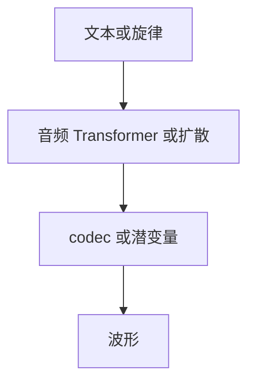

# 音乐生成

歌曲要在分钟级保持调性、节奏与结构。局部听着像音乐，并不等于会反复、会收束。

<footer>—— Copet 等 MusicGen；Agostinelli 等 MusicLM；Dhariwal 等 Jukebox</footer>

[上一课](/llm/e2e-speech-dialogue)的音频是对话轮次，秒到十几秒。[VALL-E](/llm/valle-tts) 的 codec LM 可迁到音乐，但目标从音色克隆变成长程结构。缺口是条件（文本描述、旋律、和弦）与分钟级一致性。后课 omni 默认各模态生成器已经能各自出流，再谈对齐。

## 问题

Jukebox 在量化码上分层 AR，能长，但慢、文本控制弱。MusicLM 用级联音频表示与联合文本–音频嵌入。MusicGen 用 EnCodec 码 + 单一 Transformer，文本或旋律（音频条件）可控，强调简单可复现。长程失败：调漂移、段落进不去副歌、鼓点与旋律脱拍——类似视频闪烁，但是在节拍网格上。

旋律条件通常是把哼唱或单音轨编成条件码，不是乐谱解析。没有对齐的乐谱时，模型学的是声学相关，不是明确的和声功能。

## 方法

表示：codec token 或连续潜变量 + 扩散/流。条件：文本、风格标签、旋律、歌词（歌词要另做对齐，见音画课的时间问题）。训练用长上下文或分段 + 记忆。评测：人评结构与文本遵守、FAD，不要用对话 WER。版权与训练数据来源必须单独披露，不能只报听感。

## 机制

节拍是时间上的周期结构，模型必须在位置编码或显式节拍条件里看见它，否则只有局部纹理。这与 [2D RoPE](/llm/2d-rope) 给图像格子、视频给绝对时间是同一教训：生成器不自动拥有正确的轴。

## 边界

音乐生成仍常是单模态音频。下一课把视、听、说装进一个要对齐的 omni 模型。

## 小结

- 音乐生成的硬问题是长程结构与可控条件，不是短窗听感。
- codec AR（MusicGen）与级联（MusicLM）是两条产品路。
- 节拍与调性需要时间协议，不能指望局部 CE。
- 出处：MusicGen；MusicLM；Jukebox。
