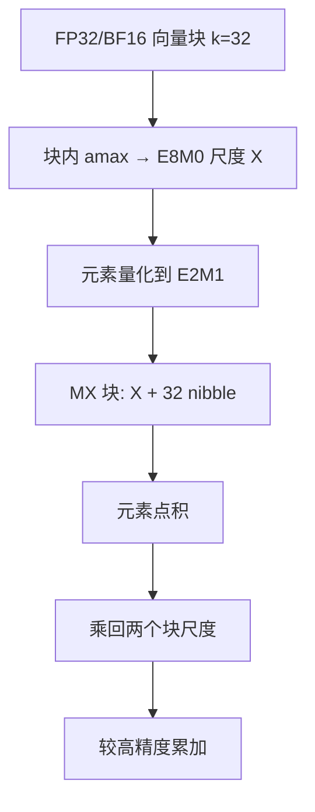

# MXFP4 微缩放

    
把 32 个 E2M1 元素绑到一个 E8M0 块尺度上，4-bit 才有资格同时谈硬件效率、可互换与可训练，而不是再发明一套私有格子。

    <footer>—— OCP Microscaling Formats (MX) Specification v1.0；Rouhani et al., Microscaling Data Formats for Deep Learning, arXiv:2310.10537</footer>

逐张量缩放的 FP8 已经把训练与部分推理推进到 8-bit。再往 4-bit 走，单个元素几乎没有尾数：E2M1 正规值只有有限几档，一层权重若跨两个数量级，单一全局尺度会把小系数打成零、把大系数打饱和。OCP MX v1.0 的折中是**微缩放（microscaling）**：固定块大小 $k=32$，块内共享一个 8-bit 纯指数尺度，元素用 FP4。这不是 NVIDIA 的 NVFP4，也不是 GPTQ 的均匀 INT4 网格。芯片侧的数值合同见 [MXFP4 / 低精度推理数值](/llm/jalapeno-mxfp4)；本篇写规范本身、Rouhani 等人的训练/推理证据，以及块尺度为什么必须进 MMA 元数据而不是事后乘在 CUDA 核心上。

## 问题

窄格式要同时满足三件事：算力与存储密度、相对 FP32/BF16 的质量、以及跨厂商可导入。逐张量 FP8 对 8-bit 往往够用，对 4-bit 不够：元素动态范围大约只有一个数量级出头，张量级 amax 会把块内大多数值挤进两三个码字。逐元素再配一个 8-bit 尺度又太贵，4-bit 密度被吃掉。研究里的块浮点（BFP）早已知道「共享指数 + 窄尾数」，但块大小、尺度格式、元素编码各写各的，权重检查点无法互换。

2023 年 9 月，AMD、Arm、Intel、Meta、Microsoft、NVIDIA、Qualcomm 把一套具体参数收进 OCP：元素、尺度、块大小三者钉死，并单独发白皮书给数据科学证据。MXFP4 是其中最窄的浮点档。问题从「4-bit 能不能表示」变成「32 元素一块、尺度只能是 2 的幂时，训练配方还要不要改」。

### E2M1 格子与 E8M0 尺度

FP4（E2M1）是 1 符号 + 2 指数 + 1 尾数。OCP 要求支持亚正常，**不保留** Inf / NaN 码字，16 种编码全是数；最大有限幅度约 $\pm 6$。转换必须支持 roundTiesToEven。溢出不能靠 IEEE Inf 传播来「显眼地炸」，量化前必须用块尺度把幅度收进格子，否则饱和被静默吃掉。

尺度是 E8M0：8-bit 无符号指数、无尾数、无符号位，表示 $2^e$，可编码 NaN。块尺度为 NaN 则整块值为 NaN。E8M0 的指数范围覆盖 FP32 能表示的指数超集，所以动态范围由尺度承担，元素只负责块内相对精度。存储上每块 $8 + 32\times 4 = 136$ bit，合 **4.25 bit/元素**——不要把「4-bit」写成 4.00。

NVFP4 不是 MXFP4。公开材料里 NVFP4 常见 16 元素一块、块尺度用 FP8（E4M3），另可有张量级 FP32 尺度。MXFP4 是 32 元素、E8M0。检查点、MMA 指令、TE 配方不能混用。Blackwell 两条路径都可能存在，导入前对格式名。

## 方法

Rouhani 等人给出的参考转换（规范第 6.3 节允许实现自定义，该算法是可复现的工作例）是：对块 $\{V_i\}_{i=1}^{32}$ 取

$$
e=\lfloor\log_2(\max_i|V_i|)\rfloor-e_{\max}^{\mathrm{elem}},\qquad X=2^{e},\qquad P_i=Q_{\mathrm{E2M1}}(V_i/X),
$$

其中 $e_{\max}^{\mathrm{elem}}$ 是元素格式最大正规数的指数，用来把块内最大值映射到元素格子的最高 binade。反量化 $v_i=X P_i$。矩阵乘时，规范定义 MX 向量点积：先对元素做点积，再补上两个块尺度的指数和。硬件应按此把尺度当作 MMA 元数据，而不是先全部展开成 FP16 再走普通 GEMM——后者只得到容量，得不到 4-bit 峰值。

白皮书把 MXFP4 主要用于**权重量化**的训练：权重走 MXFP4，激活与梯度仍可更宽。他们报告在生成式语言模型上，4-bit 权重训练相对 FP32 只有小幅精度损失，且**不改常规训练配方**（学习率、预热、优化器超参保持）。6-bit MXFP6 则被写成权重、激活、梯度全亚 8-bit 仍能对齐 FP32 的那一档。把「MX 白皮书证明了 W4A4G4 无损预训练」安到 MXFP4 头上，是读错表。

### 直接投射、误差扩散与微调

推理侧白皮书分三档：直接把 FP32 权重量化成 MX（direct-cast）、用误差扩散一类 PTQ、以及量化感知微调。8-bit MX 格式（MXFP8 / MXINT8）在多种视觉与推荐任务上可以直接投射；6-bit 往往要 PTQ 或微调才接近；4-bit 作为推理权重更依赖校准或微调，激活若也打到 MXFP4，异常通道会先坏。这与后来 AMXFP4 等工作指出的「MXFP4 对 LLM 激活不够稳健」一致：规范给的是可互换编码，不是「任意张量 direct-cast 都无损」的 SLA。

## 机制

微缩放能工作，是因为 Transformer 张量的动态范围主要沿块间变化，块内相对动态范围更窄。共享 $X$ 把块搬进 E2M1 的 $\pm 6$ 窗口；E2M1 的 1-bit 尾数只分辨块内相对比例。块大小 32 是硬件与精度的折中：太小，尺度元数据占比升高、访存不规则；太大，块内再出现尖峰，尺度被单个异常值绑死，退化成糟糕的逐张量缩放。OCP 把 $k$ 钉死，正是为了让 Tensor Core / MXU 用固定 tile 吃尺度。

E8M0 相对「每块一个 FP16 尺度」少了尾数乘法：尺度乘常常退化成指数加减。代价是尺度本身是 2 的幂，不能微调到任意实数；块内最大值映射到最高 binade 之后，其余值的相对误差由 E2M1 决定。训练时若某层权重突然出现远超历史的异常通道，块尺度跳变等于给该块乘了一个离散增益，表现成像量化噪声的学习率扰动。白皮书强调「低用户摩擦」，前提是统计假设近似成立；小 batch、损失尖峰、MoE 专家冷热不均，都会让假设变差。

模拟库与真 MMA 不是同一合同。白皮书的 CUDA 模拟在现有 GPU 上复现数值，吞吐仍是 FP16/FP32 核。Blackwell 等把 MX 推进 Tensor Core 之后，才有「表头 MXFP4 TFLOPS」。只改存储 dtype、计算升回 FP16，是 GPTQ 式 W4A16，不是 MX 点积。

## 边界与工程取舍

### 可互换编码不等于可互换检查点

不要把 MXFP4、NVFP4、INT4 GPTQ、NF4 写成一种「4-bit」。MXFP4 的互换单位是 OCP 块；GPTQ 的单位是分组均匀网格加零点。服务引擎若只实现 INT4 反量化核，不能靠改扩展名吃 MX 检查点。训练侧把权重写成 MXFP4、激活仍 BF16，与推理侧 W4A4 也不是同一配方。

实现合规不要求支持全部 MX 具体格式；只实现 MXFP8 的芯片不能报 MXFP4 峰值。点积累加精度由实现定义，规范只要求基本运算语义。调试时 inf 不出现，要用溢出计数、块尺度直方图、以及与 BF16 的层输出 MSE，而不是等 NaN 训练崩掉。

与 [MXFP8](/llm/mxfp8) 的分工：8-bit 微缩放增强的是已有 FP8 的稳健，4-bit 微缩放才真正改峰值与字节。与 [Blackwell 对推理的含义](/llm/blackwell-infer) 的分工：那边写硬件工作点，这里写格式合同。

出处：OCP MX Specification v1.0（2023-09-07），具体格式表中的 MXFP4（FP4 E2M1，块 32，尺度 E8M0）；Rouhani 等，*Microscaling Data Formats for Deep Learning*，arXiv:2310.10537。元素编码对照 OCP FP8 规范中的 OFP8；NVFP4 对照 NVIDIA Transformer Engine 与产品材料，不要回写进 OCP 表。

## 小结

- MXFP4 是 OCP 微缩放的 4-bit 浮点档：32 元素共享 E8M0 尺度，元素为 E2M1，约 4.25 bit/值。
- 块尺度承担动态范围，元素只分辨块内相对幅度；没有块尺度的裸 FP4 不是同一格式。
- 白皮书支持 4-bit **权重**训练小幅掉点且不改配方；不要外推成 W4A4G4 无损。
- 点积应带尺度元数据进 MMA；先解回 FP16 只省容量。
- NVFP4 的块大小与尺度格式不同，检查点与核不能混用。
- 出处：OCP MX v1.0 与 Rouhani et al., arXiv:2310.10537。
