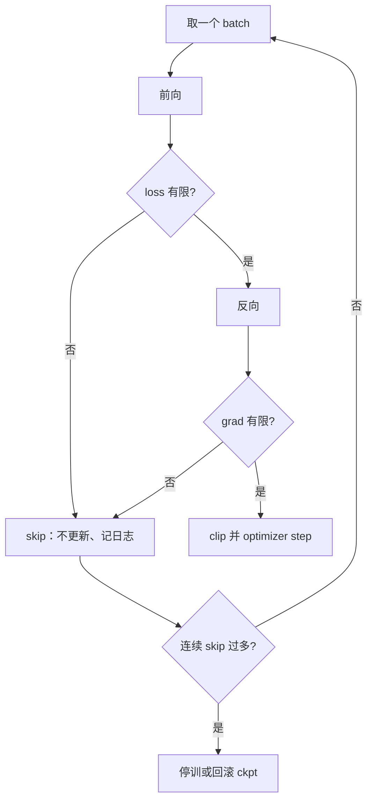

# NaN skip batch

一步 Inf 不该毁掉两周的权重；跳过这个 batch、记下现场，比在已经污染的 Adam 状态上继续走更可逆。

<footer>—— 大规模预训练运行手册中的损失尖峰处理；对照梯度裁剪仍无法挽救的非有限值</footer>

[Cut cross-entropy](/llm/cut-cross-entropy) 减少了词表 softmax 的显存事故；[z-loss](/llm/z-loss) 压住 logit 尺度。仍会有个别 step 出现 NaN / Inf：坏样本、残留的溢出、通信损坏、或优化器状态里已经进了 Inf。本课写的缺口是 **运行时策略**：发现非有限值之后，是 abort、是把整棵参数回滚到上一 ckpt，还是跳过这个 batch 继续。后课批次与学习率假定训练环在尖峰处有明确的跳过 / 记录语义，而不是默默把 NaN 写进权重。

## 问题

[梯度裁剪](/llm/grad-clip-loss-spike) 管的是有限但巨大的梯度。NaN 不是大号，是非有限。Clip 的 $\ell_2$ 范数若已是 NaN，比较与缩放都无定义。Adam 的 $m,v$ 一旦写入 NaN，之后每步都是 NaN，检查点永久报废。因此「检测到非有限就跳过这次更新」是在保护优化器状态，不是在提高泛化。

跳过的代价是：这个 batch 的监督消失；若坏 batch 其实是实现 bug（错误的掩码、错误的 EP 对齐），跳过等于掩盖，模型在特定长度或特定专家切片上永远学不到。策略必须配 **计数与告警**：连续 skip 超过阈值则停，而不是无限跳过当正常训练。

### 先分清三种非有限

（1）损失 NaN、梯度仍有限：可能是 log(0) 写在记录里，更新或许可做。（2）梯度 NaN、参数仍有限：必须 skip 更新，并可尝试把该 batch 拆小重跑以定位。（3）参数已 NaN：skip 无意义，只能回滚检查点。日志应在 all-reduce 之前就对局部梯度做 `isfinite`，否则一卡的 NaN 会污染整组。混合精度里 inf 检查要在反缩放到 FP32 之后做。BF16 的 inf 与 FP32 的「只是很大」边界不同；只看 BF16 张量会漏检或误检。ZeRO 分片后每卡只看见参数的切片，isfinite 必须在规约后的全局梯度上做一次，或每卡检查自己的分片再 all-gather 一个布尔。

## 方法

### 控制流与数据是否前进

典型控制流：前向 → 若 loss 非有限则记 skip、zero grad、不 step；否则反向 → 若 grad 非有限则同样 skip；否则 clip、optimizer step。Skip 时 **不要** 推进学习率日程里的「有效 token 数」以外的随机数状态——数据加载器是否前进是产品选择：前进则永远丢掉该数据；不前进则下一轮还可能再撞同一 packing，适合抓 bug。预训练常前进并计数，以免死循环；调试期不前进。

与检查点：skip 不写盘。若采用「连续 $k$ 个 skip 则回滚到上一 ckpt 并缩小局部 batch」，那是更强的自动康复，接近损失尖峰文献里的 rollback。单纯 skip 更轻，假定尖峰稀疏且不相关。长训里两种可以分层：先 skip，再在窗口内 skip 率过高时 rollback。

## 机制

Skip 改变的是采样分布：被丢掉的 batch 往往不是均匀的——更长序列、更极端 packing、某一种语言、某一组专家过载。长期 skip 等于对尾部数据降权，模型在长上下文或稀有语言上变弱，却被平均损失掩盖。所以日志要按原因与数据切片打标签：溢出、路由、数据损坏，分桶计数。

AdamW 的时间步 $t$ 若在 skip 时仍递增，$\hat{m}/(\sqrt{\hat{v}}+\epsilon)$ 的偏差校正会错位，通常无害但不可复现。更干净的是 skip 时 $t$ 不增，与「没有发生更新」一致。μP 与 warmup 按 token 计还是按 step 计，必须声明 skip 的 token 是否计入。计入则学习率在坏数据上「空转前进」；不计入则墙钟与日程脱钩。

数据侧的 NaN（损坏的 bf16 文件、未过滤的 inf 特征）应在 loader 就丢掉，不要等到最后一层才 skip。模型侧的 NaN 才是本课对象。两者混在同一计数器里，你会无法决定该修数据还是该加 z-loss。

### 与梯度裁剪、z-loss 的顺序

顺序建议：稳定的核（FlashAttention、Cut CE）→ z-loss 限制尺度 → 有限性检查 → clip → step。把 skip 放在 clip 前，避免对 NaN 做除法。不要指望加大 clip 阈值来「吃掉」NaN。也不要把 skip 当成正则：有人发现 skip 后损失更稳，那是因为丢掉了难 batch，不是算法变好。

## 边界与工程取舍

评估 / 推理路径不应沿用训练的 skip：eval 出现 NaN 应失败，否则指标被悄悄算在子集上。RL 与长 CoT 训练中，单条轨迹 logit 爆炸更常见，skip 粒度要从 batch 降到样本，否则一条坏轨迹拖死整组。MoE 上单专家 GEMM 溢出时，skip 整 batch 可能过粗，丢失大量好 token；更细的是对该专家本步置零贡献（类似 drop）并告警。

确定性复现与 skip 冲突：是否 skip 取决于浮点路径，换卡数、换内核就会改集合。论文应报告 skip 率；若非零且与结果相关，结果不可在「零 skip」实现上对标。

永远不要在检测到参数 NaN 之后继续 skip。那是在 NaN 权重上做随机游走。唯一合法动作是 abort 或从 ckpt 恢复。Skip 的权限止于「这一拍的更新」。

## 小结

- 非有限梯度不能靠裁剪修复；跳过本次更新是为了保住 Adam 状态。
- 连续 skip 必须有上限，否则在掩盖实现 bug 并对尾部数据降权。
- 分清数据损坏与模型溢出；检查要在规约后、反缩放后做。
- skip 是否前进数据、是否计入 token 日程，要写进配方。
- eval 禁止静默 skip；参数已 NaN 只能回滚。
- 出处：大规模预训练中的损失尖峰与运行手册实践，上接梯度裁剪与 z-loss。
