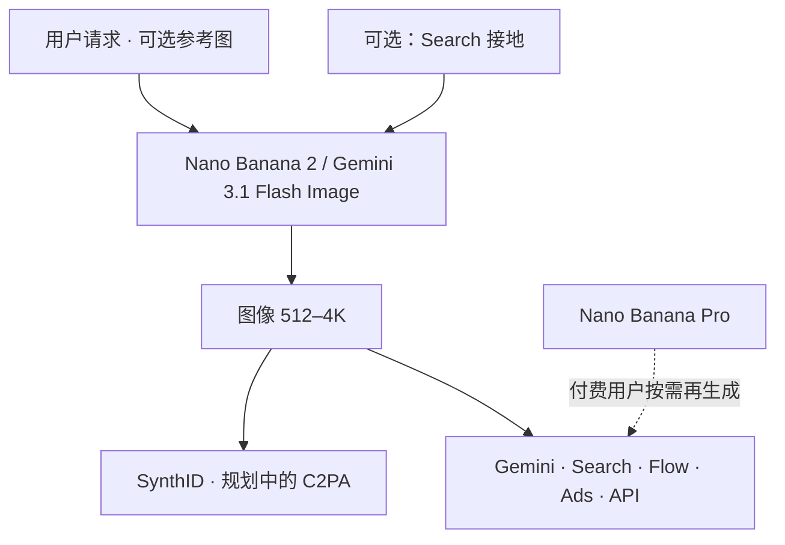

# Nano Banana 2

    
把 Pro 档的世界知识、规格与主体一致性，放到 Flash 的速度上：Gemini 3.1 Flash Image 成为这一代默认出图模型。

    <footer>—— Raisinghani，Nano Banana 2: Google’s latest AI image generation model，Google Blog，2026-02-26</footer>

Google 在 2026 年 2 月 26 日发布 **Nano Banana 2**，技术名 **Gemini 3.1 Flash Image**。产品经理 Naina Raisinghani 的博客把定位写成：2025 年 8 月 Gemini 图像模型 Nano Banana 走红，11 月的 **Nano Banana Pro**（Gemini 3 Pro Image）提供工作室级控制；2 则把 Pro 上让人喜欢的世界知识、推理与规格，降到 Flash 速度，并成为 Gemini 应用 Fast / Thinking / Pro 模式的默认出图。Pro 与 Ultra 订阅仍可通过菜单把单张再生成走 Pro 档。开发者预览：Gemini API、AI Studio、Vertex、Antigravity；Search 的 AI Mode 与 Lens、Flow（零额度默认）、Google Ads 同期铺开。本篇只根据该博客、开发者图像文档与新闻稿式转述。不引用非官方权重拆解。

## 问题

[原生出图](/llm/gemini-native-image) 已经把对话改图做成 Gemini 的接口。用户仍面临档位分裂：Flash 够快但不够「像 Pro」，Pro 够强但慢、贵、且占默认入口会让普通用户付延迟。2 要解决的产品问题是：**默认档是否能同时做信息图、多主体一致性、4K 与可读文字**，而不把所有人赶到 Pro。Search 与 Lens 要的是低延迟示意图，不是影棚海报；Ads 与 Flow 要的是可迭代资产。官方把「高级世界知识 + 联网图像搜索接地」写成 2 从 Pro 继承的能力，用于特定主体与图表，而不是保证新闻级事实。

命名是引用陷阱。Nano Banana 起初是 2.5 Flash Image 的绰号；Pro 是 3 Pro Image；2 是 3.1 Flash Image。API 必须以 `gemini-3.1-flash-image`（及当时预览后缀）为准。把「香蕉」当唯一标识，三个月后会对错模型。Cloud 文档另列：每提示最多约 14 张输入图、输出分辨率从 512 到 4K 分档、输出按分辨率计图像 token（例如文档表里 1K 约 1120、4K 约 2520，以当时页为准）。

### 默认替换 Pro 是产品决策，不是「Pro 已死」

博客写：2 在应用里替换各模式的 Pro 出图；付费用户仍可对已生成图走三点菜单用 Pro 做「需要最高事实准确性」的任务。分工被写成：Pro 最高保真与事实；2 快速、指令跟随、搜索接地。工程上应让用户或租户**显式选 id**，避免「我点了 Pro 聊天所以图也是 Pro 图像」。Search 铺到更多国家与语言，是分发，不是新损失。

SynthID 验证功能在 Gemini 应用自 2025-11 起的公开口径：超过 2000 万次使用。2 继续 SynthID，并推进与 C2PA Content Credentials 互操作，应用内 C2PA 校验「即将」提供——写时查是否已上线。

## 方法

官方能力表。世界知识：Gemini 知识库 + 实时信息与网页图像，用于特定主体与信息图、笔记转示意图。文字：可读、可本地化翻译图内文案。主体一致性：工作流内最多约 **5 个角色** 像、约 **14 个物体** 保真（博客数字）。指令跟随：复杂请求更严。规格：多种宽高比，分辨率 **512 到 4K**。观感：光、纹理、细节在 Flash 速度下拉近。落地产品：Gemini 应用、Search/Lens、API 预览与定价页、Vertex、Flow 默认且对 Flow 用户零额度、Ads 建议图。

安全与来源：所有生成带 SynthID；与 C2PA 结合以说明是否以及如何使用了 AI。这不替代版权判断。真实人像与未成年人政策以产品条款为准，本篇不讨论绕过。定价：第三方报道曾转述相对 Pro 在高分辨率上约低四成的 API 价差，引用须核对 Google 当时价格表，不把新闻稿数字写成永久公式。

### 接地会改变「画错」的形状

无接地时，错误是训练先验里的张冠李戴。有搜索接地时，错误变成检索到的图被误用、或过时页面。官方示例包括先搜视觉参考再生成（如某博物馆的立体主义风格）。评测应分：纯文本想象、需事实的信息图、需身份一致的故事板。把接地打开的 Arena 分与关掉的混报，合同无效。延迟上，接地多一跳，与「Flash 速度」叙事可能冲突，产品应报分位延迟而不是只报不含搜索的实验室数。

## 机制

2 仍是 Gemini 原生图像模态：同一模型家族做理解与生成，而不是 Imagen 专用栈——[Imagen 文档](https://ai.google.dev/gemini-api/docs/imagen) 已引导迁移。Flash 相对 Pro：推理与采样预算更小，官方主张在指令跟随与迭代编辑上足够，把「最高事实准确性」留给 Pro。主体一致性是跨图的身份约束，失败模式是第五个角色塌、或物体计数超过约 14。4K 提高输出 token，账单与审核扫描成本上升。Search 接地把工具调用插入出图前缀，机制上与文本 Gemini 的搜索工具同构，只是结果用于像素。

与 2.5 Flash Image（第一代 Nano Banana）比：官方强调从「病毒式编辑」走到「生产规格 + 知识」。与 3 Pro Image 比：同能力集的速度档，而不是新的生成论。不要把 3.1 写成「换了全新扩散公式」——未公开。交错图文、多轮编辑的接口纪律见前一篇，2 继承该合同。

Cloud 模型卡：Live API 不支持该图像模型、结构化输出不支持等限制，说明「Flash 图像」不是万能 Gemini。出图与实时语音是不同端点。虚拟试穿一类能力若标 Not supported，不要当已上线功能写。

### 默认全产品铺开会放大失败模式

Search 与 Ads 让错误示意图进入更高分发。水印帮助识别，不保证读者看见。信息图若接地失败，看起来会像官方资料。产品需要：可点的来源、易见的 AI 标记、企业关闭接地的开关。本篇只陈述官方来源机制，不提供去水印做法。

## 边界与工程取舍

### 绰号、模型 id、聊天套餐是三张表

集成钉 id 与日期。应用默认 2 之后，评测基线要重跑，不能沿用 2025-08 的 Nano Banana 分。Pro 仍在，适合印刷级与最高事实；2 适合迭代、Search、Ads。4K 与 14 图输入是上限不是免费午餐。地区可用性（Search 141 国等）以博客当时列表为准。

与视频：Flow 把 2 当默认**图像**模型，视频仍是 Veo 等另一契约。与实时视频交互：那边是帧输入，这边是图像输出。三者都叫 Gemini 生态，合同不同。

出处：Raisinghani，Google Blog，2026-02-26；Gemini API *Nano Banana image generation* 文档中的 3.1 Flash Image / 3 Pro Image 分档；对照 2025-08-26 Gemini 2.5 Flash Image 发布。仅公开博客与文档。

## 小结

- Nano Banana 2 = Gemini 3.1 Flash Image，2026-02-26 起作为默认高速出图档。
- 继承 Pro 向的世界知识、文字、一致性与 512–4K 规格，并把 Search 接地写进工作流。
- 应用里替换默认 Pro 出图；Pro 仍可按需再生成。
- 来源用 SynthID，并推进 C2PA；钉模型 id 而不是绰号。
- 出处：Google Nano Banana 2 博客与 Gemini 图像生成文档。
