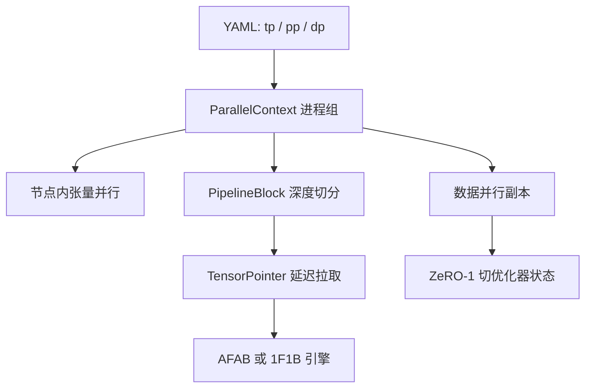

# Nanotron

    
把三维并行写成可以读完的 PyTorch：张量切、流水线切、数据切各自一组进程，层用 PipelineBlock 包起来，跨卡激活用指针延迟发送。

    <footer>—— Hugging Face，Nanotron 仓库与 3D parallelism 文档</footer>

**Nanotron** 是 Hugging Face 的开源预训练库，定位不是再造一套编译器，而是把 [Megatron-LM](/llm/megatron-lm) 那一类三维并行收成「下午能读完」的代码。仓库自称 *minimalistic large language model 3D-parallelism training*：数据并行、张量并行、流水线并行叠在同一套 `ParallelContext` 上，配置写在 YAML 里，训练循环由 `DistributedTrainer` 管。它没有单独的会议论文，贡献是工程合同——显式 API、可调试的切分、以及故意不做满的功能表。本篇写这份合同，不把 NVIDIA Megatron Core 的每一条融合核抄进来。

## 问题

2023 年前后，要在多机上预训练 Transformer，常见两条路。一条是 Megatron / Megatron-DeepSpeed：快，但切分、调度、检查点缠在一起，改一层注意力要翻很多文件。另一条是纯 [FSDP](/llm/fsdp) / ZeRO：模型代码干净，张量并行与流水线要么没有、要么后接。Hugging Face 需要一条中间路：研究人员能看见「这一层在哪张卡、这块激活何时发出」，同时仍能用节点内张量并行把单层塞进显存。

问题立刻变成三个接口，而不是三个新算法。第一，进程组怎么命名，才不会把张量并行的 All-Reduce 误打到数据并行组上。第二，流水线阶段之间传的是什么：立刻发送整块激活，还是先留一个指针、真正用到再拉。第三，优化器切到哪一档：切满参数会和张量并行抢同一份权重布局，切太浅又放不下 Adam 状态。Nanotron 的答案分别是 `ParallelContext`、`TensorPointer`、以及只做 ZeRO-1。

### 可读性被写成一等约束

仓库把「Explicit APIs for TP and PP which enables easy debugging」列进功能表。这不是宣传语，是取舍：列并行、行并行、异步张量并行都以普通 `nn.Module` 出现；流水线用 `PipelineBlock` 包每一层，而不是在图编译器里隐式切。调试时可以打印某个 block 住在哪个 pipeline rank，而不必反编译融合核。代价是峰值 MFU 通常低于把所有通信藏进自定义 CUDA 的栈。选型时要先问：这次训练是要刷集群利用率，还是要改模型结构并在八张卡上验证切分是否正确。

早期内部代号常见 *brrr*。文档里的 PipelineBlock、TensorPointer、PipelineEngine 仍沿用那套分工。读旧 gist 时不要把 brrr 当成另一个框架。

## 方法

启动时按 YAML 的 `parallelism.{tp,pp,dp}` 建 `ParallelContext`。它持有三组 `ProcessGroup`（`tp_pg`、`pp_pg`、`dp_pg`），并用一张秩矩阵把全局 rank 映到三维坐标。张量并行钉在节点内：TP 度不超过单机 GPU 数，All-Reduce 走 NVLink。模型再大，沿深度切开，用流水线跨节点。数据并行在切好的模型副本上复制，吃数据分片。

流水线的最小单元是 `PipelineBlock`：包一层计算，并负责阶段间通信。引擎 `PipelineEngine` 编排前向与反向；调度可换——`AFAB`（All Forward All Backward，即 GPipe 式先跑完所有微批前向再反向）或 `1F1B`。`PipelineBatchState` 缓存未完成的点对点操作。`TensorPointer` 表示「张量在别的 rank 上」：前向不必立刻把激活搬走，消费方真正进入该 block 再请求，通信可以按微批排队。这与「算完就 send」相比，少一次同步、多一次延迟调度。

### 张量并行的两种线性层

常规列并行：每张卡只算自己那一片输出，最后 All-Gather 或 All-Reduce 拼回。异步列并行则先对输入发起异步 All-Gather，本地权重片与本地输入先乘一截；Gather 完成后补算其余输入片与本地权重的贡献，使每张卡得到完整输出。文档把权衡写得很直：异步用更多 FLOP 换更少的集合通信次数，适合通信绑定时；计算绑定时常规切分更划算。行并行仍走 Reduce-Scatter / All-Reduce 那一套 Megatron 语义。绑定参数（词嵌入与 `lm_head`）用 **Tied Linear**：整表复制而不是切分，保存检查点只让一个 rank 写，避免同一份权重存多份。

初始化顺序是训练能复现的前提：在目标设备与目标精度上直接建模型（覆盖 PyTorch 默认的 CPU FP32 初始化），`init_model_randomly()`，标记 tied 参数，沿数据并行 All-Reduce 对齐随机初值，再沿 tying 组 All-Reduce 对齐嵌入与输出头。漏掉后两步，不同 DP 副本会从不同权重起步，损失曲线不可比。

### 功能表里有什么、故意没有什么

已支持：三维并行、MoE 的专家并行、AFAB / 1F1B、ZeRO-1、FP32 梯度累加、参数 tying、大模型自定义模块检查点、Spectral µTransfer、Mamba 示例、Nanoset 预分词数据、DoReMi 域重加权、SLURM 与 S3 检查点。README 里划掉或列为未做的包括：FP8 训练、ZeRO-3 / FSDP、`torch.compile`、Ring Attention、交错 1F1B。这张表决定了对照实验：不要用 Nanotron 去复现「FSDP2 + 编译」的吞吐论文，也不要假设它已经实现 DeepSeek 式 DualPipe。

数据侧 Nanoset 吃预分词样本，避免每个 rank 现场 BPE。生成脚本 `run_generate.py` 可用 `--tp` / `--pp` 加载同一套切分检查点，说明切分布局是训练与推理共享的，而不是训练专用的阴影图。

## 机制

三维并行能叠，是因为通信域正交。张量并行的 All-Reduce 只在 `tp_pg` 上发生，体积随激活 $b\times s\times d$ 走，必须短、必须在节点内。流水线的 P2P 只在相邻 `pp` rank 之间，体积是微批激活，延迟被 1F1B 的气泡填。数据并行的梯度同步发生在 `dp_pg`，ZeRO-1 只切优化器状态，参数在 DP 组上仍完整（相对该副本而言；TP 维上参数已经切过）。于是「谁持有哪片权重」由 TP×PP 决定，「谁持有哪片 Adam」由 DP 决定，两套切分不会抢同一把锁。

`TensorPointer` 的机制是把「数据依赖」从「立即通信」里拆出来。流水线前向时，上游 block 产出的是指针加元数据；下游 block 进入计算才把真实张量拉过来。微批一多，可以把多次 send/recv 收成批，减少启动次数。写错指针的 rank 字段会表现为静默死锁或错位激活，这是显式 API 的代价：错误可见，但不会被编译器挡住。

ZeRO-1 在这里不是「还没做完 ZeRO-3」的半成品，而是与张量并行共存的选择。参数若再按 DP 切，前向 All-Gather 必须与 TP 的分片布局对齐，实现复杂度跳一档。Nanotron 把这一档留给未完成项。

### 和 Megatron、FSDP、VeOmni 的分工

Megatron 的语义祖先仍是列切+行切；Nanotron 没有发明新的切法，发明的是把切法暴露成可打印的模块。FSDP 切的是副本上的参数/梯度/优化器，默认没有流水线，长层仍可能单卡放不下。[VeOmni](/llm/veomni) 面向全模态，并行配方是 FSDP+序列并行+专家并行，几乎不用 TP/PP。三者不要互相替代：纯文本大稠密模型、要改结构、集群中等——Nanotron 合适；要 omni 编码器和解码器插件——VeOmni；要官方 PyTorch 分片、模型已能单层放下——FSDP。

## 边界与工程取舍

### 不要用 README 的功能表当集群 SLA

节点内 TP 上限、1F1B 气泡、ZeRO-1 仍复制参数，都会在跨节点以太网或超大 Adam 上露出。交错流水线、Ring Attention、编译器融合不在合同里。把 Nanotron 的 Llama 示例吞吐写成「Hugging Face 预训练栈的上限」不成立；它是可读实现的吞吐。检查点与 TP/PP 度绑定，改切分要重切权重。词嵌入 tying 漏同步，会表现为一半词表在学、一半梯度为零。异步 TP 在通信不占主导时只会更慢，因为它多算了完整输出。MoE 专家并行是后加能力，负载均衡与 All-to-All 重叠不要默认已经做到 DualPipe 级。评测必须写 GPU 型号、TP×PP×DP、是否 1F1B、序列长度；缺一项就无法和 Megatron 对照。代码以 `huggingface/nanotron` 为准，文档里的问答式 3D 笔记是读源码的地图，不是另一份规范。

引用写 Hugging Face Nanotron 仓库与 `docs/3d_parallelism.md`。不要伪造 arXiv。若论文引用了 Nanotron 训练的某个开源模型，那是下游使用者，不是本库自己的训练报告。

## 小结

- Nanotron 把三维并行收成 `ParallelContext` + `PipelineBlock` + `TensorPointer` 的显式 PyTorch 栈。
- 节点内 TP、跨节点 PP、DP 上 ZeRO-1；调度可选 AFAB 或 1F1B。
- 异步张量并行用 FLOP 换通信次数；绑定参数单独处理以免检查点重复。
- 不做 ZeRO-3、编译与交错流水线，是合同边界，不是疏漏清单。
- 出处：Hugging Face，`huggingface/nanotron`；内部笔记见仓库 `docs/3d_parallelism.md`。
