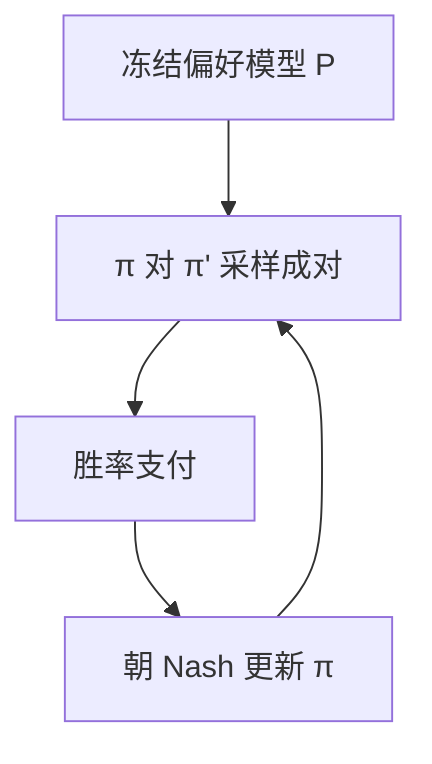

# Nash 学习

偏好不是一个固定奖励上的最优策略，而是两人博弈的均衡：谁也无法再通过单方面改写赢过对方。

<footer>—— Munos 等，Nash Learning from Human Feedback；Calandriello 等 NashMD</footer>

[上一课](/llm/self-rewarding-lm)仍在优化「对自己分数的最优」。缺口是：BT 奖励最大化假设存在全局 $r$，策略去追 $r$ 的最优；真实偏好不可传递、随对手变。Nash 学习把对齐写成对称博弈的均衡，而不是 $\max\mathbb{E}[r]$。本课写 NLHF 相对 [DPO](/llm/dpo) / [RLHF](/llm/rlhf-pipeline) 改了哪一句目标。不重导 BT。

## 问题

DPO / PPO-RM 的隐含故事：人类比较由潜在 $r$ 生成，最优 $\pi^*$ 最大化 $r-\beta\mathrm{KL}$。若比较循环（A>B>C>A），不存在这样的 $r$。即使存在，最大化会把质量压成「对平均对手最好」，而部署时对手是另一个模型或人的即时口味。Munos 等人把两人同时选完成、用偏好模型当支付，求 Nash 均衡：$\pi$ 对阵 $\pi$ 时单方面偏离不会提高胜率。

这改变评测：不是「相对 SFT 的 RM 分」，而是「对当前自己（或对手池）的胜率是否还能提高」。与自奖励不同：支付来自（通常冻结的）偏好模型，不是生成器口头分；求解的是均衡，不是对分的贪婪最大化。

### 均衡不是唯一、也不自动无害

Nash 可能有多个。无害约束仍要另加。NLHF 解决的是目标误设（把偏好当标量最优），不解决标注偏差。

NashMD 用镜像下降一类方法在策略上走，使更新朝均衡去，而不是朝 $\max r$ 去。实现仍像在线偏好优化，损失不同。

## 方法

偏好模型 $P(y\succ y'\mid x)$ 冻结（可来自人类比较）。两份策略（或一份自己对自己）采样，支付为 $P$ 的胜率。更新使 $\pi$ 提高对当前对手的胜率，对手同时变。实践上常用 last iterate 或平均策略当对手。对比 DPO：DPO 对固定对做监督；Nash 需要不断对当前 $\pi$ 采样，是在线的。

可与迭代 DPO 共用采样基础设施，只换损失：不是 $\sigma(\beta\Delta\log\pi)$，而是博弈支付的策略梯度或镜像下降。KL 仍可把均衡拴在 SFT 邻域，否则均衡可能是奇异的极端输出。

## 机制

最大化 $r$ 会过度针对偏好模型的捷径（Goodhart）。Nash 针对的是「剥削当前策略」，剥削力随 $\pi$ 变，理论上避免无限制榨取固定 $r$。经验上，若 $P$ 本身有冗长偏爱，均衡仍可能是又长又客气的固定点——只是不会在固定 $r$ 上无限走远。金标仍然需要。

自博弈（下一课）可以没有偏好模型，用可验证输赢；NLHF 的支付通常仍是偏好。不要把两课收成同一个算法。

## 边界与工程取舍

计算贵：每步要对当前策略成对采样。开放域有文献；可验证域直接用对错当支付更干净，不必 NLHF。偏好模型过优化在均衡语言里变成「均衡落在 $P$ 的黑客区」，问题缩小但还在。支付模型一更新，旧均衡作废，要重做在线采样，不能把上一周的对当 Nash 数据用。下一课自博弈把对手定义成同一任务上的另一个副本或历史版本。

支付模型一更新，旧均衡作废。可验证输赢不必走偏好 Nash；开放域才需要把「最优」改写成均衡。

## 小结

- NLHF 把对齐写成偏好支付下的 Nash，而不是 $\max r$。
- 适合不可传递、对手相关的偏好；不自动解决无害与捷径。
- 需要在线成对采样；基础设施像迭代 DPO，目标不同。
- 可验证输赢不必走偏好 Nash。
- 出处：Munos 等 Nash Learning from Human Feedback；Calandriello 等 NashMD；对照 Rafailov DPO。
