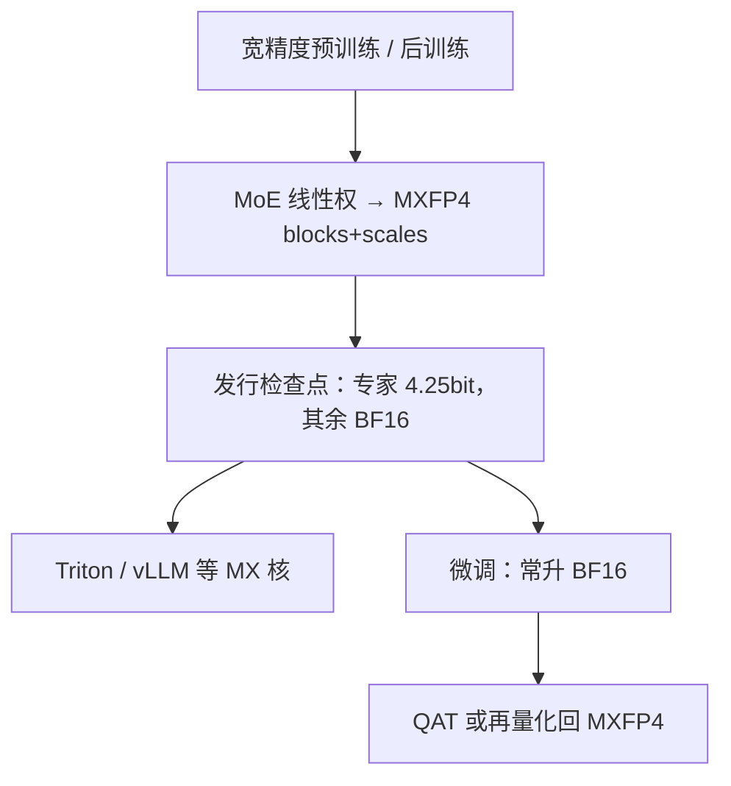

# 原生 MXFP4 预训练权重

    
「原生 MXFP4」在开权发行里首先指检查点怎么存：MoE 线性权拆成 blocks + scales，评测也在这套格子上跑；它不等于公开了从零 MXFP4 预训练的完整配方。

    <footer>—— OpenAI，Introducing gpt-oss；gpt-oss 仓库 Precision format；OCP MX v1.0</footer>

[MXFP4 微缩放](/llm/mxfp4-microscale) 把 32 个 E2M1 元素绑到一个 E8M0 块尺度上，约 4.25 bit/值。[gpt-oss-120B](/llm/gpt-oss-120b) 把这套格式写进开权发行：Hugging Face 上的权重「natively quantized in MXFP4」，120b 档目标是单张 80GB GPU。产品语言里的 **native** 容易被读成「预训练从头到尾都在 MXFP4 Tensor Core 上做」。对照官方仓库的精确句，MoE 线性投影是 **post-trained** 成 MXFP4 的；其余张量仍是 BF16，激活也建议 BF16。本篇写这套「发行即 MXFP4」的合同、它和从零 4-bit 预训练论文的差别，以及为什么不能把 NVFP4 预训练表抄到 MXFP4 头上。

## 问题

4-bit 有三条完全不同的故事。第一条是 **PTQ**：BF16/FP8 训完，再校准成 INT4 / MXFP4，服务引擎反量化。第二条是 **发行格式 native**：训练或后训练的最后阶段就把权重量化进目标格子，下载即用，评测声明与检查点同格式。第三条是 **从零窄精度预训练**：前向、反向的 GEMM 都走微缩放 MMA，要随机 Hadamard、随机舍入、保留若干高精度层。把三条都叫「原生 4-bit」，检查点、峰值、掉点原因会对不上。

gpt-oss 选择第二条里偏 MoE 的子集：专家线性权走 MXFP4，注意力、路由、嵌入仍宽。官方介绍博文写：权重在 Hugging Face 上提供，且以 MXFP4 原生量化，使 120b 能进 80GB、20b 进约 16GB。模型卡与 GitHub 进一步收窄：MXFP4 作用于 MoE 层线性投影；`tensor.blocks` 存打包的 FP4（两枚 nibble 进一个 `uint8`），`tensor.scales` 存沿最后一维的块尺度。评测全部在同一套量化上做。问题从「能不能 4-bit 推理」变成「微调之后还能否回到同一发行格式」。

### Native 指检查点，不指全部计算图

「Native quantization support」在 gpt-oss README 里的意思是：加载器认识 `blocks`/`scales`，参考 Triton MoE 核能直接吃 MXFP4，不必先在 CPU 上展开成 BF16 再量化。这不是「注意力也是 MXFP4」，也不是「梯度是 MXFP4」。NVIDIA Model Optimizer 的 gpt-oss 示例写得更硬：直接在 MXFP4 上反传，动态范围可能不够；常见路径是升到 BF16 微调，再 QAT 或转换脚本回到 OpenAI 的 weight-only 布局。升 BF16 后体积大约四倍，单卡故事暂时消失。

OCP MXFP4：块 32、尺度 E8M0、元素 E2M1。NVFP4：块 16、尺度 E4M3、另可有张量级 FP32。Blackwell 两条 MMA 都可能存在。gpt-oss 公开绑定的是 MX 合同，不要写成 NVFP4 检查点。

## 方法

发行侧合同可以写成：对 MoE 权重张量 $W$，沿最后一维按 32 元素分块，每块一个尺度 $X=2^e$，元素 $P_i=Q_{\mathrm{E2M1}}(W_i/X)$，存储为 packed nibble + 尺度。反量化 $W_i=X P_i$。矩阵乘时，合规实现应把尺度当点积元数据；只把权重量化、激活仍 BF16、计算升回 BF16，得到的是容量，不一定是 MX 点积峰值。gpt-oss 明确建议激活用 BF16，所以开权默认更接近 **W4A16 微缩放权重**，不是 W4A4 训练。

从零 MXFP4 预训练是另一篇文献。NVIDIA *Pretraining Large Language Models with NVFP4*（arXiv:2509.25149）在 Blackwell 上对比 NVFP4 与 MXFP4：12B 级模型、10T token 的公开长程实验，主结果写在 **NVFP4** 上，并保留约 15% 的末段块为 BF16；文中说明 MXFP4 的幂次尺度与块 32 使训练更难，NVFP4 的 E4M3 尺度与块 16 更稳。那是 NV 格式的可行性证据，**不能**改写成「公开了 MXFP4 从零训 12B@10T 且无损」。Rouhani 等 MX 白皮书支持 4-bit **权重**训练小幅掉点，并不等于大模型全线性层 MXFP4 预训练已有可复现配方。

### 微调与再打包

官方转换习惯把专家权转置后再按块量化，`quantization_config.quant_method = mxfp4`，并列出不转换模块：注意力、router、embed、lm_head。漏转置或把尺度轴弄错，数值会静默偏。QAT 之后若只存 BF16，服务引擎按 MX 路径加载会失败。社区把「训的时候就是 MXFP4」写成卖点，和仓库「post-trained with MXFP4 quantization」不是同一句话；写系统文档时并列两者，让读者自己选信哪一层——本篇以仓库与模型卡的精确措辞为准。

## 机制

微缩放权重能当发行格式，是因为 MoE 专家占参数主体（gpt-oss 卡片量级上专家权约九成），把这一坨打到 4.25 bit，总检查点才能进 80GB。注意力与路由对质量更敏感，留在 BF16，避免把异常通道和路由 logits 推进 E2M1 的 $\pm 6$ 格子。评测绑在量化后权重上，等于承认：**官方分数不承诺 BF16 展开后再量化能复现**。这与 GPTQ 事后校准不同：那里「满精度检查点」才是源，4-bit 是导出；这里源就是 MX 打包。

从零 4-bit 预训练要额外对付梯度偏置与块间离群值：随机 Hadamard 打散尖峰、随机舍入、前后向二维块尺度一致、敏感层留宽。NVFP4 论文把这些写成方法组件，并报告相对 FP8 基线验证损失相对误差约 1% 量级、MMLU-Pro 62.58% 对 62.62%。那是 NVFP4 方法的结果。MXFP4 若直接套同一配方，块更大、尺度无尾数，离群值更容易绑死整块——论文把这一点当作改用 NVFP4 的动机，而不是当作 MX 已经打平的证据。

「原生」在硬件上还指 MMA 是否直接吃 MX 块。Hopper 上常见路径是权重量化、计算升精度；Blackwell / 部分 AMD 路径才有 MXFP4 点积。只改 dtype、不换核，是存储压缩，不是训练峰值。

## 边界与工程取舍

### 可互换编码仍要核对轴与打包

OCP 规定块沿连续 32 元素；gpt-oss 写明尺度沿张量最后一维。导出脚本若先转置专家权再分块，加载端必须用同一布局。两枚 FP4 打进一个 `uint8` 的端序也不能错。只实现「每组 INT4 + 零点」的引擎，即使用 32 分组，也不是 MX：格子、尺度格式、有无零点全不同。跨 AMD MX 与 NVIDIA MX 的可互换单位是 OCP 块，不是某家自定义 wrapper。

不要把 gpt-oss 的 MXFP4 写成全模型 4-bit，也不要写成已公开的 MXFP4 从头预训练配方。不要把 NVFP4 12B@10T 的表贴到 MXFP4 检查点上。服务引擎必须实现 OCP 块语义；只实现 INT4 GPTQ 的后端不能靠改扩展名加载。微调后若未写回 `blocks`/`scales`，显存规划会按 BF16 翻四倍。跨厂商互换的是 OCP 编码，不是「任意 4-bit 权重」。

与 [NVFP4 Tensor Core 路径](/llm/nvfp4-tc) 的分工：那边写块 16 的 MMA 合同，这里写开权发行里 MX 权重到底覆盖哪些张量。出处：OpenAI *Introducing gpt-oss*；*gpt-oss-120b & gpt-oss-20b Model Card*，arXiv:2508.10925；GitHub `openai/gpt-oss` Precision format；OCP MX v1.0。NVFP4 预训练对照 arXiv:2509.25149，勿回写进 gpt-oss 卡片。

社区文章常写「these models were trained with native MXFP4」。对照官方：博文说 *come natively quantized*，仓库说 *post-trained with MXFP4 quantization of the MoE weights*。本篇采用后者作为训练阶段的可引用句，前者作为发行格式句。

## 小结

- 开权场景里「原生 MXFP4 权重」首先是检查点布局：MoE 线性权 `blocks` + `scales`，约 4.25 bit/参，评测同格式。
- gpt-oss 公开句是后训练量化专家权，不是已公开的全图 MXFP4 从零预训练。
- 注意力与激活仍按宽精度；微调常升 BF16，再 QAT 才能回到发行格子。
- NVFP4 长程预训练是另一格式、另一篇报告，不能冒充 MXFP4 原生预训练。
- 出处：上述 OpenAI 博文、模型卡与 OCP 规范。不编未公开参数配方。
