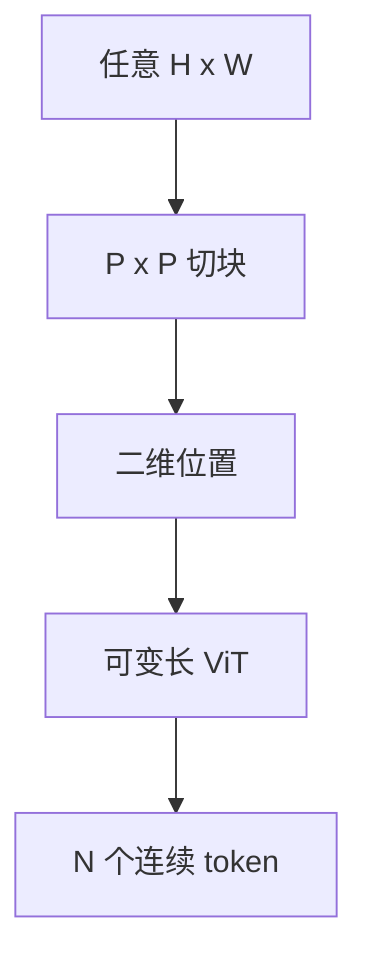

# 原生分辨率 ViT

把任意高宽的图 squish 到 224 方形，表格与路牌先死在编码器里。位置编码与切块必须承认二维可变网格。

<footer>—— Dehghani 等 NaViT；动态分辨率实践见 [Qwen2-VL](/llm/qwen-vl-naive-dynamic-res) 与 [AnyRes](/llm/anyres)</footer>

[上一课](/llm/continuous-vs-discrete-vision-tokens)选定理解侧走连续 patch。主干 ViT 课已写固定边长的位置嵌入。本课写原生分辨率：可变 $H,W$，token 数随图变。缺口是画布假设。后课 2D RoPE 提供位置编码的一种实现。

## 问题

分类 ViT 假设固定 $N$。VLM 要读文档、屏幕、非方形照片。强制 resize 破坏长宽比；padding 浪费上下文。AnyRes 把图切成多块分别过固定 ViT，再拼接——分辨率来自拼块，位置关系要另编码。NaViT 在同一 ViT 里对可变序列做打包训练，补位与掩码处理不同 $N$。Qwen2-VL 一类动态分辨率把原生切块 + 二维位置做成产品默认。

token 税：$N\approx HW/P^2$ 直接占 LLM 上下文，必须与[视觉 token 压缩](/llm/vision-token-compression)一起预算。

原生分辨率不是无限分辨率。仍有上限 $N_{\max}$，超大图要切页或降采样，只是不再强行方形。

## 方法

实现清单：可变长注意力掩码；二维位置（下一课）；打包多个不同分辨率图进同一批（NaViT 的效率点）；与 LLM 的接口声明最大视觉 token。评测用文档 OCR、截图、非方形图，不用只 squish 过的 ImageNet。

## 机制

固定位置嵌入把第 $i$ 个 token 当成「224 画布上的第 $i$ 格」。分辨率一变，格的物理意义变了，插值只是权宜。原生网格让格子对应真实 patch 坐标，注意力才能学到「右上角表头」。打包训练迫使模型在不同 $N$ 上共享权重，避免只在 224 上过拟合。

## 边界

可变 $N$ 让 KV 缓存与编译形状变难，服务要动态分桶。下一课把二维相对位置写成 RoPE 的推广。

## 小结

- 原生分辨率保留长宽比与表格结构，token 数随图变。
- 必须配二维位置与可变长掩码；有 $N_{\max}$。
- 用文档与截图评测，不用 squish 分类榜。
- 出处：Dehghani 等 NaViT；AnyRes；Qwen2-VL 动态分辨率。
