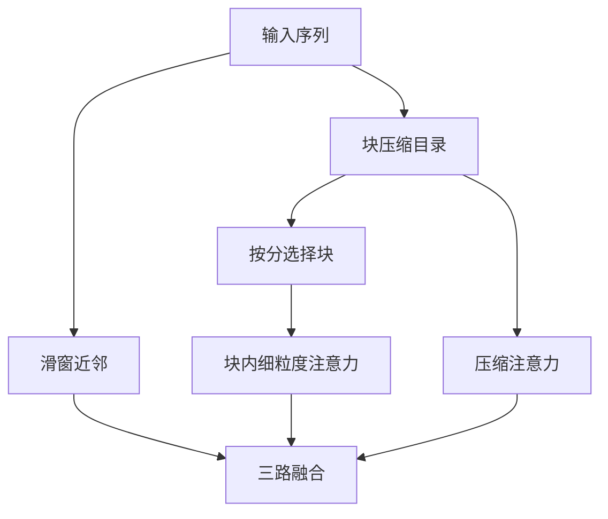

# Native Sparse Attention

稀疏不该只是推理时再打上去的核；压缩、选择与滑窗三条路要在训练里一起学会，才能又对齐硬件、又保住长程。

<footer>—— DeepSeek, Native Sparse Attention, 2025</footer>

前面几片叶子给出的稀疏，要么是训练期固定的图（滑窗、Longformer、BigBird），要么是推理期的补丁（汇点加窗、事后稀疏核）。DeepSeek 2025 年的 Native Sparse Attention（NSA）把稀疏写成训练期就存在的三路注意力：对连续块做 token 压缩、按重要性做块选择、再用滑窗保住近邻。模型从一开始就在这三路上学习，而不是先训满注意力再在服务时改图。本篇只讲这条原生稀疏，对比固定模式见 [稀疏模式](/llm/sparse-attention-patterns)，对比推理淘汰见 [Attention Sink](/llm/attention-sink)。

## 问题

长上下文的矛盾是：softmax 要精确对准任意过去键，硬件却喜欢连续、规则的块。随机稀疏与不规则 top-$k$ 在纸面上边数很少，gather 却把 Tensor Core 打散，实际延迟接近稠密。固定滑窗对硬件友好，但训练从未学习「这一层该看哪一块远历史」，远距离只能碰运气。事后稀疏（解码时按分数丢 KV）与训练分布不一致，质量要另付。

NSA 的问题提法因此有两个约束同时成立：前向在训练和推理是同一张稀疏图族；这张图必须按块对齐，使选中的键在显存里连续。目标不是发明更稀的理论模式，而是让稀疏可训、可融核、可进大规模解码器。

## 方法

### 压缩支路

序列按块长 $\ell$ 切开，每块用可学习映射（池化加 MLP 一类）收成一个代表 token。注意力在 $n/\ell$ 个代表上做，复杂度随块数线性，给出粗粒度的全文概貌。压缩不是不可微的硬下采样：代表参与训练，梯度回到块内 token，模型学会「一块里什么值得留下」。这一路解决「必须先知道远处有没有东西」，但不要求看清块内每一个字。

压缩支路像先看目录再决定翻哪一页。目录本身要可学习，否则选择支路的分数没有意义。它与 MLA 的潜向量压缩不同：MLA 压的是头维/秩，NSA 压的是序列维的块。

### 选择支路

有了块级分数，就可以选 top 块，再把选中块展开回原始 token，在这些连续段上做细粒度 softmax。按块选而不是按 token 选，是硬件对齐的关键：一次载入整块 KV，避免零碎下标。训练期必须让选择可反传——用块分数的 softmax 软选择、或直通估计，使「选哪一块」成为网络的一部分，而不是推理启发式。于是模型见到的远距离证据分布，与上线时一致。

可见集大小由「选中块数 × 块长」封顶，与 $n$ 解耦。$n$ 变长时，压缩支路仍扫全部块目录，选择支路的细算量保持配额。这与 BigBird 随机块不同：哪些块进细算由内容决定，不是抽签。选择器若在训练后期只点最近几块，压缩目录会变成摆设。应在验证里单独报「远块选中率」。这个指标掉零，长程支路就已经死了，不必等到针测全军覆没才回头加辅助损失。

### 滑窗支路与三路融合

第三路是普通因果滑窗，保证近邻句法不依赖选择是否命中。当前句、括号、刚刚的变量名走这一路，稳定且对硬件最友好。三路输出再融合——相加、门控或拼接后投影。训练同时更新压缩器、选择器与局部注意力，避免某一路塌缩：若选择器永远选最近块，模型会退化成滑窗，长程评测会揭穿。

形式上周可写成

$$
y_t = g_c\, y_t^{\mathrm{cmp}} + g_s\, y_t^{\mathrm{sel}} + g_w\, y_t^{\mathrm{win}}
$$

门控 $g$ 可学习。实现细节以 DeepSeek 2025 年论文为准；工程上要盯住的是：三路都在训练图里，推理不得拆掉压缩或选择只留滑窗。

## 机制

NSA 把「看哪里」从掩码超参提升为网络计算。压缩注意力的 logit 提供块重要性，选择支路把它变成离散配额下的硬注意力，滑窗提供先验局部边。softmax 的尖峰能力被保留在选中块与窗口内，因此拷贝与针测仍可能，这是相对线性核的优势。相对固定稀疏图，边集随内容变，同一位置在不同文档里会连到不同远块。

硬件机制是块连续性。选中的下标是一段段 $[\ell i,\ell i+\ell)$，加载模式接近密注意力的 tile，只是 tile 集合稀疏。这比膨胀的跨步加载、BigBird 的随机 gather 更接近现有 Flash 内核的假设。训练–推理一致则消除了 StreamingLLM 要补的那类分布缝：没有「训练看见文首、推理丢掉文首」的突变；若文首重要，选择器应学会把它选回来，而不是靠汇点补丁——汇点仍可额外保留，但不再是唯一长程通道。

## 边界与工程取舍

选择是离散的，配额用尽时会漏块。块太大，细粒度对准变差；块太小，又回到不规则 top-$k$。块长必须与内核 tile、页式 KV 的页大小一起选。门控若塌缩，需要辅助损失鼓励选择器使用远块，类似 MoE 的负载均衡，否则长程支路死亡。预训练要从 NSA 图开训，或尽早切入；满注意力训完再「换成 NSA 核」正是论文要避免的后加稀疏。

不要把 NSA 理解成 Mistral 滑窗的升级补丁，也不要理解成 Longformer 的随机边可学习版。它是三条可训支路的总和，缺一路就回到旧方法。部署上，压缩目录本身随 $n$ 涨，极端长度仍要考虑对目录再分级；论文主场是把训练期稀疏做成一等架构，而不是声称任意无限上下文。后加稀疏核可以在基准上刷延迟，一旦选择与训练不一致，掉的是长程任务而不是短上下文损失。NSA 把这笔账提前到训练，贵在算力，省在上线后的意外。

## 小结

- NSA 是 DeepSeek 2025 年的原生稀疏注意力：训练期同时走压缩、选择、滑窗三路。
- 压缩给块级目录，选择按块展开细算以对齐硬件，滑窗保住局部。
- 与推理后加稀疏核、固定 Longformer 图、线性核都不是同一件事。
- 尖峰 softmax 留在窗口与选中块内，故仍针对精确长程，而不是平滑汇总。
- 块长、选择配额与门控均衡是主要超参；离散选择会漏块。
- 必须从训练图就稀疏，上线不得拆成「只跑滑窗」。
- 出处：DeepSeek, *Native Sparse Attention: Hardware-Aligned and Natively Trainable Sparse Attention*, 2025；对照 Beltagy Longformer, 2020；Xiao et al. StreamingLLM, 2023；Mistral 滑窗, 2023。
