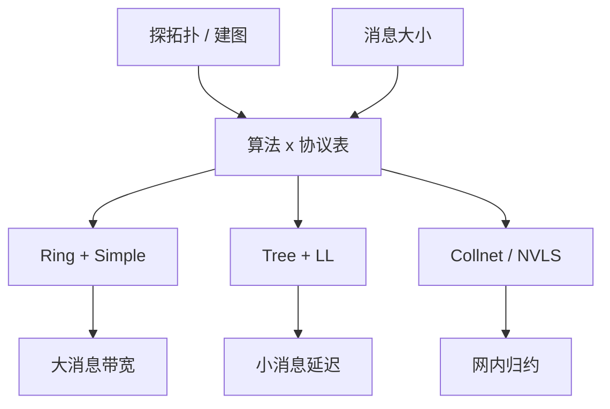

# NCCL 算法选择

NCCL 不是「一种 All-Reduce」，而是一张按消息大小、拓扑和协议探出来的决策表。同一调用，8 卡 NVLink 走环，跨节点可能走树，再大的消息又切回环。

<footer>—— NVIDIA NCCL 文档中的算法与协议（Simple / LL / LL128）说明</footer>

前三课分别写了环/树、[reduce-scatter 与 all-gather](/llm/reduce-scatter-allgather)、[all-to-all](/llm/all-to-all-impl)。本课把选择权交回库：训练代码几乎只写一条 `all_reduce`，真正跑哪张图由 NCCL 在初始化时探拓扑、在每次调用按 size 挑算法与协议。缺口是 **决策表里有哪些旋钮、何时不该让它自动**。[预训练通信](/llm/pretrain-comm) 讲过必须让密通信落在 [NVLink](/llm/nvlink) 域；本课讲域内之后，库还要在 Ring、Tree、Collnet、NVLS 之间再选一层。

## 问题

自动选择的输入是：进程组大小、NVLink / PCIe / 网卡可达性、NIC 是否支持 GPU Direct、消息字节数、以及若干环境变量覆盖。输出是一对「算法 × 协议」。算法决定调度图（环、树、网内、NVLink SHARP）；协议决定如何切 chunk、是否走低延迟路径（LL / LL128）还是吞吐路径（Simple）。选错的典型症状不是挂死，而是 busbw 只有规格的零头：大梯度走了 LL，或小同步走了 Simple 环。

用户看不见决策时，会把并行网格的锅甩给网卡。真正的问题是：默认表为「通用训练」调，服务侧短 All-Reduce、或不对称拓扑、或多进程组叠在同一套 NIC 上，默认经常是错的。缺口是读懂表，而不是再实现一个环。

`NCCL_ALGO`、`NCCL_PROTO`、`NCCL_MIN_NCHANNELS` 一类变量能锁死选择。锁之前先用 `NCCL_DEBUG=INFO` 看它选了什么，再用 `nccl-tests` 扫一条 size 曲线。没有曲线的环境变量调优是猜测。

## 方法

按公开文档能写进课的几条经验（数字以你集群上的微基准为准，不把某一版 NCCL 的阈值抄成定律）：

1. 节点内、中大消息、NVLink 对称：Ring + Simple，吃带宽。
2. 小消息、延迟敏感（层内 TP、短控制同步）：Tree 或 LL/LL128，少 $\alpha$。
3. 跨节点大 All-Reduce：层次化 Tree 或 Collnet（有 SHARP 时），减少跨节点体积。
4. 有 NVLink SHARP / NVLS 的域：中等消息的 All-Reduce 可能走网内归约，GPU 少做本地加。
5. All-to-All 与 All-Gather 的表与 All-Reduce 不同，不要共用一套 `NCCL_ALGO`。

拓扑探测失败时，决策表会退到 PCIe 或网卡。P2P 被关、NUMA 绑错、MIG 切片之间强行组集体，都会让「本应 NVLink 的环」降级。先修 [NVLink](/llm/nvlink) 拓扑，再谈算法名。

通道数（channels / CTAs）把一条集体切成多条并行流水。加通道能提高大消息吞吐，也增加 SM 占用，可能和计算核抢资源。重叠通信时，通道过多会把计算流饿死——这是调优课的对象，本课只要求：算法选择与通道数是两套旋钮，不要只拧一个。

## 机制

协议的差别主要在延迟与带宽的折中。LL 路径用更紧的同步与更小的粒度换 $\alpha$，天花板低于 Simple；Simple 用大 chunk 打满链路，启动更贵。同一算法换协议，busbw–size 曲线的拐点会移动。这就是为何「锁死 Ring」仍可能很慢——你锁的是图，不是协议。

网内归约改变的是计算位置：加法在交换机或 NVSwitch 侧完成，减少 GPU 之间的来回。语义仍是 All-Reduce；数值归约顺序变了，BF16 和可能与纯环不同。没有该硬件时强行 Collnet，库会回退或报错，不要在规划里把 SHARP 加速写成一定存在。

多进程组（TP 一组、DP 一组、EP 一组）会并发集体。NCCL 的默认表按单组微基准来，并发时网卡与 NVLink 被多组切开，有效算法可能不再是单组最优。生产要以真实网格的 step 剖析为准。

## 边界与工程取舍

不要在每次迭代改 `NCCL_ALGO`。不要把某一代 DGX 上扫出来的表抄到以太网集群。RCCL 与 NCCL 名字像，决策表不是同一份——AMD 课再写。TPU 的 mesh 通信不走这张表。

覆盖变量是排障工具，不是默认配方。升级 NCCL 版本后表会变，要把微基准纳入发布检查。自定义 allreduce 只适合服务侧固定短消息；训练梯度同步继续交给库，除非你测过自己的环在该拓扑上稳定赢。

## 小结

- NCCL 按拓扑与消息大小选择算法和协议；All-Reduce / All-Gather / All-to-All 各有表。
- 大消息环+吞吐协议，小消息树+低延迟协议；有网内归约再考虑 Collnet / NVLS。
- 先保证 NVLink 域与 P2P，再读算法名；降级路径会让任何算法都慢。
- 环境变量覆盖必须配 size 曲线；多进程组要以真实网格重测。
- 出处：NCCL 公开文档中的算法与协议；微基准用 nccl-tests。
