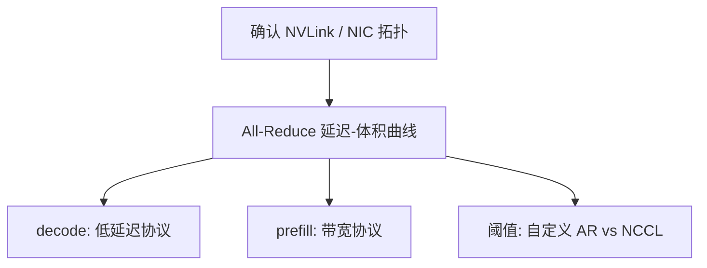

# NCCL 调优

集合通信库按拓扑选环或树、按体积切块；推理的小消息若仍走训练默认，启动开销会把 TP 的短 All-Reduce 变成逐步主项。

<footer>—— NVIDIA NCCL 用户指南中的算法、协议与拓扑探测；训练侧大块梯度与推理短激活要分开调</footer>

[上一课](/llm/tp-comm-overlap)假设通信原语已经够快，才谈得上重叠。本课写仍走 NCCL 时的旋钮：算法（Ring/Tree）、协议（LL/LL128/Simple）、通道数、缓冲。自定义 AR 覆盖不了的跨节点、大 prefill、以及 MoE 的 all-to-all，还得靠 NCCL。后课 MoE 批处理会再碰到 all-to-all；这里先把稠密 TP 的 All-Reduce 调完。不把环形算法的推导再写一遍，那是下一课程「通信与集群」的主干。

## 问题

NCCL 默认面向训练：大块、延迟可被计算藏住。推理 decode 的 All-Reduce 体积小、频率等于层数×token。默认 Simple 协议带宽好、延迟差；LL 协议延迟好、大块带宽差。缺口是按消息体积分派协议，并固定拓扑探测结果，避免每次建组都重新扫 NVLink。`NCCL_P2P_LEVEL`、`NCCL_IB_DISABLE`、网卡绑定在多节点上决定你以为的 NVLink 域是否其实绕了 PCI 或 NIC。

错误 NUMA / GPU-NIC 亲和会让「调了 LL 仍然慢」。先确认拓扑，再改算法字符串。

CUDA Graph 与 NCCL 的兼容随版本变：捕获期间禁止的操作、是否支持用户缓冲，要以当前 NCCL 文档为准，不要抄两年前进程的环境变量表。

## 方法

对目标消息大小做微基准：All-Reduce 延迟 vs bytes。decode 点落在延迟平台，应试 LL/LL128；prefill 点落在带宽斜坡，用 Simple。通道数过多会把小消息切得更碎。固定 `NCCL_ALGO` / `NCCL_PROTO` 做 A/B，但只在已验证拓扑上。与自定义 AR 分派：体积小于阈值走自定义，否则 NCCL——阈值由这张微基准定，不要写死 1MB 当宇宙常数。

环境变量在进程启动时读。与[内核自动调优](/llm/kernel-autotuning)一样，按 SKU 与节点形状存一份已知好的配置，不要每容器靠默认。

## 机制

Ring 的延迟随 rank 数线性，Tree 的延迟随层数对数；小规模 NVLink 域两者都可能被启动开销淹没。调优改的是常数项与切块，不改集合通信的渐近。重叠课要求通信走单独流：NCCL 默认流与计算流的同步点要显式，否则调了协议也看不到重叠。

## 边界与工程取舍

不要在生产用 `NCCL_DEBUG=INFO` 常开。不要把单机 TP=8 的配置拷到跨节点 TP=8。安全：环境变量属于部署契约，应进版本控制。下一课：MoE 推理里专家 token 的批怎么凑。

出处：NVIDIA NCCL 文档。算法课序见后续 Ring/Tree 专文。不发明 arXiv。

## 小结

- decode 小 All-Reduce 要低延迟协议；大块用带宽协议。
- 先拓扑与亲和，再改 `ALGO`/`PROTO`。
- 用延迟-体积曲线定自定义 AR 的阈值。
- CUDA Graph 兼容性随 NCCL 版本变。
- 配置按 SKU 固化，不要靠默认。
- 下一课：MoE 推理批处理。
- 出处：NVIDIA NCCL 用户指南。
