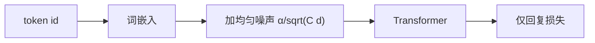

# NEFTune

指令集又短又容易背；在嵌入上加一点与长度、维度成比例的噪声，完成质量可以涨，而无需改损失或换表。

<footer>—— Jain 等，NEFTune: Noisy Embeddings Improve Instruction Finetuning，ICLR 2024</footer>

[打包与掩码](/llm/sft-packing-mask)把短指令的硬件浪费收掉之后，剩下的病是**背诵**：[谱系](/llm/instruction-data-lineage)里无论 FLAN 网格还是 Alpaca 5 万条，相对预训练都极小，全参或 [LoRA](/llm/lora) 都能把示范 n-gram 写入权重。[仅回复损失](/llm/response-only-loss)只决定背的是回答而不是问题，不阻止背。Jain、Zhang、Kaddour 等人的 NEFTune 在训练时对输入嵌入加均匀噪声，推理不加。本课写这一种正则，不谈学习率分叉（[下一课](/llm/lora-vs-full-lr)）。

## 问题

SFT 过拟合的表面是训练回复 NLL 下降、开放生成变刻板：固定开头、固定列表、固定客套。Dropout 在残差流上对指令这种短序列往往过猛或不够；权重衰减与预训练范数打架，[全参配方](/llm/full-sft-hparams)已经建议减弱它。需要一种专门针对「嵌入空间里的精确记忆」的扰动：同一条指令每次前向看到的是附近的点，而不是同一向量序列。

噪声太大，条件被毁，模型学不会[模板](/llm/chat-template)边界；太小，等于没加。尺度必须随序列长度与嵌入维变化，否则 512 维与 4096 维、短指令与打包长包不能共用一个 $\alpha$。

### 噪声加在嵌入，不加在权重

在 $W$ 上加噪接近权重衰减的表亲；在激活深处加噪干扰已对齐的特征。NEFTune 选择词嵌入输出：token 身份仍在（离散 id 未变），连续表示被推离训练集上的精确点。这与对抗训练不同：没有攻击者、没有内循环，只是均匀块噪声。

论文在 LLaMA 与若干指令集上报告对话评分上升，并强调推理时噪声为零，部署与基座相同。它不是数据增强生成新指令，而是同一样本的嵌入抖动。

## 方法

设嵌入矩阵查出的向量为 $X\in\mathbb{R}^{B\times C\times d}$（$C$ 为序列长度）。训练时

$$
X\leftarrow X+\frac{\alpha}{\sqrt{Cd}}\,\epsilon,\qquad \epsilon\sim\mathrm{Unif}(-1,1).
$$

$\alpha$ 是唯一主超参，原文常用 5 量级，需按模型宽度重扫。噪声在 embedding 之后、进入第一层 Transformer 之前注入；[仅回复](/llm/response-only-loss)的 labels 不变——抖动的是条件与目标共享的表示，不是改哪些位置计损失。推理与评测关掉噪声，否则与训练分布又错位一层。

与打包兼容：公式里的 $C$ 应是**本序列有效长度**还是窗口 $L$，要固定一种。用窗口 $L$ 则短包噪声偏小；用有效长度则不同包尺度不同。实现应写死，并在打开 packing 后重扫 $\alpha$。

NEFTune 不替代配比与过滤。脏 ShareGPT 加噪声，只是把背诵变成背嘈杂版；干净千条（[LIMA](/llm/lima)）上它才更像正则而不是遮丑。

## 机制

嵌入噪声使同一指令的前缀表示在球面上小幅游走。注意力看到的键值不再能用「精确匹配训练集前缀」检索出背好的续写，被迫使用更粗的指令语义。这与 dropout 随机切单元不同：所有维度仍在，只是平移。均匀分布各向同性，不偏向某类 token；特殊标记也会被推离，所以 $\alpha$ 过大时角色边界先坏——表现为[模板](/llm/chat-template)像坏了，其实是噪声淹没了分隔向量。

对 [LoRA](/llm/lora)，噪声在冻结基座的嵌入上（若嵌入未挂适配器）仍然有效：适配器看到的是抖动后的残差流。若 LoRA 也打在 embedding，噪声与低秩更新叠加，更要保守 $\alpha$。

NEFTune 不声称改进事实正确性。评分上升可以来自更少的模板化空话。知识类基准不是它的主指标；主指标是开放生成的多样与人评。

## 边界与工程取舍

领域适配、继续预训练、满文档语言建模上，嵌入噪声可能伤害已经稀缺的术语精确匹配，本课不外推到那些设定。RL 与偏好阶段通常也不加：奖励模型对抖动前缀的分数会漂。多模态里视觉 token 的「嵌入」尺度与文本不同，不能抄 $\sqrt{Cd}$。

$\alpha$ 与学习率耦合。大学习率已经在破坏特征时，再加噪声会加速崩溃。应先按[全参或 LoRA 的学习率](/llm/lora-vs-full-lr)站稳，再打开 NEFTune。它是正则旋钮，不是数据谱系的替代。

## 小结

- NEFTune 在 SFT 训练时对词嵌入加均匀噪声，推理关闭。
- 尺度为 $\alpha/\sqrt{Cd}$，使不同长度与宽度大致可比。
- 目标是减少对短指令集的精确背诵，改善开放完成。
- 过大 $\alpha$ 会淹没 chat 特殊 token，先表现为格式崩溃。
- 与 packing、LoRA 兼容，但 $C$ 的定义与 $\alpha$ 需重扫。
- 出处：Jain 等，NEFTune，ICLR 2024。
