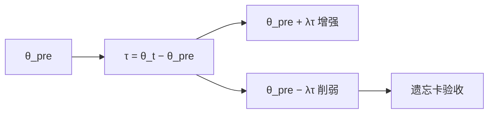

# 负任务向量

任务向量是微调后减去微调前的权重差；取负再加回去，等于在权重空间里沿适应方向退回，从而削弱该任务。

<footer>—— Ilharco 等，Editing Models with Task Arithmetic（ICLR 2023）</footer>

[遗忘的度量](/llm/forgetting-metrics)给了验收卡。本课用一种不碰 $D_f$ 文本做梯度上升的方法：Ilharco 等人的任务算术。设 $\theta_{\mathrm{pre}}$ 为起点，$\theta_t$ 为在任务 $t$ 上微调后的权重，任务向量 $\tau_t=\theta_t-\theta_{\mathrm{pre}}$。推理时 $\theta_{\mathrm{pre}}+\tau_t$ 增强任务；$\theta_{\mathrm{pre}}-\lambda\tau_t$ 削弱任务。课程「微调、编辑与遗忘」收到这里：适应是一条可加减的方向，负号即遗忘的几何。后课默认会把算术与 [LoRA 合并](/llm/lora-merge-conflict)、ROME 槽编辑区分开。

## 问题

你已经为任务 $t$ 付过一次 SFT（全参或可物化的[LoRA](/llm/lora)）。现在要减弱 $t$（过时技能、误加的风格、需去掉的能力），却不想维护 $D_f$ 做 RMU 或反向梯度。若适应近似沿一条直线，退回去应当削弱 $t$。问题：$\tau_t$ 与其它任务是否正交？$\lambda>1$ 会不会越过 $\theta_{\mathrm{pre}}$ 把通用能力也打负？多任务曾用 $\theta_{\mathrm{pre}}+\tau_1+\tau_2$ 相加，负号只是其中一项取负——冲突与合并课同源。

LLM 全参 $\tau$ 与模型同大，存一份差很贵。LoRA 的 $\tau$ 就是 $\gamma BA$（相对挂载前），负任务向量 = 减去该适配器，几乎免费。若知识在 $\theta_{\mathrm{pre}}$ 里而不在 $\tau$ 里，取负无效：只能削弱「这次微调新增的」，不能削弱预训练先验。这与[遗忘课](/llm/machine-unlearning)「LoRA 去不掉预训练知识」一致。

### 算术发生在权重空间，不是在梯度上再训

不做优化步。假设微调轨迹的弦 $\tau$ 近似有用方向。非线性网络里这是启发式；Ortiz-Jimenez 等人讨论在切空间里任务算术更干净，实践仍大量直接加减 $\theta$。

Ilharco 原文在 CLIP 与 T5 等模型上展示加技能、减技能、类比组合。解码器 LLM 上同样可做，但 λ 网格必须用遗忘卡，不能假设 λ=1 最优。

## 方法

保存 $\theta_{\mathrm{pre}}$ 与 $\theta_t$（或 LoRA 因子）。选 $\lambda$ 网格（如 0.3–1.5），构造 $\theta_{\mathrm{pre}}-\lambda\tau_t$，在[遗忘卡](/llm/forgetting-metrics)上测：任务 $t$ 探针下降、声明的 $D_r$ 效用、格式。[模板](/llm/chat-template)必须与训 $t$ 时一致，否则减的是错误条件。多任务：$\theta_{\mathrm{pre}}+\sum_i\sigma_i\lambda_i\tau_i$，其中 $\sigma_i\in\{+1,-1\}$。符号冲突用 TIES 一类修剪，或干脆不要把强负任务与强正相关任务加在同一张网上。

与 ROME 比：任务向量是全局稠密差，不定位槽，副作用按层散开。与 RMU 比：不需要领域语料前向，但必须有一次「正向微调」作为 $\tau$ 的定义；从未为危险能力专门微调过，就没有该能力的任务向量可减——减一个代理任务（如「回答 WMDP 风格题」的 SFT）只是近似。

## 机制

一阶看，$\theta_{\mathrm{pre}}+\tau_t$ 沿微调弦走到终点。负号沿弦反向。若损失在该方向上近似凸且其它任务的梯度与 $\tau_t$ 内积小，则 $t$ 弱化、其它任务少动。内积大时，负 $\tau_t$ 等于损坏共享特征，效用栏崩。这就是为何要正交性假设，以及为何[内在秩](/llm/lora-intrinsic-rank)低的适应更适合算术：$\tau$ 能量集中，比较像一条技能轴。

$\lambda>1$ 是外推：可能比 $\theta_{\mathrm{pre}}$ 更不会做 $t$，也可能离开预训练流形。必须靠效用栏截断。LoRA 负向量：$-\gamma BA$ 加回 $W_0$，与从未挂载等价当 $\lambda=1$；$\lambda\neq 1$ 是部分挂载或过校正。

回放是数据空间的折中；负任务向量是权重空间的折中。可以先回放再算术，但难归因。默认选一种主方法。

## 边界与工程取舍

没有 $\theta_{\mathrm{pre}}$ 或不可物化的适配器，无法做本课。量化后再减，误差累积，应在合并精度上做算术再量化。安全上：负掉「拒答任务向量」会削弱对齐，符号要审查。本课程结束：SFT 工程决定数据与损失；PEFT 决定谁可训练；编辑与遗忘决定如何局部改写或沿任务轴退回。论文附录里的型号对比不插入这条主干。

## 小结

- 任务向量 $\tau_t=\theta_t-\theta_{\mathrm{pre}}$；加增强、减削弱。
- 只能削弱写在 $\tau_t$ 里的适应，不能减去预训练先验。
- $\lambda$ 必须用遗忘卡扫描；$\lambda>1$ 是外推。
- 多任务加减与 LoRA 合并同一类冲突。
- LoRA 上负向量几乎就是卸载或缩放卸载。
- 出处：Ilharco 等，Task Arithmetic，ICLR 2023；度量承接 TOFU / WMDP / 局部性评测。
