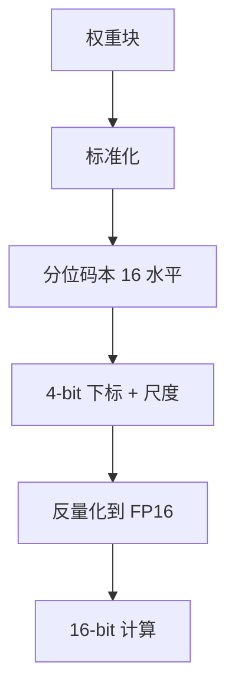

# NF4 与分位量化

正态权重的质量堆在零附近。把 16 个 4-bit 码字按标准正态的分位切开，每个箱子概率质量接近相等——这就是 NF4，不是又一种 INT4。

<footer>—— Dettmers 等，QLoRA；分位量化作为非均匀码本的实例</footer>

[混精](/llm/mixed-precision-search) 在均匀格子上分配 bit。本课换码本几何： **分位量化 / NF4**。[均匀 vs 非均匀](/llm/uniform-nonuniform-quant) 已立对立；[QLoRA](/llm/qlora) 主课写过训练期存储。缺口是课序里把 NF4 讲成量化基础的一环：它优化的是**冻结权重的存储**，查表反量化后仍在 16-bit 里算，和 [GPTQ](/llm/gptq) 的 INT 网格不是同一检查点。

## 问题

均匀 INT4 在高斯中心浪费间距、在尾部过粗。按 $\mathcal{N}(0,1)$ 的分位取 16 个水平，使 $P(c_i \lt  z \lt  c_{i+1})$ 近似相等，信息论上匹配「权重先标准化再量化」的假设。块内标准化（减均或只除标准差）把各块拉到同一张码本上，码本可固定、不学。

没有 INT4 Tensor Core 时，NF4 的墙钟收益主要是显存与加载带宽（若核真按 4-bit 存）。反量化成 FP16 再乘，算力墙场景不加速。问题是认清：**NF4 是存储码本，GPTQ 是整数网格加补偿**，不能互换文件。

NF4 名字强调 NormalFloat、4-bit。还有 FP4 等格式，语义不同。本课 NF4 特指 QLoRA 那张固定分位表。

## 方法

块长（如 64）标准化 → 映到 16 个分位水平 → 存 4-bit 下标 + 块尺度。双重量化再压尺度，见 QLoRA 主课。推理若继续当 QLoRA 基座，反量化约定必须一致。若目标是 INT4 GEMM 部署，应走 GPTQ/AWQ，而不是把 NF4 张量「当成 INT4」送进整数核。

与均匀分组：同样是 per-group 尺度，差别在组内码字是否等差。直方图更峰、更高斯，NF4 越占优；多峰、有硬饱和，分位表可能错位。

## 机制

等概率箱子 ≈ 最小化对给定分布的均匀码字浪费。假设错了（权重并非正态、块内离群未标准化掉），分位切在错误密度上，比均匀还差。块标准化是假设的一部分：块太大，块内方差不齐；块太小，尺度元数据反弹。

训练时冻结 $W_0$ 用 NF4 存、计算用 16-bit，LoRA 梯度不被 4-bit 算术淹没。部署若坚持这条路径，没有「INT4 加速」，只有容量。

## 边界与工程取舍

不要把 AutoGPTQ 的 INT4 与 bitsandbytes NF4 混加载。不要在对比加速器时把 NF4 算进「INT4 核吞吐」。不要对激活用 NF4——激活不是静态正态权重。下一课 FP8：硬件原生的另一种非均匀（指数格子），面向计算而非存储码本。

## 小结

- NF4：标准正态分位码本 + 块标准化，QLoRA 的存储格式。
- 计算仍在较高精度；与 GPTQ 均匀 INT 网格不互换。
- 假设权重近似高斯；假设失败时不如均匀。
- 无对应加载核则只省容量。
- 出处：Dettmers 等 QLoRA；分位量化与非均匀课的接口。
