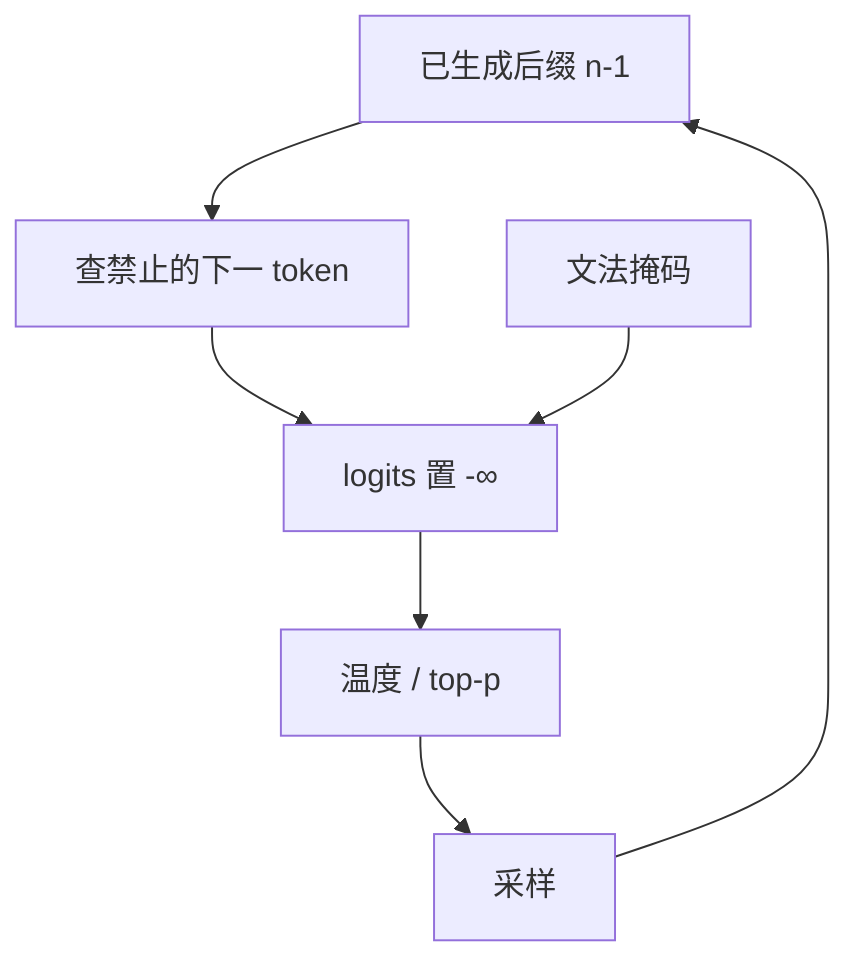

# n-gram 阻断

摘要模型喜欢把已经写过的短语再写一遍；解码时把已出现的 n-gram 从词表里抹掉，是最粗暴也最常用的重复闸门。

<footer>—— Paulus, Xiong & Socher, A Deep Reinforced Model for Abstractive Summarization, ICLR 2018</footer>

[上一课](/llm/context-aware-decoding)用对比把生成拉向证据，挡的是「不信上下文」。本课挡的是更浅的病：[退化](/llm/length-penalty-degeneration)里的局部循环。Paulus 等人在强化学习摘要里采用 *禁止重复 n-gram*：若某个续写会完成一个已在输出中出现过的 n 元组，则该 token 的 logit 置 $-\infty$。HuggingFace `no_repeat_ngram_size` 把同一闸门做成了默认旋钮。它不理解语义，只看表面字符串；后课的 logit bias 把闸门从硬零改成软偏置。

## 问题

核采样降低长尾崩盘，挡不住头部短循环：一旦「是的」成为高概率续写，下一步仍是「是的」。CAD 与 DoLa 在循环已经自洽时帮不上——对比两边都喜欢重复。需要一种与 $\pi$ 无关的硬约束：输出作为字符串，不得包含重复的 n-gram。缺口是逐步实现：约束定义在 *完成该 n-gram 的那个 token* 上，必须维护一个正在长出的 $(n-1)$ 后缀索引，而不是生成后再正则过滤。

$n$ 太小（2）会禁止合法叠词与英文里必要的功能词对；$n$ 太大（8）只挡住很长的复制，短循环仍在。摘要上 $n=3$ 是常见起点，不是定理。代码里重复的 `i++` 或相同调用是语法，阻断会把程序写坏。

阻断发生在采样之前，与文法掩码同类：支撑集变小。它与频率惩罚的差别是硬零 vs 减分。硬零不能回退，除非实现提供「若合法集为空则忽略阻断」。

## 方法

维护已生成 token 序列上所有长度为 $n-1$ 的后缀到「禁止的下一 token 集合」的映射。每步查当前 $(n-1)$ 后缀，把对应集合在 logits 上置 $-\infty$，再温度与 top-p。新 token 追加后更新映射。提示里的 n-gram 是否计入，是产品选择：摘要常阻断与 *源或已输出* 的重叠（避免抄源句），对话通常只阻断已输出，否则系统提示的套话会把回复的合法词封死。

与[约束解码](/llm/constrained-decoding)同时开时，最终支撑集是文法 ∩ 非重复 n-gram ∩ 核。交为空必须回退（放宽 $n$、忽略阻断、或贪心合法集），否则流式连接卡死。顺序应先文法、再阻断、再核：核若先切，可能把唯一不重复的合法 token 当尾巴丢掉。

## 机制

硬阻断把重复从「低概率」变成「不可能」，对已经塌进循环的贪心特别有效。它不修复 MAP 与效用的不对齐：模型会改写近义循环（「是的呀是的呀」），表面 n-gram 不重复，读者仍觉得退化。因此阻断是闸门，不是多样性算法；多样性仍靠[采样](/llm/sampling-temperature-topp)或 DBS。子词使「n-gram」的 n 不是词数：BPE 下三个 token 可能是一个英文词加半个词，阈值要对着分词器调，不能按空格词照搬论文里的 $n=3$。

流式输出时，阻断状态与 detokenize 无关：闸门在 token 空间。后课会写字符串空间的 UTF-8 边界；不要把二者合成一个状态机。

## 边界与工程取舍

工具调用、JSON、代码默认关阻断，或只在自然语言字段上开。多语言输出里，高 $n$ 的汉字可能一个 token 就是一个字，$n=3$ 已经很强。评测若在有阻断的设置上报告重复率下降，必须同时报任务质量：摘要 ROUGE 可能升、对话多样性指标也可能只是换了一种套话。不要把某一 Transformers 默认值写成科学常数。

出处：Paulus et al., ICLR 2018。See 等人的 pointer-generator 讨论过复制，但逐步 n-gram 禁令以强化学习摘要该文的解码技巧为常用引用。

## 小结

- n-gram 阻断在逐步把会完成已出现 n 元组的 token 置 $-\infty$。
- 挡的是表面短循环，不挡近义循环，也不提供语义多样。
- $n$ 相对子词定义；代码与 JSON 应关。
- 与文法、核的交集为空时必须回退。
- 提示是否计入阻断是产品契约，不是默认定理。
- 后课把硬零换成可调的 logit 偏置。
- 出处：Paulus, Xiong & Socher, ICLR 2018。
