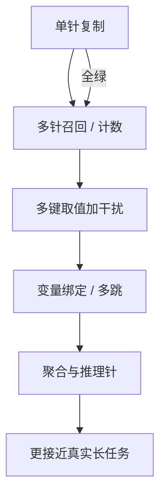

# Needle-in-haystack 变体

一根与草堆分布刻意不同的针、一句复述针的问，测到的是检索冒烟；把针变成多键、干扰项、要计算的事实或与正文同分布的句子，热力图才会开始接近产品失败。

<footer>—— 单针协议见 Liu 等人与后续热力图实践；多键与聚合变体被 RULER 收成可配置任务</footer>

标准 [NIAH](/llm/niah) 的实验极干净：草堆是一篇或一袋无关文本，针是一句独特陈述，问句几乎指向该句，答案是找回。全绿可以否定「该长度上检索通道坏死」，不能肯定「长上下文已可用」。变体要做的，就是系统地把标准协议删掉的那些难度加回去：针的数量、键的相似度、问的是检索还是运算、草堆与针是否同分布、提问是否泄漏句式。Hsieh 等人在 RULER 里把其中几支写成生成器；工程界还有 UUID 针、魔法数字针、多针计数、以及「读到针之后还要推理」的设定。本篇只写变体族怎么改命题，不重写单针热力图的基本读法。

## 问题

单针失败很响：中间全红，人人看得见。单针成功很静：它可能只说明模型会抓与问句 n-gram 重叠的那一行。产品里的「针」很少这么友善——政策文档里有多条相近条款，用户问的是聚合或例外，草堆是同一领域的行话而不是保罗·格雷厄姆散文。若评测停在友善针，优化会朝「让那一句的嵌入更尖」走，而不是朝「在相似键上做内容寻址」走。

变体评测的问题因此是设计空间，不是再画一张同样的图。每一个改动都在改任务的充分统计量：多针把「有没有一个峰值」改成「能不能列出集合」；近义干扰把点积竞争变窄；推理针把答案从复制改成计算。不声明改了哪一维，就说「我们的 NIAH 更难」，无法复现。

### 针的独特性是超参数，不是装饰

把针写成 `The magic number is 42` 插进随笔，问「magic number 是多少」，检索几乎是关键词匹配。把针写成与草堆同风格的普通事实，或把键改成 UUID、把值改成随机串，问句不再能靠主题词定位，才更接近「内容寻址是否还在」。评测规范必须冻结：针模板、键空间、草堆语料、是否允许问句复述针的用词。改模板造成的「更绿」不是能力。

Greg Kamradt 式公开演示用固定针句和可复述提问，适合做实现冒烟。把它写进模型卡当唯一长上下文证据，规格偏了。至少要加多针与干扰针。

## 方法

常见变体可以按改动的坐标分类。

**数量。** 多针：插入 $k$ 条事实，问其中一条、问全部、或问计数。漏一条在单针准确率里看不见，在集合召回里可见。**键结构。** 多键多值：草堆是许多 `key → value` 行，查询指定键；RULER 的 retrieval 任务把 $k$ 和干扰键数当成旋钮。**干扰。** 近义针、同主题假针、问句改写但不改指称。**运算。** 找回后还要做算术、比较、或「满足条件的针有哪些」。**草堆。** 重复噪声 token、网页、论文、代码、对话日志——重复结构会制造假汇点。**提问位置。** 问句在末尾是默认；问句在开头或中间会改变「查询是否还在最近的位置」。

$$
A(n,d,k,\rho)=\Pr\bigl[\mathrm{recover}(q;\mathrm{hay}(n)\oplus \mathrm{needles}_{k,\rho,d})\bigr]
$$

$k$ 是针数，$\rho$ 是干扰或相似度参数。标准 NIAH 是 $k=1$ 且 $\rho$ 极低的切片。报告变体时应画出 $A$ 对 $k$ 或 $\rho$ 的曲线，而不是只给一张 $k=1$ 热力图。

解码与判定同样要锁。UUID 值适合精确匹配；自然语言针需要允许同义改写，否则惩罚文风。计数题不要用「大致列出」的 LLM 法官当主指标，法官会把漏针评成「大体正确」。

### 从检索冒烟到绑定与聚合

一条有诊断价值的阶梯是：单针复制 → 多针全召回 → 多键取值（干扰键）→ 变量追踪（同一实体改名后仍绑定）→ 聚合（计数 / 最值）→ 推理针（针是条件，答案不是针句本身）。前两级仍是 NIAH 家族；后几级已经跨进 [RULER](/llm/longbench-ruler) 的任务定义。实验室可以在同一草堆生成器上实现整条阶梯，避免「NIAH 用小说、RULER 用另一套噪声」造成的不可比。

## 机制

单针成功主要依赖查询与针在注意力里的峰值。多针要求多个峰值都被读到，且输出阶段不要被第一个峰值截断——有的模型能「看见」却只报一条，失败在解码策略与「只答一个」的助手先验。多键干扰把峰值竞争从「针 vs 无关散文」变成「正确键 vs 相似键」，这才是内容寻址的压力测试：位置偏置之外，还有特征碰撞。

推理针改的是损失函数意义上的目标。训练时，模型习惯把问句附近的陈述抄回；若正确答案是针中两个数的差，抄回整句会在表面重叠上得高分、在任务上得零分。这类变体区分「检索通道在」和「检索之后仍会算」。它仍然不是完整的长文档推理——草堆依旧是填充——但已经不允许只靠复制。

### 草堆分布会改变汇点

用随机 token 当草堆，模型可能靠「非随机的那一句就是针」作弊，根本不需要理解问句。用高度重复的样板合同，注意力可能塌进页眉页脚。用代码时，标识符密度高，UUID 针反而更显眼。因此「换草堆」不是美化图表，是在换作弊通道。严肃的变体协议应至少固定一种与产品相近的草堆，并另报一种故意易作弊的对照（随机 token）：若对照远高于产品草堆，说明模型在用异常检测而不是检索。

问句复述针的用词，等于把针的键复制到序列末尾，lost-in-the-middle 会被掩盖——末尾查询已经带了针的词。变体里应保留「问句不泄漏针面」的一列。

## 边界与工程取舍

变体可以无限加难，直到变成另一项基准。加难的停止条件是诊断：每一维应对应一种你准备修的失败（分配、碰撞、解码截断、不会聚合）。把所有维同时随机化，分数降了也无法归因。网格费用随 $n\times d\times k\times\rho$ 涨，CI 里应只跑单针冒烟加一两个产品相关变体；完整网格留给发布。

判定自动化会偏待复制类、亏待改写类。若产品接受同义回答，就要公开判定脚本；若只接受精确值，就不要用散文针。多针列出的顺序、分隔符、是否允许嵌在解释里，都会改分，必须写进 verifier，而不是靠人工「看看说到了没」。

变体全绿仍不是 LongBench。真实文档有未标注的针、有冲突条款、有表和图。NIAH 家族再复杂，也是插入式探针。它的角色是把窗口实现和检索通道从真实任务里拆出来，见 [LongBench / RULER / ∞Bench](/llm/longbench-ruler)。

不要把多针计数的失败自动诊断成「上下文不够长」。有的模型在短窗口上就不会计数。应先在短草堆上跑同一 $k$，把「不会做这题」和「长了做不了」分开。

## 小结

- 标准单针 NIAH 是检索冒烟；独特性、针数、干扰、运算和草堆都是会改命题的超参数。
- 有诊断价值的阶梯从复制、多针、多键干扰走到绑定、聚合与推理针。
- 问句泄漏针面、随机 token 草堆、只报单针热力图，都会让结论偏乐观。
- 判定必须与答案类型匹配：UUID 精确匹配，散文要公开抽取规则。
- 变体网格用于归因，不能替代真实长任务评测。
- 出处：Liu et al., *Lost in the Middle*；Hsieh et al., *RULER* 中的多键与聚合检索设定；单针热力图实践。
