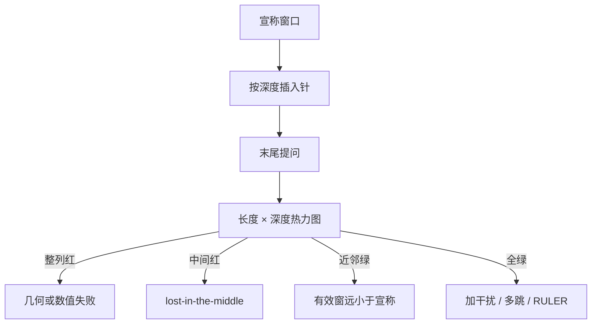

# 长上下文针测 NIAH

模型宣称能读两万 token，往往只保证掩码与位置下标还能算；把一句无关事实埋进长文再提问，中间位置的准确率会先塌。

<footer>—— Liu et al., Lost in the Middle: How Language Models Use Long Contexts</footer>

针与草堆（Needle-in-a-Haystack, NIAH）把长上下文能力收成一次可控的检索实验：在长度为 $n$ 的填充文本（草堆）的某个相对深度插入一条与上下文几乎无关的陈述（针），于序列末尾提问，看模型能否原样或等价地找回。Liu 等人的 *Lost in the Middle* 用多文档问答与键值检索表明：即便总长度仍在窗口内，相关段落被放在中间时，准确率显著低于放在开头或结尾——U 形曲线，而不是随深度平坦。后来的热力图把长度与深度做成二维网格，把这条曲线铺开成一张诊断图。本篇只写针测本身：它证明什么、证伪什么，以及为何全绿仍不能写成「长上下文已可用」。更宽的评测分层见 [位置外推评测](/llm/long-context-eval)。

## 问题

窗口配置、位置插值、能完成一次 $n$ 长前向，回答的都是「算不算得动」。用户要的是「中间那句约束还在不在」。这两件事在损失上可以脱钩：困惑度被大量局部 token 主导，中间那一个事实对平均损失几乎没贡献，却决定问答对不对。需要一个几乎不考推理、只考「指定位置的内容能否被查询选中」的探针，失败时才能把锅分给位置几何、注意力汇点或检索分配，而不是笼统说「长了就笨」。

Liu 等人指出的中间丢失，不是长度外推专属。窗口内、位置编码仍在训练支撑集时，相关文档被夹在许多无关文档中间，模型也更常去读开头与结尾。这说明问题首先是**使用**长上下文的方式，其次才是能不能把下标拉到 128k。NIAH 把「使用」变成可画的图：横轴总长度，纵轴针的相对位置，格子颜色是找回与否。

### 单针检索不是多跳推理

标准 NIAH 的针通常唯一、句式固定、与草堆分布刻意不同，提问还可能复述针的句式。这把任务压成：查询与针的键在点积上赢过所有填充。它几乎不要求变量绑定、计数、或沿实体链跳两跳。因此它是冒烟测试：红了，可以否定「该长度上检索通道可用」；绿了，只能肯定「至少这一类独特针找得到」。用 NIAH 全绿去签发长文档合同条款产品，规格写错了。

针的独特性是超参数。把针写成与草堆同分布的平凡事实，或在草堆里插入近义干扰句，热力图会立刻变脏。评测规范必须冻结针模板、草堆语料、提问模板和随机种子，否则「更绿」可能只是针更好找。

## 方法

一次试验由三元组 $(n, d, s)$ 描述：总长度 $n$，相对深度 $d\in[0,1]$（$0$ 为开头，$1$ 为结尾），随机种子 $s$ 决定草堆抽样。插入针后，在末尾问针的内容，二元对错得到 $A(n,d)$。热力图是 $A$ 在离散网格上的估计。协议要固定：分词后的 $n$ 而不是字符数；针是否计入 $n$；提问是否占用窗口尾部；解码是贪心还是短采样。

Liu 等人的多文档设定可以看成 NIAH 的近亲：若干文档中只有一篇含答案，打乱顺序改变答案文档的位置，画出准确率对位置的曲线。键值检索变体把针换成「键 $k$ 对应值 $v$」的表格行，进一步降低语义干扰、突出位置。两种都比「随机小说里藏一句魔法密码」更接近问答产品，也更难用句式匹配作弊。

$$
L_{\mathrm{retr}}(\tau)=\max\bigl\{n:\min_{d} A(n,d)\ge\tau\bigr\}
$$

若只看平均深度的准确率，中间塌、两端绿会被平均成「还行」。上式用最差深度定义可检索长度，才与 lost-in-the-middle 的命题一致。阈值 $\tau$ 要预先钉死。

### 失败型怎么从热力图读

超过训练长度立刻整列全红：更像位置几何或数值崩，而不是分配。只在最近邻绿：有效感受野是局部的，宣称窗口是假的。两端绿、中间红：Liu 曲线，汇点与首尾偏置。只有开头绿：像过度依赖 BOS / 系统提示汇点。全绿：检索冒烟通过，下一步应加多针、干扰针、或多跳，而不是停笔。

## 机制

因果注意力里，查询在最后，理论上可以读到任意合法键。实际分配被三件事扭曲。位置通道：RoPE 一类编码让距离进入点积，中间键相对末尾查询的相位可能既不如近邻「近」，又不如开头某些汇点「特殊」。内容通道：草堆若与针的词项重叠，针的优势被稀释；独特针则几乎只靠内容就能赢，这会让热力图虚绿。结构先验：预训练与对齐都见过「重要信息在开头或最近轮」，中间段落被当成可忽略的填充——Liu 的 U 形与这种先验一致。

### 变绿的修法对不上另一种失败

因此改进 NIAH 的手段会分叉。改位置外推、温度、sink，主要修几何与汇点，对独特针往往先变绿。改训练数据的中间监督、随机插入关键句、或显式检索，才修「愿意读中间」。只报某一种改法之后 NIAH 变绿，不能推断另一类失败已经消失。

前缀缓存命中、系统提示重复、以及把针放进比草堆更新的对话轮，都会让「结尾绿」被高估。评测应将针埋进与用户文档同一角色块，提问单独一轮，避免模型靠「最近用户消息」捷径找回。

## 边界与工程取舍

NIAH 的计算成本随 $n$ 与网格分辨率上升，每次改 RoPE 基数就跑细网格不现实。门禁级用粗网格加固定几种深度（0、0.5、1.0）即可否定明显回归；发布级再出细热力图。不要用「能完成 128k 前向」代替网格。

合成草堆没有章节、代码作用域、表格结构，真实长文档的失败会更早出现。针测通过后，仍要 [RULER / ∞Bench 一类](/llm/long-context-eval) 以及业务同分布文档。多针、计数、排序会把「找得到」升级成「找得到并聚合」，那已经不是本协议的范围。

另一边界：聊天模板与安全策略可能拒答「重复一句看起来像密钥的话」，被误记为检索失败。针的措辞应避免触发拒答，或把拒答从准确率里单列。评测机截断 `max_new_tokens` 太短，也会把说对了但先客套的输出判错。

不要把 NIAH 准确率当成上下文压缩、滑窗或线性注意力的唯一验收。这些方法可以故意放弃中间精确寻址。应用压缩模型时，应声明针测不是目标，或只在保留的槽位上评针，以免用错误的考场否定正确的归纳偏置。

## 小结

- NIAH 在长度与深度网格上测单点检索；Liu 等人表明窗口内仍会 lost-in-the-middle。
- 全红能否定该长度的检索通道；全绿不能肯定多跳、聚合或真实文档可用。
- 应按最差深度定义可检索长度，避免两端分数掩盖中间塌陷。
- 针模板、草堆、提问与解码必须冻结；独特性过高会虚绿。
- 失败型（几何、汇点、局部窗）可以从热力图形状读出，对应不同修法。
- 发布仍需更难的合成任务与同分布长文档；针测只是冒烟层。
- 出处：Liu et al., *Lost in the Middle: How Language Models Use Long Contexts*；工程上的二维针测热力图是同一探针的可视化扩展。
