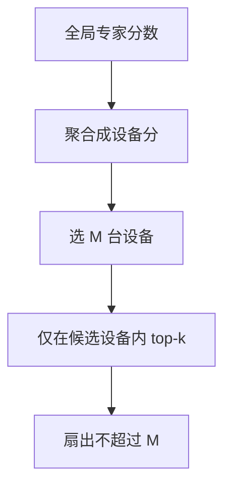

# 节点受限路由

每个 token 只允许从少数设备上的专家里选，把 All-to-All 的扇出从「全球」收到「几台邻居」。

<footer>—— DeepSeek-V2 的 device-limited routing；大规模稀疏通信的背景见 Lepikhin et al., GShard, 2020</footer>

[上一课](/llm/aux-loss-free-balancing)让负载在**全局专家集**上调偏置。真正训练时专家铺在许多节点上，token 选中远端专家就要跨机搬隐状态。[GShard](/llm/moe-routing) 已经付 All-to-All。本课补硬约束：每个 token 先限定候选节点数 $M$，再在这些节点的专家里 top-$k$。后课序列级均衡在这张被剪过的候选图上做；通信比课会算 $M$ 怎么进公式。

## 问题

专家数 $N$ 到上百、上千时，无约束 top-$k$ 的通信对象几乎是全部设备：每个 token 一份向量飞向 $k$ 台可能很远的机器，网络先于计算饱和。缺口是**限制扇出**：不是改专家内部，而是改可选集合的拓扑。DeepSeek-V2 的 device-limited routing 让每个 token 最多与 $M$ 个设备通信（$M$ 常为 1 或 2 量级的小整数）。

这与容量因子不同：容量是设备上专家能吃多少 token；节点受限是 token 能跟几台设备说话。两者叠加。

节点（device）不是专家。一台设备可挂多名专家。限制的是设备数，设备内专家仍可再 top。

## 方法

先对专家打分，再按设备聚合（取设备上专家的最大分或分数和），选出 $M$ 台设备，然后只在这些设备的专家里做 top-$k$。$k$ 仍可大于 $M$ 若每设备多专家。实现上 All-to-All 的对端集合变小，或改成对 $M$ 个目标的点对点/分组通信。

偏置均衡仍可做，但统计负载时要承认：有些专家对某些 token 根本不可见，均匀是在「可见性图」上的均匀，不是全局均匀。哈希也可以先哈希到节点再哈希到专家，天然节点受限。

### 与专家并行布局

专家在设备上的摆放决定图的品质。同一类专家挤在一台机器上，token 一旦选中这台就能拿全套；打散则 $M$ 小会切掉组合。EPLB 一类放置算法（主干若已有 [EPLB](/llm/eplb)）与本课正交：本课是路由约束，放置是布局。

## 机制

$M=1$ 时 token 先选机柜再选专家，通信接近一次机内 GEMM 加一次跨机，扇出最小，表达力最伤：永远看不见其它机器上的专家。$M$ 增大，向无约束 top-$k$ 连续过渡。训练应把 $M$ 当架构超参固定，与推理一致，否则训练时看见的专家集比推理大，质量虚高。$M$ 还可以随训练进度放开：早期 $M$ 大以便探索，后期收到部署值——必须把后期值当作真正架构，早期只是优化技巧。

节点受限会诱导「设备级特化」：某台机器上的专家共同服务一类 token，因为它们总是一起被看见。这与后课层次 MoE 的显式层级不同，但是同一种可见性造成的聚类。

过小的 $M$ 加尖锐门，等于把模型切成 $M$ 台近乎独立的稠密模型，稀疏参数的组合优势消失。

## 边界

单机或专家很少时本课无意义，不要加约束自找特化损失。网络拓扑（NVLink 域、机柜）应与 $M$ 对齐：限的「节点」最好是通信便宜的单元。下一课序列级均衡处理的是另一轴——一条序列内部专家占用，不是机器扇出。通信-计算比课会把 $M$、$k$、$d$ 放进同一条粗公式。

## 小结

- 节点受限路由把每个 token 的通信对端收到 $M$ 台设备，再在内部选专家。
- 负载均匀与特化都变成可见性图上的性质，不是全局集合上的。
- $M$ 必须训推一致；过小则稀疏组合名存实亡。
- 与容量因子、专家放置正交，三者一起决定能否训练。
- 出处：DeepSeek-V2 的 device-limited routing；GShard, 2020。
