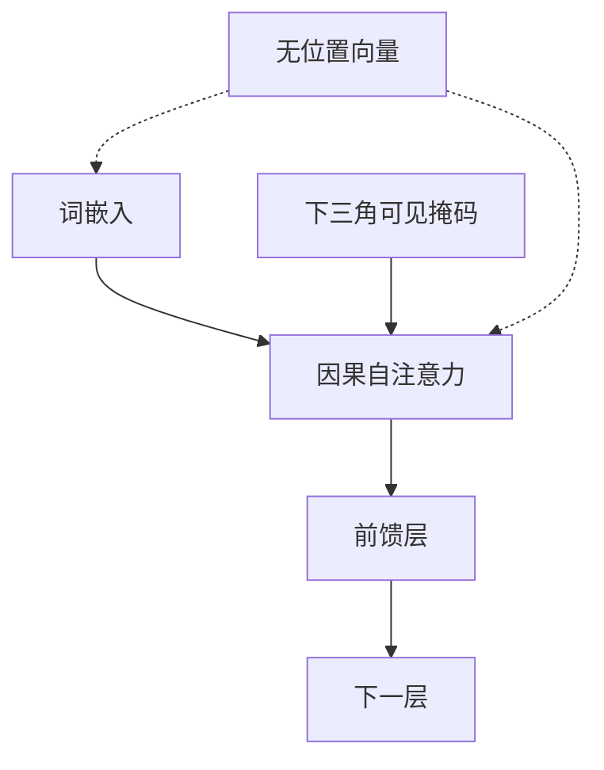

# NoPE

在解码器里拿掉显式位置编码，因果掩码仍能提供顺序；长度外推上，这种「什么都不加」有时反而更好。

<footer>—— Kazemnejad 等，位置编码与长度泛化，2023</footer>

给 Transformer 加位置，几乎已成默认。绝对嵌入、正弦、RoPE、ALiBi，争论的是加哪一种。Kazemnejad 等人 2023 年的工作把问题倒过来：解码器若只做因果自注意力，不加班位置通道，模型还能否表示顺序？长度泛化会不会因此变好？答案是：能，而且在若干合成与语言建模外推设定里，NoPE（no positional encoding）可以优于常见显式方案。它不是说位置无用，而是说因果掩码已经泄漏了足够的方向与深度信息，额外通道有时会变成过拟合训练长度的捷径。

## 问题

编码器的自注意力双向可见，置换等变，没有位置就无法区分「A 在 B 前」与相反。解码器不同：第 $i$ 个位置只能看见 $0$ 到 $i$，可见集合的大小恰好是 $i+1$。理论上，网络可以通过「我能看见多少东西」恢复自己的下标，通过「你比我少看多少」恢复相对距离。显式位置编码不是唯一的顺序来源。

实践里显式编码很强，因为它们把下标变成容易线性读出的特征，训练损失下降更快。代价在长度泛化：RoPE 的相位、绝对嵌入的表、甚至 ALiBi 的斜率，都会把「训练长度」写进归纳偏置。模型可能用这些特征记忆「第 512 个位置附近该怎么做」，而不是用内容与可见范围计算。一旦序列更长，捷径失效。问题是：在解码器里删除显式位置，强迫计算走因果掩码这条对长度更不变的路，外推会不会更好？NoPE 的赌注不是「语言没有顺序」，而是「顺序已经在掩码的可见性里」。显式通道若与训练长度绑定过紧，会在外推时变成负担而不是帮助。

## 方法

NoPE 的实现几乎是否定句：词嵌入之后不加算术位置、不旋转 $Q$ 与 $K$、不加距离偏置。注意力就是缩放点积加因果下三角掩码。其余与普通 Pre-LN 解码器相同。

训练仍在固定或有上界的长度上进行，因为批次要切分。与 ALiBi 的「训短测长」不同，NoPE 并不在 logits 上写距离；它依赖层叠的因果注意力自己构造位置敏感的电路。Kazemnejad 等人在受控长度泛化任务与 Transformer 语言模型上比较绝对、相对、RoPE、ALiBi 与 NoPE，观察哪一种在超出训练长度时掉点更慢。

方法贡献主要在实验设计：把位置方案换成可插拔模块，长度作为独立轴，而不是只报训练窗口内的困惑度。

## 机制

### 因果掩码如何泄漏位置

第 $i$ 个查询的注意力归一化是在 $i+1$ 个键上做的。softmax 的配分函数、均值、极值统计都随 $i$ 变化。多层之后，表示可以编码「当前可见前缀有多长」。相对位置则可通过「键侧表示已经过多少次只能看见更短前缀的变换」来区分：更早的 token 经过更多步的「被后续位置读取」。这不是闭式的 $i-j$，而是一种可学习的深度计数。

因此 NoPE 仍有位置信息，只是位置被藏在计算图的非对称里，而不是藏在加性向量或旋转角里。读出它需要深度与注意力头的配合，浅模型或头数不足时，可能学不全计数电路，这时显式编码会重新显得必要。

### 长度外推为何有时更好

显式编码给出与 $L_{\text{train}}$ 绑定的坐标系。RoPE 在 $L$ 附近有一套被拟合的相位用法；绝对嵌入在最后若干行上有一套被拟合的向量。外推时坐标系的新点没有训练监督。NoPE 的坐标系是「可见集合的基数」，基数在更长序列上只是继续增大，没有未见过的嵌入行，也没有未见过的旋转角。若任务的算法本身是「对前缀做内容选择」，这种计数可以延续。

「有时更好」不能写成「总是更好」。语言建模在训练长度内，RoPE 或 ALiBi 通常仍更省参数、更易优化。NoPE 的优势集中在长度泛化轴上，而且依赖足够深度去构造位置电路。浅解码器去掉位置后，连训练窗口内都可能不稳。

### 与 ALiBi、RoPE 的取舍

ALiBi 也走「不把下标写成向量」的路，但在 logits 上留下单调距离势，近邻优先被硬编码。NoPE 连这势都没有，近邻优势必须由内容与深度自己学。对自然语言，近邻优先往往是正确偏置，ALiBi 更省事；对需要把位置当计数器、且测试比训练长得多的算法任务，硬编码势可能反而限制电路形状。RoPE 则把相对位置写进几何，训练内最强，外推最依赖插值或改基数——那是位置插值与 YaRN 的问题，不是 NoPE 要修的。

## 边界与工程取舍

NoPE 几乎不被用于从零训练的超大通用语言模型：在固定上下文里，显式相对位置的样本效率更高，业界默认 RoPE。它的价值是揭示位置通道与长度过拟合的关系，以及在需要外推的解码器实验里提供一条强基线。

实现上仍要处理批次填充：因果掩码必须把 pad 排除，否则「可见长度」变成「含 pad 的长度」，位置电路被污染。这比有显式位置时更致命，因为模型没有另一套下标可以对照。

推理期把 NoPE 模型接到长于训练的窗口，没有 RoPE 那种相位爆炸，但不保证质量。没有距离势时，注意力更容易在长前缀上摊平或被句首吸走。长度外推「有时更好」来自受控实验，不是生产模型的默认承诺。

### 何时值得当真尝试

合成长度泛化、需要把位置当指针的程序式任务、以及研究「位置编码是否在帮倒忙」的消融——这些场合 NoPE 是一等公民。通用聊天模型的长窗口，优先仍是 RoPE 加插值或 YaRN，或从零用 ALiBi。不要把 NoPE 理解成可以省掉位置模块就省参数的免费午餐：省掉的是参数，买到的是更难优化的位置电路。

## 小结

- NoPE 指解码器不加班位置嵌入、旋转或距离偏置，只保留因果掩码。
- 可见前缀长度与层叠读取提供可学习的位置信息，因此「无位置」并非无顺序。
- 在 Kazemnejad 等人的长度泛化设定里，NoPE 有时优于绝对、RoPE 与 ALiBi。
- 训练窗口内的样本效率通常仍低于显式相对位置，大模型默认不会只用 NoPE。
- 填充掩码必须干净，否则可见长度被 pad 污染，位置电路失效。
- 它说明显式位置可能成为长度捷径；外推问题有时该做减法而不是更复杂的插值。
- 出处：Kazemnejad 等，关于解码器位置编码与长度泛化的研究，2023；对照 Press 等 ALiBi（2021）与 Vaswani 等原 Transformer 的位置需求（编码器侧，2017）。
