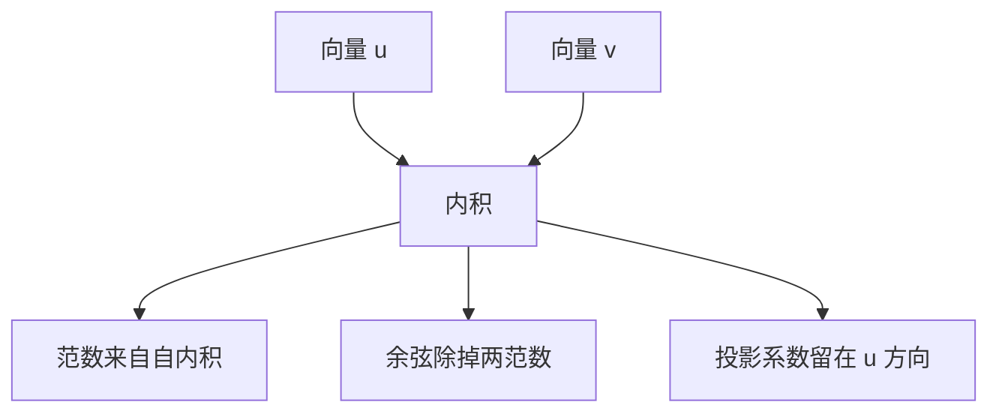

# 范数、余弦与投影

两个向量是否「像」，要先说清用哪种长度；夹角与投影是同一套内积里的不同读数。

<footer>—— 据 Goodfellow, Bengio &amp; Courville, Deep Learning, 2016；Strang, Linear Algebra and Its Applications 整理</footer>

[矩阵乘作为一层](/llm/matmul-as-layer)给出 $y=xW^\top$，把向量从一个坐标送到另一个坐标。本课不重推这次乘法。缺口是：送到新空间之后，如何度量长度、夹角、以及「落在某一方向上的分量」。后面的 softmax 打分、注意力里的点积、层归一化里的除标准差，都要先有范数与内积，否则分数只是一堆无单位的数。

## 问题

线性层输出一组坐标，但训练目标很少直接比较原始坐标。分类要的是「谁更像某一类的方向」，检索要的是「两段表示夹角小不大」，归一化要的是「把长度拉到固定尺度」。若只用逐维相减的平方和，尺度大的向量永远「更远」，即使方向一致。缺口因此不是再做一次矩阵乘，而是在已经对齐的 $\mathbb{R}^d$ 上引入长度与角度。

内积 $\langle u,v\rangle=u^\top v$ 同时给出三件事：自身内积是欧氏范数的平方；除以两范数得到余弦；固定一个方向 $u$ 时，$\langle u,v\rangle$ 是 $v$ 在该方向上的（未归一）投影系数。后课把「打分」写成内积，把「相似」写成余弦，把「去掉长度」写成除范数——本课把这三种读数一次分清。

### 余弦不是另一种距离公式

欧氏距离 $\|u-v\|_2$ 对平移和尺度都敏感。余弦 $\langle u,v\rangle/(\|u\|_2\|v\|_2)$ 只看方向，把长度除掉。两者不是同一度量换写法。把词向量里「相近」理解成欧氏最近邻，会把高频词（往往更长）和低频词系统性地分开；理解成余弦，才是在比方向。后课嵌入几何默认比的是角，除非明确说用欧氏。

$\ell_2$ 范数 $\|x\|_2=\sqrt{\sum_i x_i^2}$ 是本课默认长度。$\ell_1$、$\ell_\infty$ 在稀疏与对抗里会出现，本课不切换。投影是 $\mathrm{proj}_u v=\frac{\langle u,v\rangle}{\langle u,u\rangle}u$，系数是标量，结果仍是向量。

## 方法

对 $x\in\mathbb{R}^d$，欧氏范数 $\|x\|_2$。单位向量 $\hat x=x/\|x\|_2$（零向量除外）。两向量余弦 $\cos\theta=\langle u,v\rangle/(\|u\|_2\|v\|_2)\in[-1,1]$。未归一的点积 $\langle u,v\rangle=\|u\|_2\|v\|_2\cos\theta$，因此点积同时含长度与夹角：两向量都变长，点积变大，即使角不变。

一批向量 $X\in\mathbb{R}^{B\times d}$ 的两两余弦，是先按行除范数，再做 $XX^\top$。这与上一课的矩阵乘是同一算子，收缩的是特征维 $d$。本课不把这一步叫成注意力：没有查询键的线性投影，也没有按行的 softmax。只是「同一套 GEMM 可以读成相似度矩阵」。

## 机制

训练里经常先去掉长度再比方向，因为长度容易被层的尺度、初始化、学习率带跑，方向才编码「像哪一类」。层归一化稍后会在特征维上减均值、除标准差，那是把每个位置的向量拉到相近的范数量级；本课的除范数是更粗的版本，只处理长度，不处理各维的偏移。

点积作为打分函数的隐患也在这里：若不确定 $\|q\|$ 与 $\|k\|$ 的尺度，同一夹角会给出差几个数量级的分数，后面的 softmax 会饱和。本课只指出这个乘法结构；如何在指数之前减最大值、如何除 $\sqrt{d}$，分别是后课 softmax 与（更后面的）缩放点积的缺口，这里不提前讲完。

## 边界

本课不引入马氏距离、核技巧，也不把 PCA 投影当成一层网络。下一课[Softmax 与数值稳定](/llm/softmax-numerics)把一组无约束的打分变成单纯形上的概率；那些打分可以是点积，但本课不把 softmax 写出来。后课默认：说到两个向量「像」，先声明是余弦还是点积；说到「长度」，默认 $\ell_2$。

## 小结

- 内积同时给出长度、余弦与沿一方向的投影系数。
- 余弦去掉尺度，只比方向；点积保留长度，尺度会污染分数。
- 按行归一再做 $XX^\top$ 是相似度矩阵，还不是注意力。
- 后课 softmax 吃的是这组分数；分数尺度过大将在指数上饱和。
- 出处：Goodfellow et al., Deep Learning, 2016；Strang 对内积与投影的处理。
