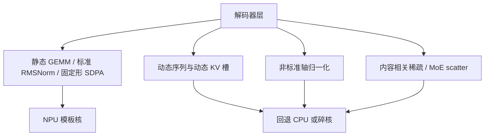

# NPU 友好算子

端侧加速器吃得下的，是编译期形状确定、能融进矩阵乘流水线的算子；动态轴、稀奇归一化和不规则稀疏，往往会把图打回 CPU。

<footer>—— 对照手机 NPU / APU / 神经引擎上的 LLM 部署约束</footer>

GPU 上「能写出来就能跑」几乎成立：动态序列、MoE 路由、稀疏掩码、自定义归一化，都可以靠通用核硬扛。NPU（以及同类的 NPU/APU/神经引擎）是另一套契约：图在编译期被切成固定形状的卷积或 GEMM、有限的融合模式、以及对齐到 16/32/64 的内存布局。语言模型要上设备，先问的不是 FLOPs 理论值，而是**哪些算子会迫使回退**。本篇只谈友好与不友好的算子形状，不评测某一家芯片的 TOPS。

## 问题

端侧 LLM 的计算图看起来简单：Embedding、RoPE、SDPA、FFN、RMSNorm、采样。每一项在 GPU 上都能动态执行。NPU 编译器通常要求：张量维在编译期已知或来自很小的枚举；归约轴固定；控制流不要按 token 内容分叉。一旦序列长度 $n$ 随对话增长、专家下标随路由变化、掩码随内容变稀疏图案，编译结果要么是一串微小核，要么直接落到 CPU 标量路径。这时「NPU 加速」名存实亡，功耗和延迟一起坏。

不友好有三类高频来源。**动态 shape**：KV 缓存从 1 涨到 $n_{\max}$，每次 reshape 触发重新推断。**奇怪归一化**：非标准轴上的 LayerNorm、带额外条件缩放的变体、GroupNorm 配上与硬件向量宽度互质的组数。**不规则稀疏**：非结构化剪枝、数据依赖的稀疏注意力、MoE 里每个 token 指向不同专家导致的 gather/scatter。三者都会打断「大块矩阵乘 + 逐元素融合」这条唯一高效通路。

### 友好意味着可融合、可对齐、可静态

友好算子不是「数学上简单」，而是「能变成编译器已有模板」。稠密 GEMM、固定核的卷积、逐元素 SiLU/GELU、沿最后一维的 RMSNorm、静态下三角掩码的注意力，都属于模板内。RoPE 若能写成对偶数维的乘加，也可以融；若写成按位置查表再不规则重排，就可能拆核。采样若在 NPU 上做 Gumbel 与动态词表裁剪，常不如把 logits 搬回 CPU 做一次 top-$k$。

同一套 PyTorch 模型，导出成静态 ONNX / QNN / Core ML 时失败的点，几乎总是动态轴与控制流，而不是「MatMul 太慢」。先把图改到可编译，再谈量化位数。

## 方法

部署前把计算图收成白名单。线性层：$Y=XW$ 且 $K,N$ 对齐到加速器向量宽。MLP：SiLU/GELU 紧贴 GEMM，避免中间写出再读。归一化：优先 RMSNorm 或标准 LayerNorm，归约维等于隐藏宽，仿射 $\gamma$ 可融；不要在中间插入按 token 的条件缩放，除非能编译成同一条向量指令。注意力：预填充用固定 $n_{\mathrm{prefill}}$ 或分块但块长固定；decode 用固定 KV 槽，见 [端侧 KV](/llm/on-device-kv)。掩码用编译期下三角，不要每步生成一张稠密 bool 再转。

量化选对称 INT8 或芯片文档写明的 INT4 方案，标定沿静态轴做。逐通道对权重友好，对动态激活要看实现是否支持；不支持就退到逐张量，不要为了多 0.1 分引入编译器没有的非对称逐 token 量化。

### 把动态性挪到图外

序列变长是产品需求，不等于图必须动态。预分配 $n_{\mathrm{max}}$ 槽、有效长度用掩码屏蔽，是把动态性变成静态张量上的数值掩码——掩码本身仍建议是编译期图案（因果下三角）加一个长度标量，而不是任意布尔图。MoE 在端侧通常应先蒸馏成稠密学生，而不是在 NPU 上做 top-$k$ 路由；64 专家的 gather 几乎必然不规则。滑窗注意力可以友好，条件是窗口 $w$ 固定、块大小对齐；H2O 一类按分数逐出的缓存，索引不规则，对 NPU 不友好，适合 CPU 侧偶尔整理，而不是每步在加速器上做。

「稀疏能加速」在 GPU 上有时成立，在 NPU 上几乎总要求**规则稀疏**：块稀疏、N:M 且 $N,M$ 写进芯片文档。随机 90% 剪枝若不重排成块，只省理论上的 FLOPs，不省墙钟。

## 机制

NPU 的吞吐来自大规模脉动或向量阵列。阵列一次吃进固定 $M\times K\times N$ 的砖块。动态 $K$ 迫使砖块变小或填充浪费；不规则索引迫使从砖块改成标量 gather，阵列停转。归一化若归约轴不是硬件归约指令支持的那一维，就会变成多次转置 + 小归约，带宽墙。这就是「奇怪归一化」比「多一次 Linear」更致命的原因：Linear 仍是 GEMM，怪归一化可能完全离开 GEMM 世界。

融合的意义是减少中间激活写回 DRAM。RMSNorm + Linear + SiLU 若能融成一条，端侧 decode 才可能被算力而不是内存绑住。任意插入一个自定义 $\mathrm{norm}(x)/\mathrm{norm}(x)_{\mathrm{another}}$ 就会切断融合。因此「数学上等价的重写」在 NPU 上不一定等价于同一条流水线。

### 与 GPU 友好清单的差集

GPU 友好：FlashAttention 的动态分块、MoE grouped GEMM、数据依赖稀疏、torch.compile 即时特化。NPU 友好：固定分块、稠密 FFN、静态掩码、AOT 编译。FlashAttention 的算法可以在 NPU 上用**固定块长**的版本近似，但不能假设编译器会自动把 Python 里的变长循环变成那套核。端侧解码 batch=1，Flash 的节省主要是内存流量；若 NPU 没有对应融合注意力，手写分块 SDPA 仍要比碎成 $n$ 次向量点积好。

## 边界与工程取舍

友好约束会限制模型选择。DeepSeek 式细粒度 MoE、原生稀疏注意力、动态分辨率视觉塔，默认都不是手机第一公民。SLM 应在训练或蒸馏阶段就改成 RMSNorm、SwiGLU 或 GELU MLP、GQA、固定窗，而不是训完再「图优化」。量化感知训练要在最终图上做，否则校准的是 GPU 图，部署的是另一张被插入 reshape 的图。

芯片文档未写明的算子，一律当不友好，直到有融合核。不要用桌面 GPU 的 profile 去推断手机 NPU。回退到 CPU 的层哪怕只有一层 RMSNorm，也会在 decode 的每一步同步，把流水线打断。边界是：宁可在模型里多一个对齐的 Linear，也不要一个漂亮但不在白名单里的归一化。

词表 softmax 与采样经常故意留在 CPU：词表 32K–150K 的归约对 NPU 不划算，且温度、top-$p$ 是标量控制流。这不算失败，只要 logits 的搬运不是每层都发生。

## 小结

- NPU 友好 = 静态形状、对齐的稠密 GEMM、标准 RMSNorm/LayerNorm、固定图案注意力，并能融合。
- 三类典型回退：动态 shape、奇怪归一化、不规则稀疏（含内容相关掩码与 MoE scatter）。
- 用固定 KV 槽和因果掩码消化变长；用蒸馏消化 MoE；用规则块稀疏代替非结构化剪枝。
- 在最终部署图上做量化与融合验证，不要用 GPU 墙钟代替 NPU 墙钟。
- 采样与大词表 softmax 可留 CPU，但不要每层往返。
- 出处：约束来自端侧加速器的编译与阵列执行模型；结合 RMSNorm（Zhang & Sennrich, 2019）、GQA（Ainslie et al., 2023）等已有算子选择。不编造芯片厂商内部白皮书编号。
