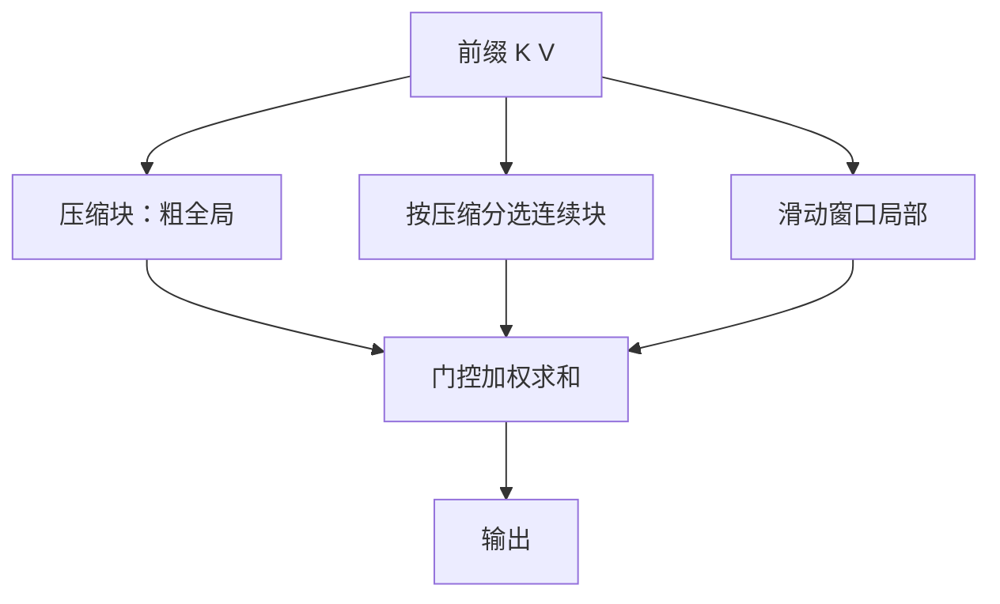

# Native Sparse Attention 原文

    
可训练的分层稀疏注意力：压缩块提供粗粒度全局，选中的连续块提供细粒度，滑动窗口管局部；算法与 Tensor Core 上的块访问对齐，从而前向、反向与解码都能加速。

    <footer>—— Yuan 等，Native Sparse Attention，arXiv:2502.11089，2025</footer>

DeepSeek-AI 与北大等合作的 **NSA**（Jingyang Yuan、Huazuo Gao、Damai Dai 等，2025）针对长上下文 softmax 的墙钟，而不是再做一种核线性近似。命题有两半：**硬件对齐**（块状访问、算术强度、GQA 下共享 KV 选择）与 **原生可训**（前向反向都有算子，稀疏图案跟预训练一起学）。推理期才剪 KV 的方法（H2O、Quest、MInference）被批评为阶段残缺、与 GQA 内存路径冲突、或含不可微聚类/哈希。本篇按 2502.11089 写实验合同：27B 骨干、64k、相对 Full Attention 的榜与核速度。

## 问题

解码 64k 时，softmax 注意力可占延迟的七成到八成（文中理论估计）。稀疏能降 FLOPs，但许多方法只加速前填或只加速解码；Quest 一类按头独立选块，在 GQA 上 KV 装载变成组内选择的并集，算力降了带宽不降。训练侧：k-means / SimHash 切断计算图；token 级散读无法走 FlashAttention 式连续块。后处理稀疏会偏离预训练轨迹——文中引 Chen 等：top 20% 位置只覆盖约 70% 注意力质量，检索头易被剪掉。

NSA 要同时覆盖训练、前填、解码，并与 GQA/MQA 的共享 KV 相容。分层映射把每个查询的可见键值收成三类：压缩 token、选中块内的满分辨率 token、窗口内局部 token，总数 $N_t\ll t$，再用门控混合三条注意力。

### 「Native」针对的是后处理稀疏

不是「GPU 原生指令」，而是稀疏进入预训练目标，图案可反传（选择本身仍是 top-$n$，不可微，但重要性来自压缩支路已经 Softmax 过的分数，不必另挂辅助损失）。文中用 3B 模型对比：带辅助损失的块选择、Quest 式 min-max 启发、冷启动后再切稀疏，损失都不如 NSA。这是方法节的动机实验，主表仍是 27B。

骨干：27B 总参 / 3B 激活，DeepSeekMoE（72 路由+2 共享，top-6），30 层，隐宽 2560，GQA 4 组、64 查询头，$d_q=d_k=192$，$d_v=128$。第一层 FFN 稠密。不要写成 V2 的 236B。

## 方法

压缩：块长 $l=32$、步长 $d=16$，可学习 MLP（含块内位置）把一块键/值收成一个压缩向量，通常 $d<l$ 以免切碎。选择：块大小 $l'=64$，top-$n$ 且 $n=16$（含固定首块与局部块），重要性由压缩支路的注意力分数按空间对齐加总；GQA 组内对各查询头的块分求和，保证同组同一套 KV 块，解码只装一次。窗口 $w=512$。三支独立 $K,V$ 投影，避免局部捷径抢走压缩/选择的学习。门控 $g^c$ 由 MLP+sigmoid 得出。

预训练：Full Attention 与 NSA 都在约 **270B**（摘要亦写 260B 量级）的 8k 文本上训到收敛，再 YaRN 续训与 SFT 到 32k。主表（文中 Table 1）NSA 平均 0.456 对 Full 的 0.443；GSM8K 0.520 / 0.486，DROP 0.545 / 0.503，MBPP 略低。LongBench 平均 0.469 对 Full 0.437、Exact-Top 0.423；多跳 QA 与 LCC 代码子集涨幅更大。64k 针测 NSA 全位置正确。AIME 24：用 R1 蒸馏的 10B 条 32k 数学 SFT 后，8k 生成上限 NSA-R 0.121 对 Full-R 0.046，16k 上限 0.146 对 0.092（温度 0.7，top-p 0.95，16 样本均值）。

### 核与解码访存

压缩与窗口走现成 FlashAttention-2 式核。选择支路特制 Triton：外层按 GQA 组在 grid 上切查询位置，内层按该位置共享的稀疏块连续装 $K,V$，避免「同一查询块要的 KV 彼此不相邻」。A100、8 卡、Triton 对 Triton：64k 上前向约 **9.0×**、反向约 **6.0×** 相对 FA2 稠密核。解码按装载 token 数估计：64k 时 NSA 最多装压缩块数 $+\ n l'\ +\ w$，表中 5632 对 65536，期望约 **11.6×**。期望值假设内存墙且实现打到该访存量；实际核可能略差。

## 机制

算术强度解释为何块选而不是点选：训练/前填是计算墙，要喂满 Tensor Core，连续 $B_k$ 行键才能走 MMA；解码是带宽墙，GQA 组共享选择才能少装 KV。注意力图可视化（27B Full 模型）显示分数呈块状聚集，给「连续块」一个现象学生成理由，不是证明。独立三支 $K,V$ 防止窗口支路在早期主导梯度。固定激活首块对应注意力汇（sink），与 StreamingLLM 的经验对齐，但是学出来的选择仍覆盖其余顶块。

LongBench 对照把各稀疏基线的每查询激活 token 对齐到 NSA 在 32k 上的平均量级（文中 2560，含 128 汇与 512 局部）。不对齐 token 预算就不能说赢了 Quest。

### 和 H2O、Quest、Exact-Top

H2O 等驱逐是解码期启发式，一般训练不走同一图案。Quest 启发分在 GQA 上并集过大。Exact-Top 先算满分数再选，训练贵，且仍是推理算法。NSA 用压缩分数当便宜的查询感知建议，细支路只在选中块上做满注意力——建议可反传到压缩 MLP，选择离散。失败模式：重要证据落在未选中块且压缩特征没打出高分，针测全对不能推出所有多跳文档都安全。

## 边界与工程取舍

### 27B/3B 激活不是满血 V3

超参 $l,d,n,w$ 绑在这篇骨干上。换头数或不用 GQA，组内共享选择的收益会变。Triton 相对手写 CUDA / FA3 的倍数会变；论文为公平用同一后端。AIME 样本少、方差大，16 条均值仍吵。SFT 10B 推理轨迹之后的「NSA 更会数学」可能混杂稀疏正则与数据，不能单独归因。MoE 第一层稠密、辅助均衡策略跟 DeepSeek 家族一致，换稠密 MHA 骨干要重做核。

实现若把选择做成随机 gather 而不是块加载，硬件对齐条款作废。训练必须有反向算子；只接前向稀疏、反向走稠密，不是原文。与 Ring Attention、上下文并行正交：NSA 减的是每卡可见 token，不是跨机切序列。部署要固化块大小与 $n$，服务端动态 $n$ 会改变质量合同。开源复现若只抄三支结构、不写组内共享选择，GQA 解码装载会回到「并集」故事，11.6× 的访存账不再成立。

出处：Yuan et al.，*Native Sparse Attention: Hardware-Aligned and Natively Trainable Sparse Attention*，arXiv:2502.11089，2025。不要写成 DeepSeek-V3 已默认 NSA；V3 报告是另一套 MLA 故事。

## 小结

- NSA 用压缩、块选择、窗口三条可训支路做分层稀疏，并按 GQA 共享 KV 块以对齐硬件。
- 27B 骨干上通用榜与 LongBench 不低于 Full Attention；64k 核前向约 9×、解码访存估计约 11.6×。
- 针对后处理稀疏的阶段残缺与不可训组件，而不是针对核线性注意力。
- 超参与 Triton 数字绑定该骨干与 A100；换形状要重测。
- 出处：Yuan et al.，arXiv:2502.11089，2025。
