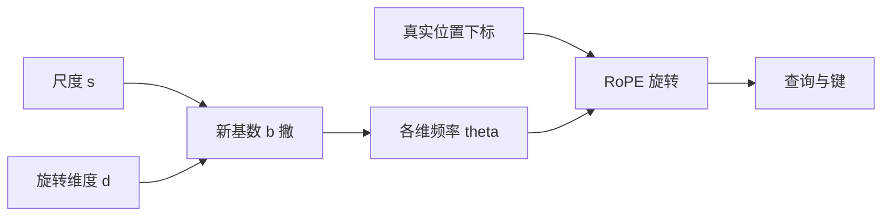

# NTK-aware 插值

不要把所有旋转频率按同一比例压慢；按神经正切核的尺度关系改基数，才能在拉长窗口时少牺牲高频。

<footer>—— bloc97，NTK-aware interpolation 社区方案，2023</footer>

2023 年开源侧把 LLaMA 一类 RoPE 模型往长上下文拉时，最先广泛使用的是 Meta 的位置插值：把位置下标除以尺度 $s$，使新窗口的最大角位移不超过训练窗口。随后 bloc97 在 Reddit 等社区提出 NTK-aware interpolation：不压缩下标，而缩放 RoPE 的基数 $\theta$，使高频维度少被伤害。它不是会议长文里的正式方法名，而是被 YaRN 等后续工作吸收并写进论文相关工作的社区方案。单独理解它，是为了看清「改位置」与「改频率」两条路差在哪，以及它本身停在哪一步。

## 问题

RoPE 第 $i$ 个频率 $\theta_i=b^{-2i/d}$，其中 $b$ 为基数（常见为 $10^4$），$d$ 为旋转维度。位置 $p$ 的旋转角是 $p\theta_i$。线性位置插值令 $p\leftarrow p/s$，等价于所有 $\theta_i$ 同时乘 $1/s$。对小 $\theta_i$（低频），这只是把本来就慢的波变得更慢，长程相位仍平滑；对大 $\theta_i$（高频），$p\theta_i$ 在训练里本用来分辨邻域，除以 $s$ 之后邻域差落进几乎平坦的余弦区间，局部相对位置被抹掉。

从核的角度看，位置编码诱导的函数空间对高频更敏感：小位移应仍能在表示里产生可学习的差异。把所有频率一刀切地压慢，等于降低核的有效带宽。社区讨论借用神经正切核（NTK）的尺度直觉：宽度与频率的分配应随「输入被拉伸」而调整，而不是把整条频谱平移。问题于是变成：如何只改 $b$，使拉伸长度 $s$ 之后，高频端的局部分辨率尽量接近原模型。线性插值改的是坐标，NTK-aware 改的是尺子的刻度。坐标压缩让每一个频率都变慢；改基数则让不同频率变慢的程度不同，这正是它相对位置插值的全部差别。

## 方法

NTK-aware 方案保持位置下标为真实下标 $0,1,\ldots,L'-1$，把基数换成 $b'$，使得旋转角的尺度关系符合「输入拉伸 $s$ 倍时核的临界缩放」。社区与后续论文中常用的闭式是

$$
b' = b \cdot s^{d/(d-2)}
$$

其中 $d$ 为 RoPE 作用的维度。$d/(d-2)>1$，因此 $b'$ 比 $b$ 增长得比 $s$ 更快。基数变大则同一下标 $i$ 对应的 $\theta_i$ 整体变小，但高频与低频的相对压缩并不等于统一乘 $1/s$：高频 $\theta$ 下降得相对较少，局部相位差被保住一块；低频承担更多「把窗口拉长」的外推。

动态版本在推理时按当前序列长度估计 $s=\max(1, n/L)$，每一步或每个请求更新 $b'$，无需续训。静态版本把 $s$ 固定为目标窗口比，可配合少量微调。二者都不引入新参数，只改 RoPE 的 $\theta$ 表或等价的 $\cos/\sin$ 缓存。

## 机制

### 为什么线性插值伤高频

考虑相邻 token 的相位差 $\theta_i$。训练时 $\theta_{\text{high}}$ 足够大，使得 $\Delta p=1$ 就能在高频维上看到 $\cos$ 的明显变化。插值后相位差变成 $\theta_i/s$。若 $s=8$，高频维上「差一个位置」只剩原来的八分之一转角，几乎贴在泰勒展开的常数项上。模型若曾用这些维做局部点积调制，现在局部调制消失，只剩下低频维还能动——而低频维的分辨率本就粗。于是出现典型失败：短距离重复、邻近混淆、复制任务在近邻上出错，同时长程困惑度看起来还不算太糟。

### 基数缩放公式在做什么

$\theta_i=b^{-2i/d}$ 对 $b$ 取对数后与维度下标成线性关系。把 $b$ 换成 $b s^{d/(d-2)}$，相当于给这条对数频率直线改斜率与截距，使得在连续近似下，拉伸输入时核的高频能量不过快衰减。不必把 NTK 理论推到严格成立：对工程而言，公式提供的是「高频少压、低频多压」的单调方案，并且只有一个超参数 $s$（外加已知的 $d$ 与 $b$）。

与「只增大 $b$ 到 $10^6$」这类启发式相比，NTK-aware 把增大幅度写成 $s$ 的函数，避免在 $s\approx 1$ 时无故改频率，也避免在 $s$ 很大时仍沿用原 $b$。$d/(d-2)$ 来自对频率连续谱的近似，不是从语言模型损失推出来的定理。$d$ 很大时指数接近 $1$，缩放几乎像乘 $s$；旋转维较少时指数更大，基数跳得更狠。换头维或只旋转部分维时，要把公式里的 $d$ 取成实际参与旋转的宽度。

### 社区方案如何进入后续方法

bloc97 的帖子与代码证明：仅改推理期 RoPE 缓存，就能把若干 2k/4k 模型的可用长度往上推一截，且对高频伤害小于纯插值。YaRN 把这种「改基数」收进低频与部分中间维，并补上温度与斜坡，等于承认 NTK-aware 是有用但不完整的一步。单独部署时，它往往作为无续训的第一刀；若目标长度很大，再叠 YaRN 分段或短续训。

## 边界与工程取舍

NTK-aware 不修正注意力熵。窗口变长后 softmax 仍可能变尖或变平，表现为过度关注句首或最近 token。它也不重新训练任何投影，超出原窗口太多时，低频维的相位仍会离开训练分布，只是比朴素外推和纯插值更晚崩。社区评测以困惑度与简单检索为主，对需要精确相对偏移的任务并不保证。

动态 NTK 在长度跨越 $L$ 时 $b'$ 会跳，KV 缓存里已经旋转过的键与新 $\theta$ 不一致，原则上应在尺度变化时重算缓存或分段使用固定 $s$。生产里更常见的是按请求锁定目标窗口，避免一步一改基数。

没有正式论文编号并不妨碍它成为事实标准：开源推理栈里「NTK」几乎总是指改 RoPE 基数。引用时应标明社区方案与年份，避免写成某篇不存在的会议论文。YaRN 论文的相关工作章节是把它写进学术叙述的主要入口。

### 与位置插值的选用

若几乎不续训、且更在意邻域任务，NTK-aware 通常优于纯线性插值。若愿意在目标长度上微调若干步，位置插值的全局压缩加上微调，有时比只改 $b$ 更整齐，因为微调能补偿被压慢的高频。二者都不是 ALiBi：它们修补 RoPE，不替换位置通道。

## 小结

- NTK-aware 插值是 2023 年的社区方案：拉长 RoPE 窗口时缩放基数，而不是压缩位置下标。
- 常用形式 $b'=b\,s^{d/(d-2)}$，使高频少受统一压缩的伤害。
- 动态版本按当前长度估计 $s$，可无续训启用；尺度变化时要注意与 KV 旋转缓存一致。
- 它不处理注意力温度，也不保证极大 $s$ 下低频相位仍在分布内。
- YaRN 将其作为分段策略的组成部分，而不是终点。
- 引用时应写社区方案，不要伪造成会议论文。
- 出处：bloc97，NTK-aware interpolation（Reddit / 开源社区，2023）；后续形式化讨论见 Peng 等 YaRN（2023），并与 Chen 等位置插值（2023）对照。
