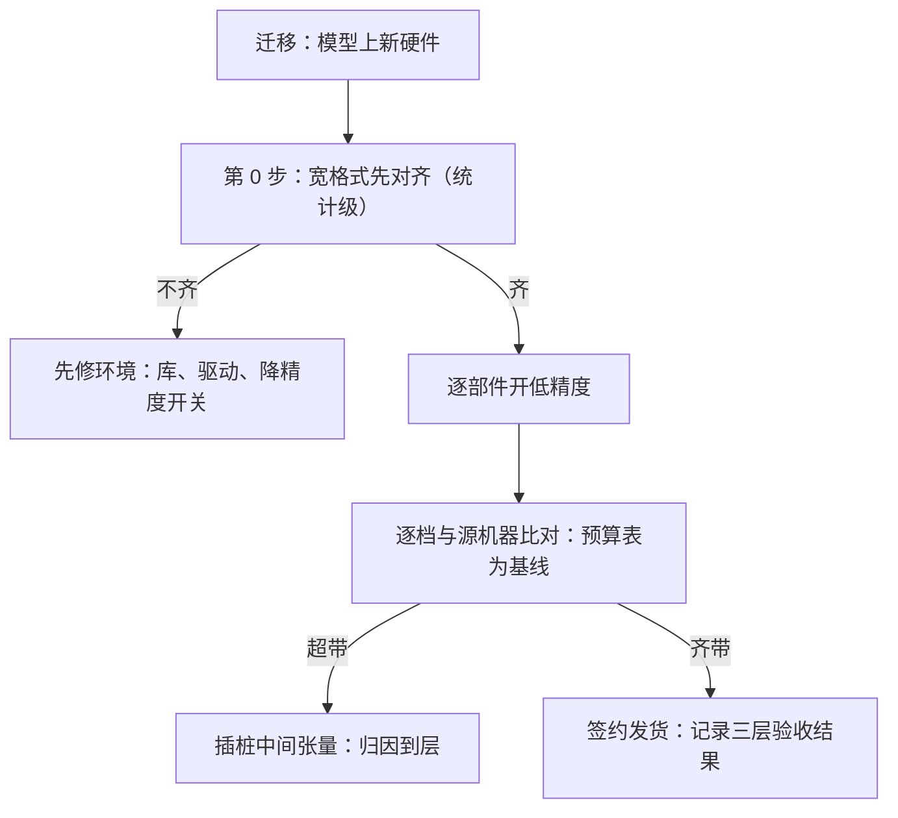
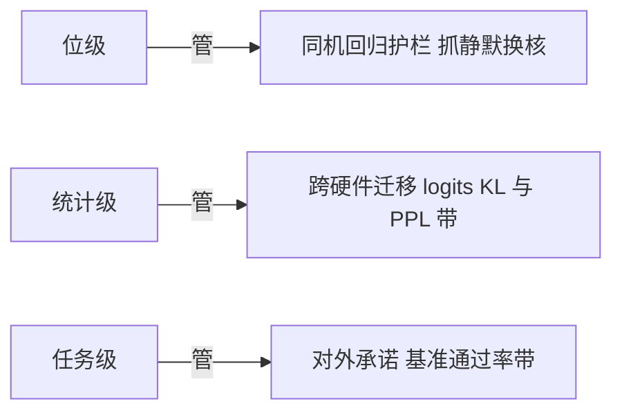

# 跨硬件的数值一致性

同一检查点在不同芯片上给出不同的 token 不是事故；事故是没有事先约定：哪一层一致才算通过。

<footer>—— 据各加速器数值格式白皮书与加速器对比方法课整理</footer>

[上一课](/llm/num-inference-error-budget)的预算表默认在同一台机器上兑现。真实服务跨代际、跨厂商：Hopper 上的逐张量延迟缩放、Blackwell 与 MX 阵营的块缩放、不同后端的归约树与融合策略，见 [MXFP8](/llm/mxfp8) 与 [Blackwell 对推理的含义](/llm/blackwell-infer)。加速器怎么公平对比在 [加速器对比方法](/llm/accelerator-comparison-method) 已写。本课写数值口径：位级一致为什么不可达也不需要，统计级与任务级验收怎么做，迁移时差异怎么归因。

## 问题

同一个低精度检查点，在两台机器上 token 逐位不同，误差从哪来？清单比直觉长。累加顺序：浮点加法不结合，归约树、split-K、并行度切分都改变求和次序——这不是 bug，是调度的组成部分。舍入与融合：FMA 是否可用、中间结果写不写回、不同的核融合边界。格式变体：E4M3 的 NaN/Inf 约定分家（第二课）、MX 的块大小与 scale 取幂规则、某些后端对特定算子静默使用 TF32 一类的自动降精度。库与驱动版本：同一芯片不同版本的归约实现也会变。低精度放大一切：格子粗了，次序差的舍入跨档概率变大。

数字实例：两台机器某个 token 的 logit 只差 $0.001$，恰好横跨第 2 与第 3 名的分界，采样翻面；下一个 token 的条件分布从此换轨，几十个 token 后两段输出面目全非。没有谁算错——自回归把一位格子之差复利成了两个故事。

于是第一条结论：位级一致在跨硬件时不可达；追求它只会得到「处处回退宽格式才能过测试」的假验收。

## 方法

三层一致性，验收前先签约用哪层。**位级**：同硬件、同软件版本下的回归护栏——用于捕捉「不该变的东西变了」（内核被静默替换、回退路径触发）。**统计级**：输出分布对齐——固定提示集上比较 logits 的 KL 或温度扫描后的采样分布距离，配 PPL 差的容忍带；这是跨硬件迁移的主验收层。**任务级**：基准通过率在预置容忍带内——最终对外承诺的层。三层各管一段，混用层级是常见事故：拿位级标准卡跨硬件迁移（做不到），或拿任务级标准做内核回归（太钝，抓不到）。

归因靠插桩：预算表（上一课）给了每部件的期望误差，超出部分插入中间张量探针逐层定位——是某层的缩放合同没对齐，还是归约树差异在长链路里放大。

## 机制

位级不可达的机制在第一课就埋着：浮点加法不结合，而并行求和的次序是调度问题。宽格式下次序差在 $10^{-7}$ 相对量级，低位被淹没；低精度下格子粗，同一物理和值落在不同格子，差一位就 diverge——自回归再把这个差异逐 token 复利。统计级为什么够：下游消费的是分布不是序列——采样本身带随机性，任务的语义对局部改写不敏感；PPL 与 KL 都是在分布层面对账，正好匹配。任务级为什么必要：统计级对「少数能力大幅退化、总体分布不动」的故障不敏感——长上下文、代码、数学的敏感谱不同（上一课的验收分账），必须各留一道门。

这张图回答「三层一致性各管哪一段」：位级只在同机同版本下当护栏，统计级是跨硬件迁移的主验收，任务级管对外承诺。拿错层级的标准验收（位级卡迁移、任务级做回归），要么验不过、要么抓不到。

混合集群里通信 dtype 必须全集群统一（第六课合同的跨硬件版）：不同厂商对 FP8 归约的实现不同，同一 All-Reduce 两边各按各的缩放解释，求和无定义——这类故障在单机测试里永远不出现。

直觉类比：验收译者不该逐字对照（位级），而该看译文是否传达同一意思（统计级）、关键数字有没有译错（任务级）。两个合格译者译同一篇文章，字面必然不同——逐字相等反而是抄袭的信号。

## 边界

验收签约必须钉住版本：驱动、库、内核后端、格式变体——「这台机器上过了」是一个随时间过期的陈述，内核升级要重跑统计级。不要用 A 卡的精度结论给 B 卡签字：格式变体不同（逐张量对块缩放），预算表要按目标硬件重排。自动降精度开关（TF32 类）要在环境清单里显式列出——它是最常见的「宽基线先就没对齐」的原因。最后，一致性验收的成本随提示集大小线性涨：固定一个小的金丝雀集做日常回归，全量集按版本节点跑。

为什么重要：忘关 TF32 类自动降精度，你的「宽格式基线」从一开始就不宽，后面所有差异归因都建在错的地基上。它是「宽基线先就没对齐」的最常见原因，必须写进环境清单并逐项打卡。

## 小结

- 跨硬件位级一致不可达也不需要；验收前签约用哪一层：位级护栏、统计级迁移、任务级承诺。
- 差异来源清单：归约次序、融合与舍入、格式变体、静默降精度、库版本。
- 迁移流程：宽格式先对齐，逐部件开低精度，超带用中间张量插桩归因。
- 统计级对局部能力退化不敏感，任务级按敏感谱分能力设门。
- 混合集群通信 dtype 全集群统一；验收结果随版本过期，升级重跑。
- 出处：各加速器数值格式白皮书；[加速器对比方法](/llm/accelerator-comparison-method) 的对比口径。
