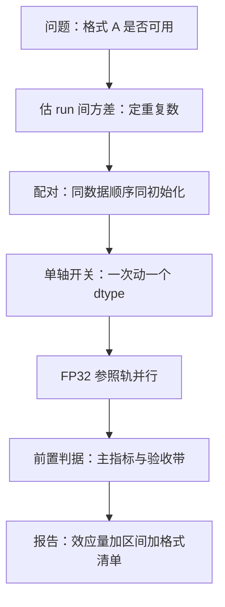

# 数值实验设计

数值实验最难的不是跑，而是归因：你看到的差来自格式、来自舍入，还是仅仅来自另一条归约树。

<footer>—— 据混合精度训练报告的消融口径与本课程前九课的记账框架整理</footer>

[上一课](/llm/num-crosshardware-consistency)给跨硬件的迁移签下三层验收；前几课的每条结论——指数换尾数、尺子三代、SR 的方差、STE 的偏置、异常分型——都只有在设计正确的实验里才可信。本课写方法本身：一个数值实验怎么设计，结论才能写下「格式 A 优于格式 B」而不掺杂别的因素。训练运行的统计观（梯度噪声、batch 与方差的换算）见 [梯度噪声尺度](/llm/gradient-noise-scale)；优化器状态怎么存见 [AdamW](/llm/adamw)。本课不重复它们，只管实验的骨架。

## 问题

数值实验比普通消融难在三处。其一，开关不独立：改一个 dtype 可能同时改变速度、显存、数值噪声与溢出率——一次动两个轴，效应就归因不了。其二，随机种子钉不住非确定性：原子加、核调度、归约树的差异让同种子两次运行也不同，种子不再是唯一的随机源。其三，效应量小：格式变化对损失的常见效应量，与 run-to-run 方差同量级——单次运行看到的差，很可能只是噪声的名字。

三处共同指向一个失败模式：跑了很多实验，写下的结论是「我们觉得 BF16 加 FP8 通信更好」——没有对照组的口径，等于没说。

## 方法

骨架分五件。**单轴开关表**：把数值决策拆成五个独立开关——计算 dtype、通信 dtype、主权重格式、优化器状态精度、缩放策略（第一课起逐课定义的三个 dtype 在这里归位）；每次只动一个，其余钉在默认档。**配对设计**：同一数据顺序、同一初始化、同一拓扑下成对比较——数据顺序与初始化主导 run 间方差，配对把它们从比较中消掉。**重复与功效**：先估计同配置的 run 间方差，再决定重复次数与可分辨的最小效应；分不清「没效应」与「没功效」是设计失败。**FP32 参照轨**：每批实验保留一条宽格式同 schedule 的参照，所有窄格式结果相对它报告——没有参照轨，看不出联合漂移。**前置判据**：判停条件、主要指标、验收带在跑之前写下，防止事后挑选。

## 机制

配对为什么有效：run 间方差的主要成分是数据顺序与初始化（它们决定损失景观里从哪条谷下去），配对比较让两次运行共享这些成分，差值里只剩被测轴的效应与数值非确定性。五开关为什么不能一起动：开关之间有交互项——通信精度的影响取决于主权重格式（梯度在什么宽度上被累加回去），缩放策略的影响取决于计算 dtype；两个轴一起动，交互项会伪装成主效应，方向都能错。中间量插桩为什么是归因的钥匙：损失是积分量，amax 序列、溢出计数、update 与 weight 之比这些微分量才指得出故障在哪一层——第五课的图谱与第十一课的仪表盘都是插桩协议的特例。

小模型上跑通的数值结论不能外推：异常通道的幅度与集中度随模型规模变（第五课），FP8 配方在 1B 上的溢出率不代表 70B。缩放验证是数值实验里少数「必须重跑」的类目。

## 边界

三个易错点。速度不是正确性的证据：快了三倍与算得对是两个命题，验收表（第八、九课）没过之前不开香槟。记录要带格式清单：计算、通信、主权重、优化器状态、缩放策略五个字段写进每条实验记录——三个月后没人记得当时的 dtype 组合。非确定性要在报告里定性：同种子两次运行的散布测一次，写进误差棒；否则读者无法判断你的差是效应还是抖动。最后，数值实验的可重复性以「统计级重复」为标准，不以位级复刻为标准——位级只在自己跟自己比（第九课）时才有意义。

## 小结

- 五开关单轴消融：计算、通信、主权重、优化器状态、缩放策略，一次只动一个。
- 配对设计消掉数据顺序与初始化的 run 间方差；重复数由测得的方差决定。
- FP32 参照轨是每批实验的锚；前置判据防事后挑选。
- 交互项会伪装成主效应；归因靠 amax、溢出计数、更新比这类微分量插桩。
- 结论外推受规模限制；报告必须带五字段格式清单与散布。
- 出处：混合精度训练报告的消融口径；本课程第一至九课的记账框架。
