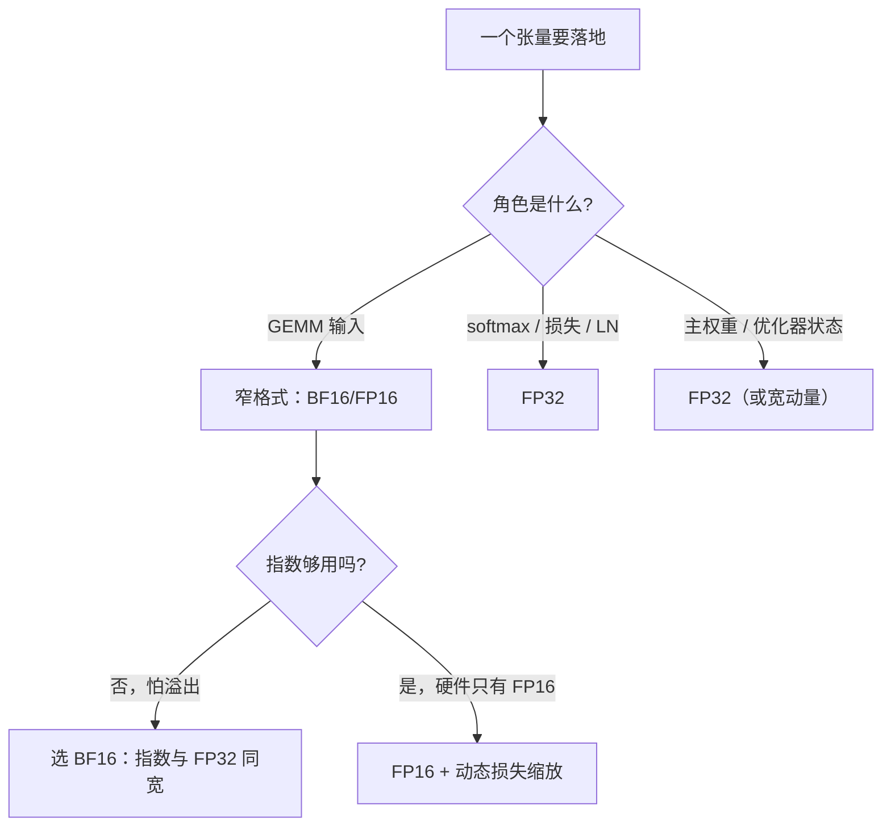
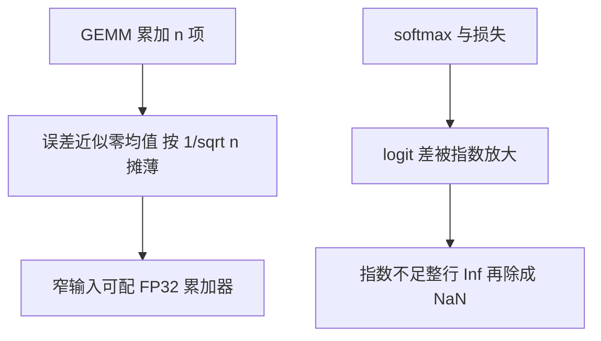

# 浮点格式谱系：FP32/BF16/FP16

宽度不是精度，精度不是稳定；浮点把比特预算分给指数与尾数，训练稳定的第一件事是把这份预算分对。

<footer>—— 据 IEEE 754 与 Micikevicius et al., 2018（混合精度训练）整理</footer>

[上一课](/llm/sch-map)把调度收束成一张按依赖排序的决策单——指标合同、批与预算、策略、执行、放置、运维——并把它自己定位成回答「池子怎么用」的那层地图；地图之外，token 之下是内核与数值层。本课程就从这里接棒：每个数占几个比特、以什么格式参与计算。这是低精度数值与训练稳定这门课的第一课，写最基础的一层——FP32、BF16、FP16 的位分配与各自的失败方式。训练配方视角（主权重、损失缩放、哪些算子留宽）见[混合精度 BF16 / FP8 训练](/llm/pretrain-mixed-precision)，本课给格式本身的账；后课 FP8 缩放与随机舍入默认已经读完这份位账。

## 问题

一个浮点数把 $b$ 个比特切成三份：符号、指数、尾数。FP32 是 1/8/23，FP16 是 1/5/10，BF16 是 1/8/7。这份切法决定了两件不同的事：指数决定动态范围——能表示的数有多大、多小；尾数决定相对精度——相邻两个可表示数靠得多近。在二进制指数 $e$ 处，相邻可表示数的间隔是 $2^{e-m}$（$m$ 为尾数位），于是舍入到最近的相对误差约 $2^{-(m+1)}$：FP32 约 $6\times 10^{-8}$，FP16 约 $4.9\times 10^{-4}$，BF16 约 $3.9\times 10^{-3}$。BF16 的相对误差是 FP16 的八倍，但动态范围与 FP32 完全同宽——这就是谱系的全部逻辑：预算在指数与尾数之间搬家。

预算分错有两个确定死法。指数太少：FP16 的最大有限值是 65504，最小正规数约 $6.1\times 10^{-5}$，未归一化的注意力分数与 logits 上溢成 Inf，反向传播里的小梯度下溢成零——后者表现为「某些层永远不更新」，损失停在一个平台。尾数太少：累加与小更新的量化噪声变大，小学习率的步长被台阶吃掉。

数字实例：FP16 的最大有限值是 65504，而 $\exp(11)\approx 59874$——一个 11 的 logit 过一次指数就顶到天花板；BF16 上限约 $3.4\times10^{38}$，同样的 logit 毫无压力。一格之差，就是那三比特尾数换来的范围。

## 方法

把格式分配写成三条规则。其一，矩阵乘可以窄、归约与归一化要宽：GEMM 是大量乘加的平均，Tensor Core 的累加器比输入宽（FP16 输入配 FP32 累加），个别乘积的尾数误差被项数摊薄；而 softmax、LayerNorm 统计与交叉熵要做减最大值、指数、除法，对动态范围和尾数同时敏感。其二，主权重与优化器状态留在宽格式，窄格式只管计算：更新写回若也走窄格式，小于半格的更新被舍入吞掉（机制在第三课展开）。其三，逐元素非线性留在宽格式。

直觉类比：位预算像一笔钱，在「量程」与「刻度细度」之间分配。FP16 是刻度很细、但最多称到 65504 的精密天平；BF16 是刻度粗一倍、量程却与 FP32 同宽的台秤。要量程（怕溢出的 logits、梯度）选台秤，要细刻度（小更新）才选天平。

FP16 并没有死：只支持 FP16 的上一代卡上，动态损失缩放（溢出则跳步并缩小 $s$）仍是可用配方；BF16 在 Ampere 及以后与 TPU 上是一等公民，指数同宽让全局损失缩放通常可以关掉。选择不是「谁更好」，而是「哪份预算在这块硬件上买得到」。

## 机制

三条规则的机制是两类运算对噪声的敏感度不同。GEMM 的误差近似零均值的随机变量，被大量项平均后按 $1/\sqrt{n}$ 缩小；softmax 不是平均而是比值——logit 差经过指数放大，尾数不足时小概率 token 的相对误差失控，指数不足时整行 Inf 再除成 NaN。主权重必须宽的机制在舍入：RN 舍入下，$|\Delta w|$ 小于半格的更新系统性丢失，FP32 主权重把累积挪到台阶更细的格子里。BF16 的本质因此可以一句话说完：把 FP16 的三比特尾数挪给指数，用更新噪声换溢出安全；大 batch 预训练把噪声平均掉，于是成为默认。

这张图回答「为什么 GEMM 敢窄、softmax 必须宽」：GEMM 的误差是大量项的平均，噪声按 $1/\sqrt{n}$ 摊薄，窄格式有宽累加器兜底即可；softmax 是比值且过指数，一格动态范围的缺口就会被放大成整行 Inf——两类运算对预算的敏感度天生不同。

「BF16 不需要损失缩放」是经验默认不是定理：某层梯度若系统性小于 BF16 的最小正规数，照样归零。遇到整层不更新，先看梯度直方图，再动格式。

## 边界

格式不是数值行为的全部：同格式下累加顺序不同，结果就不同——跨硬件对账是第九课的事。「位数减半误差翻倍」只在相对误差的量级意义上成立，具体层的掉点要看异常值分布，不是均匀噪声（第五课的图谱）。FP16 的 65504 上限也不是抽象风险：一个 $\exp(11)$ 的 logit 就已用掉大半预算。最后，别把「BF16 训练」写成一句口径——计算 dtype、主权重 dtype、优化器状态 dtype 是三个独立开关，实验记录必须分开写。

常见误区：以为「16 位就是误差恰好翻倍、掉点注定」。相对误差确实从 $6\times10^{-8}$ 跳到 $10^{-3}$ 量级，但掉不掉点取决于异常值分布与运算类型——GEMM 里大量项的平均会把噪声摊薄。先看异常图谱，再下结论。

## 小结

- 浮点格式是指数与尾数之间的预算分配：指数保范围，尾数保相对精度。
- FP16 险在范围（65504 上限、小梯度下溢），BF16 险在精度（相对误差约 $0.39\%$），FP32 是参照系。
- 三条规则：GEMM 可窄、归一化与归约留宽、主权重与优化器状态留宽。
- BF16 换来溢出安全、付出更新噪声，大 batch 平均掉噪声，故为预训练默认。
- 格式之外还有舍入模式与累加顺序，分别在第三、九课展开。
- 出处：IEEE 754 格式定义；Micikevicius et al., 2018 混合精度训练；框架混合精度文档口径。
