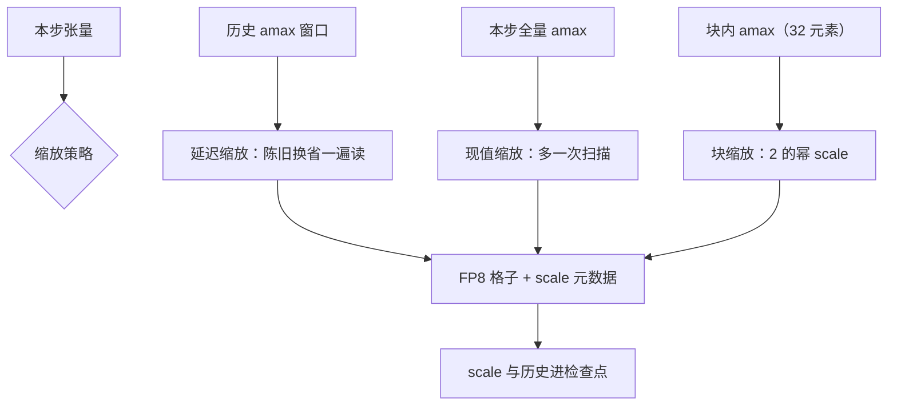
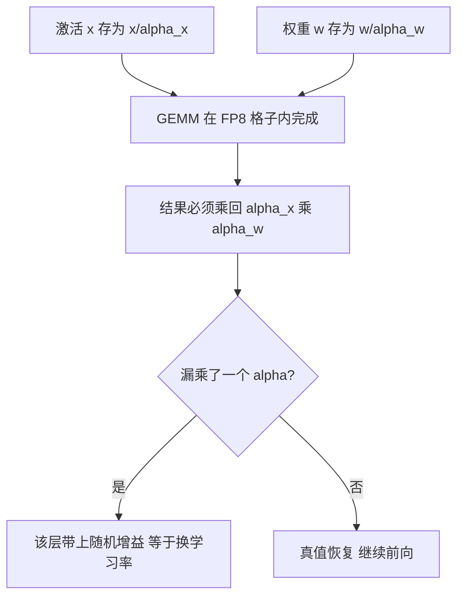

# FP8 的格式与缩放

FP8 的难点不在那八个比特，而在给每个张量配的那把尺子；尺子错了，格式再好也是静默地换了一个学习率。

<footer>—— 据 Micikevicius et al., FP8 Formats for Deep Learning, 2022 与 OCP 微缩放规范整理</footer>

[上一课](/llm/num-float-formats)把位预算的账算清：指数保范围、尾数保精度，BF16 用三比特尾数换来了与 FP32 同宽的指数。FP8 把预算砍到八位，账立刻破产：E4M3 的最大有限值只有 448，E5M2 的尾数只剩两位。两种编码的对照与「前向 E4M3、梯度 E5M2」的分工在 [E4M3 / E5M2](/llm/fp8-formats) 已写，库层合同在 [FP8 训练（Transformer Engine）](/llm/fp8-training) 已写。本课从数值课的角度写「缩放」本身：scale 是一份跟着张量走的元数据合同，要写清它怎么产生、什么时候失效、粒度细到哪一档。

## 问题

没有缩放，绝大多数张量根本塞不进 FP8 的格子：数值范围必须被搬进 $[0, 448]$（E4M3）或更大的 E5M2 范围，且最大值要贴着格子顶端才不浪费尾数。逐张量缩放 $\alpha$ 以 amax 为基准，立刻撞上三个失败模式。绑架：一个异常通道把 amax 抬高，全张量的其余值挤在粗格子里，有效位坍缩。陈旧：为省掉「先扫 amax 再量化」的额外一遍访存，scale 用历史窗口估计，尖峰来时慢一拍。统计开销：每步全张量扫描等于把 GEMM 的访存翻倍，FP8 的带宽红利被统计吃掉。

直觉类比：逐张量缩放像按全班最高的人定门框——一个两米二的「异常通道」让其余所有人的刻度全被撑粗。块缩放相当于每个小组自己定门框，离群点只绑架自己那 32 个人。

三个失败模式指向同一个事实：缩放策略是一组统计假设，不是参数旋钮。假设破了，训练能跑、损失在降，但有效更新已经变质。

## 方法

三代缩放对应三种假设。延迟缩放假设 amax 平滑：本步 scale 来自历史窗口（配 margin 留头寸），本步观测写入历史；窗口长度是核心参数，过长跟不上突变，过短让 $\alpha$ 抖动。现值缩放放弃假设：先扫本步 amax 再量化，多一次读换零陈旧。块缩放（MX 一族）换假设的层次：每 32 个元素一块，scale 限为 2 的幂，硬件在寄存器内完成缩放——离群点只绑架自己那一块，见 [MXFP8](/llm/mxfp8)。粒度即预算：块越小越准，元数据越厚，核越复杂。

数字实例：scale 限取 2 的幂，乘法在硬件里只是挪指数位、零成本。代价是尺子只能 2、4、8 地跳：块内 amax=100 时 scale 取 128，头部贴着格顶、尾部留白约两成——用一点刻度浪费，换掉一整个乘法器。

无论哪一代，scale 与 amax 历史必须随检查点一起存——只存 FP8 权重，无法按原配方续训。

## 机制

scale 为什么是合同而不是注释：存储的是 $x/\alpha$，硬件算完后必须乘回 $\alpha_x\alpha_w$ 才是真值，漏乘一个 $\alpha$ 等于给该层乘了一个随机增益。分布式下合同变厚：张量被切开时，各 rank 的局部 amax 不是全局 amax，必须在持有该张量分片的进程组上归约，否则每张卡各用各的尺子，拼接后的数值协议破裂。陈旧性为什么通常无害：大 batch 预训练的 amax 在相邻步之间平滑，慢一拍仍落在可表示区——这是延迟缩放成立的统计根据；损失尖峰、微调的小 batch、MoE 路由剧变都会破这个假设，那时该换现值缩放或回退宽格式，而不是责怪格式。

这张图回答「scale 合同在哪一环兑现」：存储的是除过尺子的数，硬件算完必须把两只尺子乘回去才是真值；漏乘任何一个 $\alpha$，损失不报错、训练照常降，但那一层已被悄悄换了一个随机学习率。

E4M3 在部分白皮书约定里不保留 Inf，用多余码字表示 NaN 或扩展值。溢出时饱和还是变 NaN，改变「无损失缩放能否跑完一层」的答案——跟硬件文档，不要跟 IEEE FP16 的直觉。

## 边界

块缩放与逐张量延迟缩放的实验结论不能互相搬运：块的统计假设、元数据布局、核支持都不同，混表会把收益记错账。decode 的小 $M$ GEMM 填不满 Tensor Core，FP8 精度再窄也接近带宽墙——「开了 FP8 就该快」要按算子问。缩放也救不了绑架：块缩放缓解的是空间维的绑架，时间维的突变仍要靠窗口与回退。最后，训练 FP8 的目标是跟上 BF16 的更新轨迹，不是部署压缩——用推理校准集来「验证」训练缩放，问错了问题。

常见误区：以为 FP8 只是「更小的 FP16」。E4M3 最大只有 448、E5M2 尾数仅 2 位，没有缩放合同时大多数张量根本无处落脚。FP8 的可用性是「格式加尺子」的整体性质，不是八个比特本身的性质。

## 小结

- FP8 训练是「格式 + 缩放合同 + 核」三件套，缩放是元数据不是注释。
- 三代策略对应三种假设：延迟缩放赌平滑，现值缩放放弃赌，块缩放把假设缩到 32 元素。
- 漏乘 scale 等于随机学习率；分布式 amax 必须按分片组归约。
- scale 与 amax 历史进检查点，否则无法按原配方续训。
- 绑架靠粒度治，突变靠回退治；decode 小 GEMM 吃不满 FP8 红利。
- 出处：Micikevicius et al., FP8 Formats for Deep Learning, 2022；OCP 微缩放规范；Transformer Engine 文档口径。
