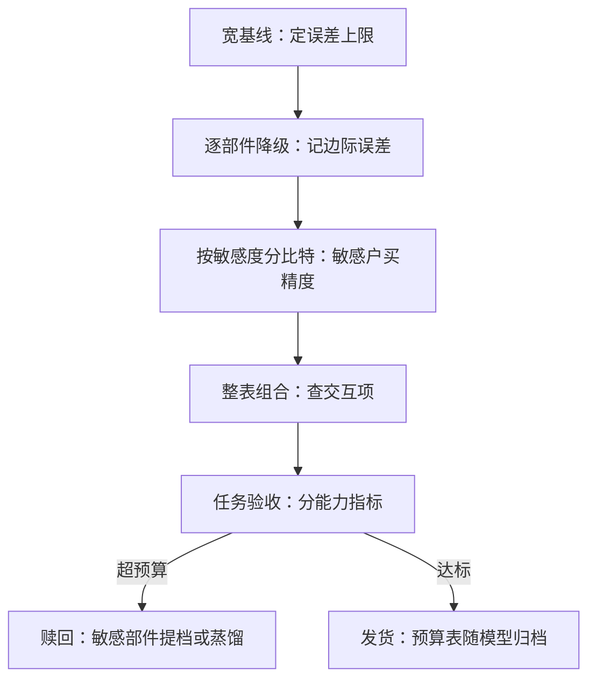

# 低精度推理的误差预算

预算思维把「能不能量化」变成「把误差花在哪」：权重、KV、激活、注意力核各有价目表，任务指标是唯一收银台。

<footer>—— 据 Frantar et al., 2022（GPTQ）与 KV 量化文献的误差口径整理</footer>

[上一课](/llm/num-sparse-training)收掉稀疏的数值账，训练侧的七课到此把「怎么把数算稳」写完；本课转到部署侧。低精度推理的各零件都已单独写过：权重的 [GPTQ](/llm/gptq)、KV 的两档在 [KV 量化：INT8 与 INT4](/llm/kv-quant-int8-int4)、逐层敏感度与 bit 背包在 [混合精度搜索](/llm/mixed-precision-search)、低精度注意力核在 [低精度注意力的内核](/llm/ak-quantized-attention-kernel)。本课不重复任何一件零件，只做装配：把每个部件花的误差写进同一张预算表，规定怎么加总、拿什么验收。

## 问题

一次低精度前向里至少四笔误差同时发生：权重的量化误差（PTQ 校准或 QAT 冻结）、KV 缓存的量化误差（在线追加、随上下文长度累积）、激活与注意力的低精度计算误差（随实现与序列位置变）、采样前的 logits 扰动。它们不同质：权重误差是**固定偏置**——同一权重每次前向犯同样的错；KV 误差是**累积过程**——错误的历史持续参与后续注意力；核误差近似**每次独立的噪声**。加总因此不是算术相加：logit 扰动过 softmax 是非线性的，PPL 对几笔误差的敏感度也不一样——KV 的误差在长上下文上先爆，短文本 PPL 几乎不动。

预算表的真正问题是分配：在总误差上限内，哪个部件多拿比特、哪个部件少拿，依据是什么。

直觉类比：权重误差像鞋里固定的石子（每步都偏同一个方向），KV 误差像记错的地图（错的历史一直带你走），核误差像手抖（每次抖得不一样）。三种病用药不同：石子换鞋垫（校准），地图要修正（重写缓存），手抖靠稳（平均）。

## 方法

预算表三列起步：部件（权重 / KV / 激活 / 注意力核 / 最终 logits）、格式与粒度、误差代理。误差代理要便宜且可比：层输出 MSE、校准集上的交叉熵增量、或 logits 层与宽基线的 KL。流程四步：先跑宽基线定上限；逐部件单独降级，记录**边际误差**（该部件从 8-bit 到 4-bit 独自增加多少）；按敏感度把比特预算花出去——lm_head、首层、KV 的键天然是高敏感户，与 [混合精度搜索](/llm/mixed-precision-search) 的背包是同一算法；最后在任务指标上整表验收。

数字实例：lm_head 从 8-bit 降到 4-bit，短文本 PPL 单独涨 0.05；KV 同样操作只涨 0.01——先别把 KV 砍到 4-bit：128K 检索上它的账完全不同。边际误差必须连同「在哪类任务上量的」一起报告，否则是没单位的数据。

验收的分账规则：短文本 PPL 是最钝的收银台，长上下文针检索、代码、数学各自对误差的敏感谱不同，整表验收必须分能力做，且对照运行级方差（run-to-run 噪声）——低于基线噪声的误差免票。

## 机制

预算能分配的机制根据是一阶可加性：各部件的扰动对 logits 的贡献在一阶近似下可加，残差网络的跨层补偿是一阶之外的美好意外。这解释了两个现象：为什么逐部件测得的边际误差在整表组合后常略好于相加（补偿），偶尔显著更差（某两笔误差在同一坐标上同号叠加——交互项，必须整表复测）；为什么 PPL 会骗——PPL 是对数尺度上的平均，把少数任务上的大误差摊平，预算表要留一列「分位数误差」而不是只看均值。KV 误差的累积性让它的预算随上下文长度重新定价：8-bit 在 4K 上下文免票，128K 上要重验，这正是 KV 课「评估看长上下文任务」的预算表版本。

这张图回答「为什么 KV 的预算要按上下文长度重新定价」：KV 的错不是一次性噪声，而是被写进历史、被后续每一步注意力反复消费的偏置——短文本上免票的格式，长上下文上必须整表重验。

预算表是负载相关的：decode 阶段 M 小、KV 主导带宽，prefill 阶段权重与激活主导计算——同一张表在两类负载上的敏感度排序可以不同，发货前各跑一遍。

## 边界

预算表是模型的、负载的，不是行业的：换基座换负载要重测，别引用别人的表。超预算部件的赎回顺序有讲究：先提档敏感部件（便宜、确定），蒸馏是重武器（贵、能赎回更深误差）。采样的温度会放大或掩盖 logits 扰动——预算表按生产采温验收，不按贪婪。最后，预算表随模型归档：它是第九课跨硬件验收与后续迭代的基线，丢了表，回归就只剩体感。

常见误区：把 0.001 的 PPL 改善当胜利。同配置重跑两次的 run-to-run 噪声可能就有 0.01——小于噪声带的差异是抽奖不是效应，验收之前先测一遍自己的噪声地板。

## 小结

- 四笔误差不同质：权重是固定偏置，KV 是累积过程，核是独立噪声；加总有交互项。
- 预算表三列：部件、格式粒度、便宜可比的误差代理；逐部件记边际误差再整表复测。
- 敏感户（lm_head、首层、KV 键）先买精度；分配是混合精度搜索的背包。
- 验收分能力、按生产采温、对照运行方差；短文本 PPL 是最钝的收银台。
- 预算表随模型归档，是跨硬件与迭代回归的基线。
- 出处：Frantar et al., 2022（GPTQ）的误差口径；KV 量化与本课程前七课的记账框架。
