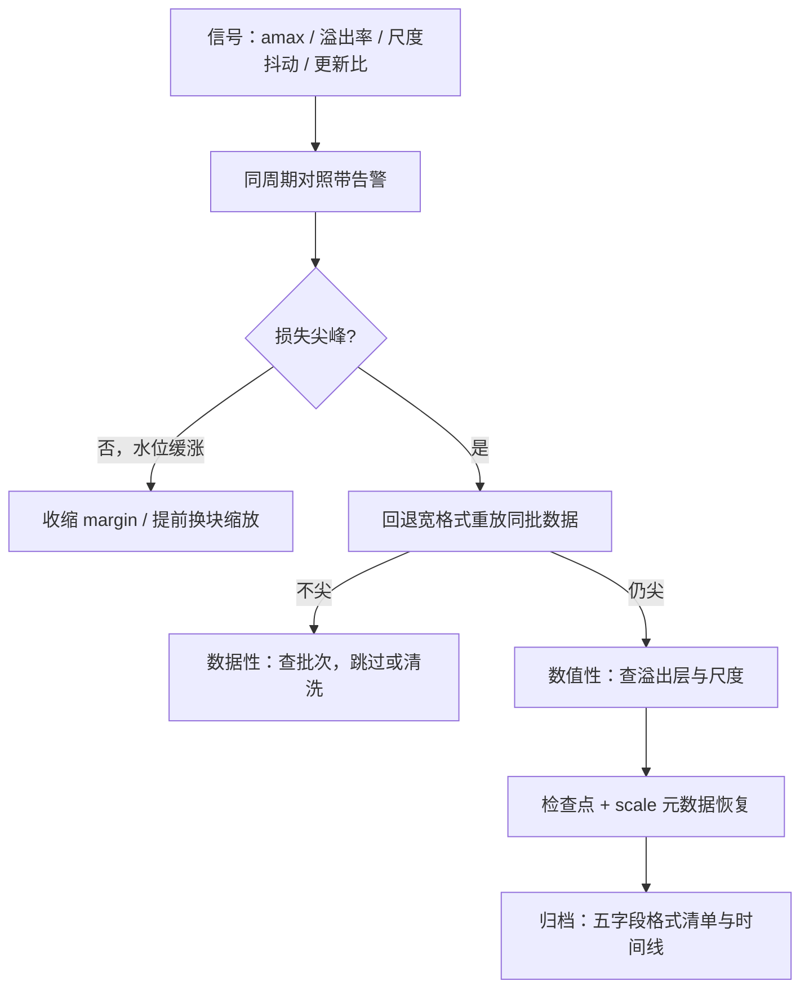
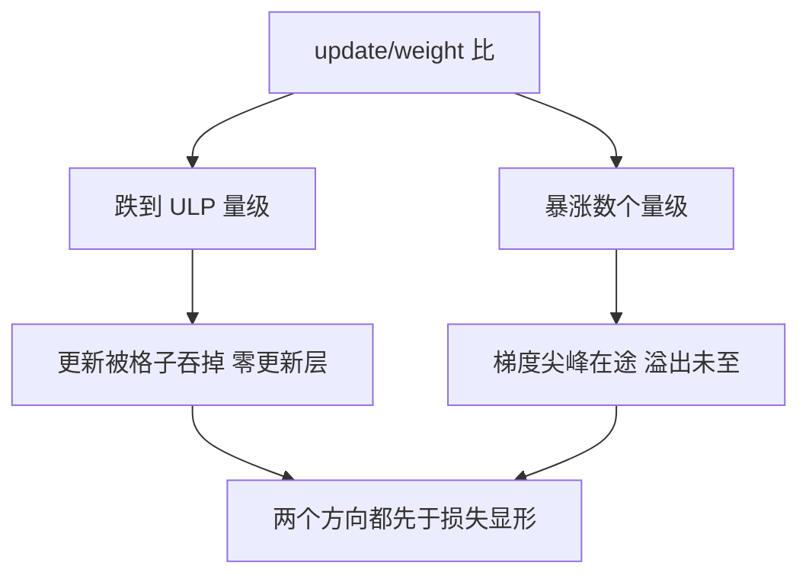

# 长期训练的健康监控

长跑死于细节的累积：溢出计数、尺度陈旧、梯度尖峰，都早在损失可见之前写进了监控曲线。

<footer>—— 据 PaLM 等大规模训练报告的损失尖峰记录与工程监控实践整理</footer>

[上一课](/llm/num-experiment-design)给了单次实验的骨架，本课给万里长征的仪表盘：数周量级、数千卡、中途换数据的训练，数值故障不是「会不会发生」而是「多久一次、怎么兜住」。损失尖峰的裁剪与成因在 [梯度裁剪与损失尖峰](/llm/grad-clip-loss-spike) 已写，Adam 状态的尖峰模式在 [Adam β₂ 尖峰](/llm/adam-beta2-spikes) 已写，失败率的宏观统计在 [大规模训练失败率](/llm/large-scale-failure-rate) 已写，损失曲线的正常分期在 [损失曲线的阶段](/llm/loss-curve-phases) 已写。本课只收低精度训练特有的监控面：看什么、什么阈值、谁负责兜。

## 问题

低精度在长跑里新增的故障面，逐条来自前几课的机制。溢出与跳步计数：延迟缩放的尺子慢一拍时以溢出形式还债（第二课），偶发正常，频率上升是异常图谱突发型（第五课）的前兆。amax 水位漂移：持续型异常让 amax 平滑增长，吃掉 margin 直到首次溢出——漂移曲线比溢出事件早几天报警。尺度序列抖动：$\alpha$ 的高频抖动等效学习率噪声，来源常是 batch 换小或路由剧变。零更新层：某层梯度长期落在半格以内，权重不动（第三课的偏置在训练里的样子），损失平台出现前它已在直方图里。块缩放元数据损坏：检查点恢复后 scale 与权重不同步，损失跳变但梯度正常。

这些信号的共同点：滞后性。损失曲线看起来平滑时，数值可能已退化数天——等损失可见，能做的只剩回滚。

直觉类比：体检指标异常往往早于症状好几年。amax 水位缓涨、溢出率爬坡是「数值体检」，损失曲线是「症状」——等症状出现，能做的只剩回检查点「住院」，而不是门诊调参。

## 方法

仪表盘的最小集与告警阈。逐张量 amax 的分位数序列（P50 与 P999 各一条，看水位与突发）；溢出/跳步计数的滑动率；有效尺度 $\alpha$ 的序列与相邻步抖动幅度；梯度范数与 update/weight 比；逐层「零更新」计数（更新与权重之比低于 ULP 阈值的层数）。阈值不设单点：amax 有数据周期（昼夜、周末），用同周期对照带而非绝对上限。triage 流程固定：尖峰发生 → 先分数据性还是数值性（回退宽格式重放同一批数据：重放不尖是数据问题，仍尖是数值问题）→ 数值性按最近检查点加 scale 元数据恢复 → 记录归档。

术语翻译：同周期对照带就是「和上周同一时刻比」。训练负载有昼夜与周末节律，绝对上限要么天天误报、要么形同虚设；把此刻的值与「上周此刻 ± 合理浮动」相比，节律就从阈值里自动消掉了。

## 机制

update/weight 比为什么是中心指标：它把舍入台阶、学习率、损失缩放、优化器状态折成一个无量纲数。比值落到 ULP 量级，更新正在被格子吞掉（第三课）；比值突然放大数个量级，梯度尖峰在途、溢出未至——上下两个方向的故障都在这一个数上先于损失显形。同周期对照带为什么必要：长训练的负载有节律，绝对阈值要么天天误报、要么形同虚设；「和上周同一时刻比」把节律从阈值里消掉。重放诊断为什么干净：它把「数据」与「数值」两个因果链在一次实验里切开——这是上一课配对思想在事故现场的使用。

这张图回答「为什么 update/weight 比是中心指标」：它把舍入台阶、学习率、损失缩放、优化器状态折成一个无量纲数，向下是慢性中毒（更新被吞）、向上是急性前兆（尖峰在途），两个方向的故障都在这一个数上比损失先显形。

恢复必须带 scale 元数据：只回滚权重不回滚 amax 历史与尺度，第一分钟内就会二次溢出。检查点的数值契约（第二课）在事故恢复时才显出全部价值。

## 边界

监控自身有成本：直方图与 amax 归约要同步，采样过密吃吞吐——按张量重要性分级采样，路由与首尾层全采，中间层抽样。告警要有人负责兜：阈值没有响应流程就只是墙纸；triage 的分工（谁看数据、谁看数值、谁有权决定回滚）要先写下来。归档按失败实验的口径（死因落在判据上）：尖峰的时间线、重放结果、恢复检查点、格式清单，缺了任何一样，下次故障还要重猜一遍。最后，监控曲线本身要随配方迁移重验：换了缩放策略，旧阈值全部作废。

常见误区：以为告警发了就算监控到位。没写明「谁在几点负责看、谁有权按回滚」，告警只是墙纸——长跑事故的真实损失常常不在检测，而在响应流程卡在等人拍板。

## 小结

- 低精度长跑的故障面：溢出率、amax 漂移、尺度抖动、零更新层、元数据损坏——全部先于损失显形。
- 中心指标是 update/weight 比：向下落进 ULP 是吞更新，向上暴涨是尖峰前兆。
- 告警用同周期对照带，不设绝对阈值；triage 用宽格式重放切开数据与数值两条因果链。
- 恢复带 scale 元数据；归档按判据口径。
- 监控分级采样，阈值随配方迁移重验。
- 出处：PaLM 等大规模训练报告的损失尖峰记录；本课程第二、三、五课的机制口径。
