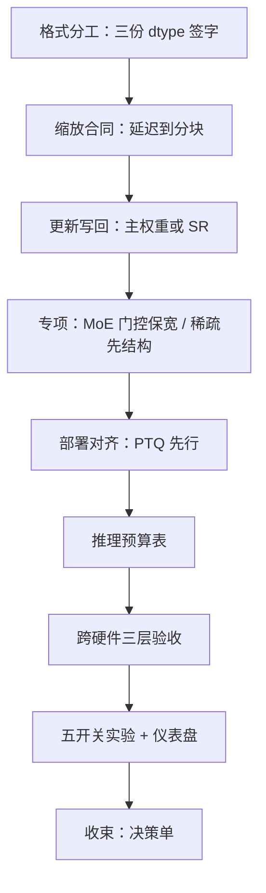
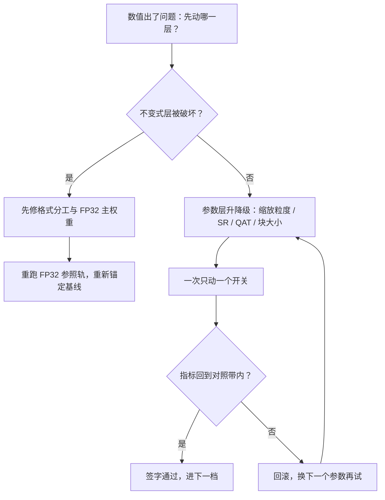

# 数值收束

十二课压成一张决策单：先选格式，再配尺子，后验预算；数值稳定是设计出来的，不是监控出来的。

<footer>—— 据 Micikevicius et al., 2018 / 2022 与本课程十二课综合整理</footer>

[上一课](/llm/num-longrun-health)把仪表盘装好，本课程至此零件齐了：格式谱系、FP8 缩放、随机舍入、量化感知训练、异常值图谱、MoE 的低精度、稀疏的数值、推理误差预算、跨硬件一致性、实验设计、健康监控。本课收束：把它们装配成一张先后分明的决策单。上游是[服务调度与多租户](/llm/sch-map)回答「谁在什么时候用哪张卡」，下游是投机解码一类的推理深化课程；本课程回答中间这一层——卡里每个数怎么存、怎么算、怎么验。**本课程到此收束。**

## 问题

十一个决策点分布在格式、训练、验收三层，各自局部最优会互相拆台：块缩放解决了绑架却改变统计假设，QAT 迁就了部署却抬高训练方差，跨硬件对齐逼你钉住每一个缩放约定。没有全局顺序，团队会在错误的位置先动刀——最常见的两条弯路：训练还没稳就追 FP8 全量（把统计假设押在没验证的分布上），以及推理量化不建预算表（误差花在哪说不清，掉点了不知道回收哪一刀）。收束交付的是这张先后表。

## 方法

**决策单**，按「先无损后近似、先机制后参数」排序：

「三份 dtype 各自签字」翻译成白话：同一个模型里同时存在三种数字格式——矩阵乘法用窄格式（如 FP8）省算力，归一化和求和用宽格式（如 FP16/BF16）防误差累积，主权重和优化器状态用 FP32 保稳定。「签字」指把每处的选择写进实验记录，换卡换框架时逐项核对，而不是凭默认值。

1. **格式分工**：GEMM 可窄、归一化与归约留宽、主权重与优化器状态留宽——三份 dtype 各自签字（第一课）。
2. **缩放合同**：逐张量延迟缩放起步；异常图谱显示绑架或突变，再上通道/块粒度（第二、五课）。
3. **更新写回**：FP32 主权重是默认；显存极限处用随机舍入换偏置，优化器状态不豁免（第三课）。
4. **部署对齐**：PTQ 先行，敏感层不够再 QAT；目标格式与实际核对齐（第四课）。
5. **专项数值**：MoE 门控保宽、专家缩放分块（第六课）；稀疏先定结构后降精度（第七课）。
6. **推理预算表**：四笔误差记账，敏感户买精度，分能力验收（第八课）。
7. **跨硬件三层验收**：位级护栏、统计级迁移、任务级承诺，迁移时宽基线先行（第九课）。
8. **实验与监控**：五开关单轴消融（第十课）；仪表盘按 update/weight 比与对照带告警（第十一课）。

每一步拿上一步吐不出的余量。永不碰的四件事：漏乘 scale（等于随机学习率）、路由 argmax 上降精度（离散事件不进噪声框架）、无 FP32 参照轨下结论（没有锚）、跨口径比较吞吐与精度（账本不同）。

常见误区：初学者容易以为漏乘 scale 只是「精度差一点点」。实际上 scale 是把大数压回格式能表示范围的系数，漏乘等效于给一部分激活乘上一个随机大小倍数，训练就像换了一个随机学习率——曲线往往还能跑，但已经无法复现，排查代价远高于第一次就写对。

## 机制

顺序背后的机制是假设的分层：格式分工与主权重是不变式层，破了它们任何调优都在错的账本上算；缩放粒度、SR、QAT、块大小是参数层，按各自统计假设成立与否升降级。另一个机制是**同一份预算在训练与推理两处兑现**：训练侧守住的格式合同（scale 进检查点、amax 归约、写回偏置），正是推理预算表能「逐部件记账」的前提——训练数值混乱的模型，推理误差预算无从谈起，因为基线本身在漂。

数字实例：假设推理预算表允许总共 1% 的能力下降，四笔误差（权重、激活、KV 缓存、注意力累积）各预留约 0.25%；若权重量化一项实测就吃掉 0.9%，说明该给敏感层买回精度（如局部升到 BF16），而不是继续把别的部件往下压——预算超支要找到花超的那一户，不能全楼分摊。

一张自检表：若只能做三件事——把三份 dtype 签清、给每个缩放张量挂上 amax 监控与溢出计数、为推理建一张四行预算表。多数团队在这三步之前就已避开绝大多数数值事故；后面的每一档都要求先证明前面拿不出来。

## 边界

这张单子有时效。格式侧：微缩放与下一代块格式的普及会把「缩放合同」从工程自觉变成硬件默认，第 2 步的权重大幅前移；负载侧：MoE 与长上下文把异常图谱按专家与位置切分，监控面继续加宽；硬件侧：跨厂商混合集群放大第九课的合同成本。收束不是终点：数值管好之后，瓶颈移向解码与投机，移向更长上下文的系统工程——本课程交付的是「数」这一层的地图，地图之外的路，由相邻课程接棒。

## 小结

- 决策单八步：格式分工 → 缩放合同 → 更新写回 → 专项数值 → 部署对齐 → 预算表 → 三层验收 → 实验与监控。
- 不变式层（三份 dtype、主权重）先于参数层（粒度、SR、QAT）；每步拿上一步吐不出的余量。
- 四件永不碰：漏乘 scale、量化路由、无参照下结论、跨口径比较。
- 训练的格式合同是推理预算表的前提，同一份预算两处兑现。
- 出处：本课程十二课综合口径；底层文献锚点为 Micikevicius et al., 2018（混合精度）与 2022（FP8 格式）。
