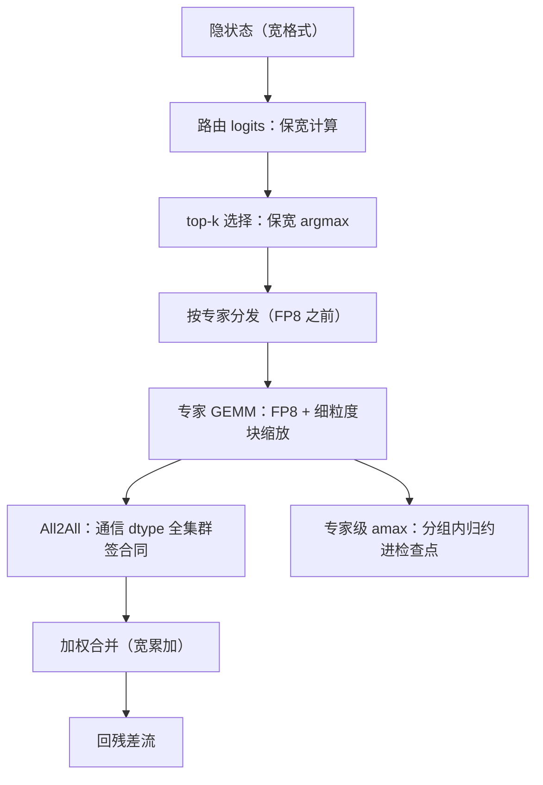
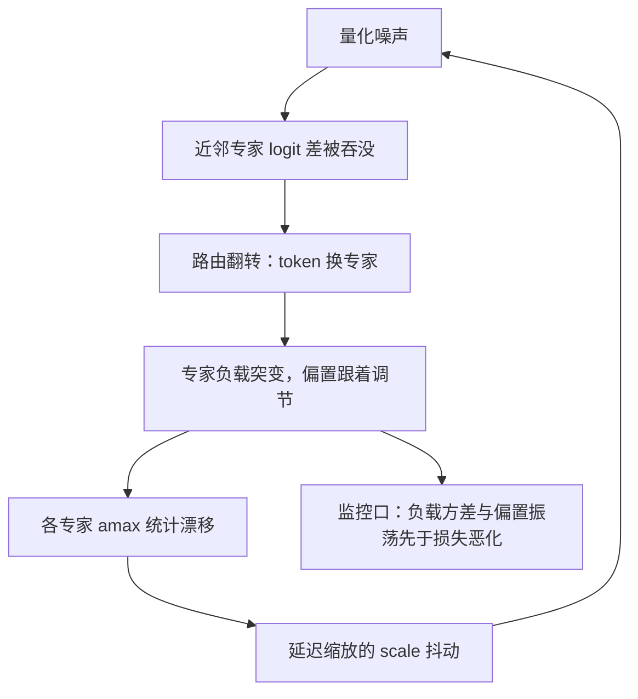

# MoE 的低精度

MoE 里最贵的低精度事故不在专家的 GEMM，而在路由：一个 logit 的舍入偏差，掀翻的是整张负载表。

<footer>—— 据 DeepSeek-AI, DeepSeek-V3 Technical Report, 2024 的 FP8 训练设计整理</footer>

[上一课](/llm/num-outlier-atlas)的图谱在混合专家上多出一个维度：同一个模型里，激活分布按专家分裂。专家 GEMM 的低精度与稠密模型同类——格式、尺子、舍入三份账照算；MoE 特有的是门控与均衡的数值。负载均衡的机制与无辅助损失的偏置调节分别在 [MoE 负载均衡](/llm/moe-load-balance) 与 [无辅助损失的均衡](/llm/aux-loss-free-balancing) 写过，本课只写数值面：哪些量必须保宽，专家级缩放怎么做，通信格式怎么签合同。

## 问题

路由是 argmax：每个 token 的 top-$k$ 专家由门控 logits 的排序决定。排序对扰动过敏——两个近邻专家的 logit 差小于量化噪声时，舍入方向决定谁入选。这与前几课的噪声有本质区别：GEMM 的舍入误差是零均值的，单个选择的翻转是**离散事件**，且后果是系统性的——专家负载突变，均衡偏置跟着调节，负载变化又改各专家的 amax 统计，第二课延迟缩放「amax 平滑」的假设在这里被路由亲手打破。闭环是：量化噪声 → 路由翻转 → 负载振荡 → 尺度抖动 → 更大的量化噪声。

「argmax」翻译成白话就是「挑出分数最大的那一个」：路由器给每个专家打分（logit），top-$k$ 选择把分数最高的 $k$ 个专家挑出来处理这个 token。它只看名次、不看分差——所以再小的舍入误差，只要改变了名次，选中的专家就整个换掉，这就是「离散翻转」的含义。

第二层困难在统计量：专家按 token 切分后，每个专家在自己的 expert parallel 组里拿到的样本远少于全 batch，per-expert 的 amax 与分位数天然抖；冷门专家的统计更稀。

## 方法

分层保精度，把「必须宽」的清单划到专家机制上。路由 logits、softmax 门控与 top-$k$ 选择保 BF16 或 FP32——这是清单里不可谈判的一项。专家 GEMM 走 FP8，但缩放粒度要细：DeepSeek-V3 的配方是细粒度块缩放（按 128 通道或固定元素数分块），因为不同专家的分布差异大，per-tensor 尺度会被最野的专家绑架。保宽清单还有：共享专家、嵌入、路由器本体、输出头与首尾若干层（首层激活格局未定型，尾层直接接损失）。

直觉类比：per-tensor 缩放像全公司共用一个报销上限——最能花钱的部门一超标，全公司的额度都被迫收紧，其他部门跟着受穷；按 128 通道分块则像每个部门各有各的预算，最「野」的专家再夸张，也只绑架自己那一小块的精度。

专家级统计与检查点：amax 按专家分片组归约（第二课的分布式合同加上专家维），scale 与偏置调节量同批存档，否则续训的负载表接不上。

## 机制

为什么 argmax 保宽是机械要求而不是保守习惯：softmax 门控的权重由 logit 差决定，翻转改变的不是某个系数的精度，而是**计算图走哪条边**——被换掉的专家输出完全不同，误差不进入「小扰动」框架。这也解释了为什么负载指标必须与损失一起看：路由噪声在损失上可能被平均，在专家负载方差上却先行恶化，等损失可见时闭环已转了几圈。细粒度缩放在 MoE 收益更大的机制在分母：块越小，单点绑架影响的面越小；专家分布的离散差异让 per-tensor 方案的绑架概率按专家数放大。

常见误区：看到损失曲线没涨就以为路由数值没问题。这个闭环里，路由噪声最先表现在专家负载方差和均衡偏置的振荡上，要转几圈才传导到损失；只盯损失等于等火烧到门口才看烟感。

DeepSeek-V3 报告的 FP8 混合精度框架保留 BF16 的清单包括路由、嵌入、输出头与首尾层，正与「离散事件不进噪声框架」的机制一致；细粒度累加则把 FP8 的精度损失压到与 BF16 训练同量级。

## 边界

全 FP8 的 MoE 配方要在小规模上先验两件事：负载指标（专家负载方差、偏置调节量的振荡）与每专家溢出计数，都稳了再放大。通信 FP8 需要全集群对同一缩放约定签字——不同实现混布等于无定义（第九课的跨硬件合同的特例）。专家并行的重构排布会改变统计窗口，压测要按真实并行度做。最后，别把「MoE 低精度」简化成「专家权重 4-bit」：推理侧的专家量化另有一条线，训练态的门控与缩放合同才是本课的地盘。

## 小结

- 路由是 argmax：量化噪声引发离散翻转，经负载与缩放形成正反馈闭环，门控必须保宽。
- 专家 GEMM 可 FP8，缩放要细粒度分块，per-tensor 会被最野专家绑架。
- 专家级 amax 按分片组归约，scale 与均衡偏置进检查点。
- 负载指标先于损失恶化；监控面要看专家负载方差与偏置振荡。
- 通信 dtype 全集群签同一合同。
- 出处：DeepSeek-AI, DeepSeek-V3 Technical Report, 2024；MoE 负载均衡与无辅助损失均衡的既有口径。
