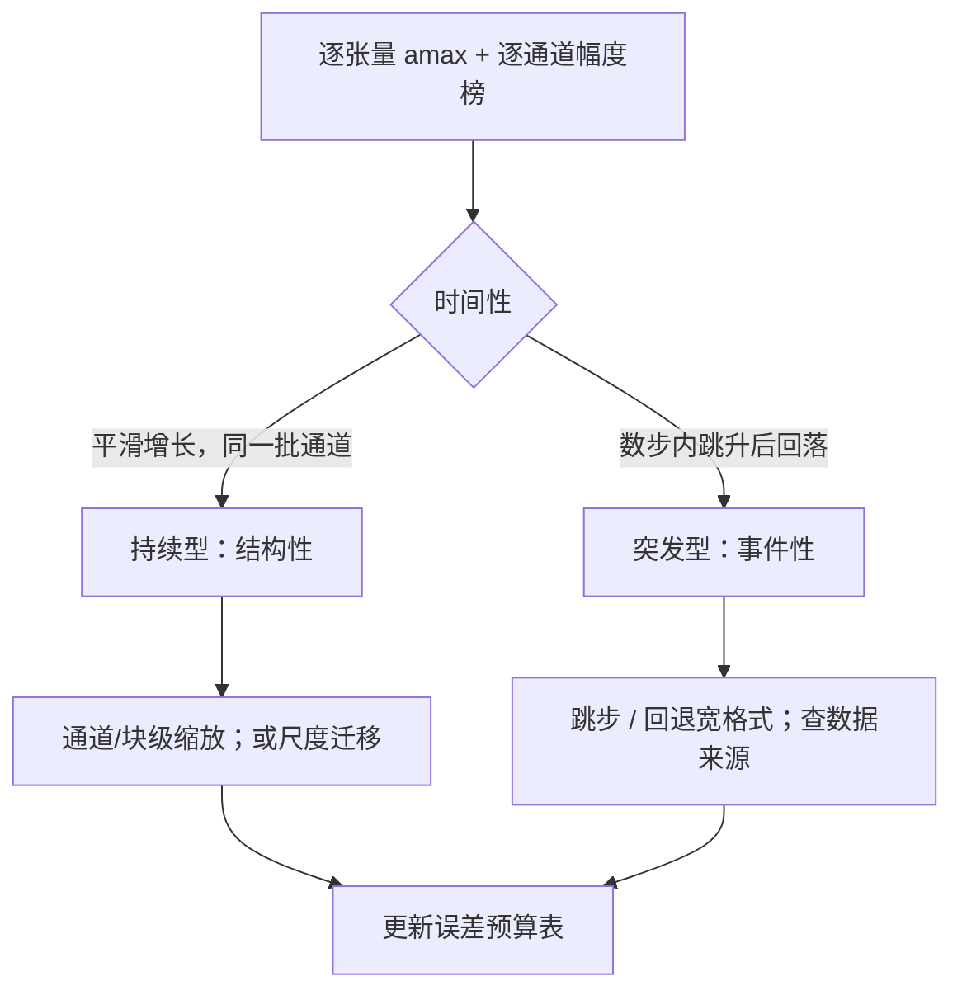
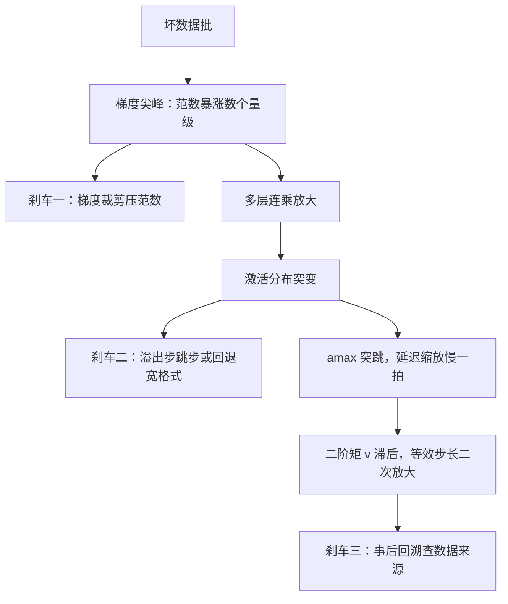

# 训练中的异常值图谱

低精度训练的失败很少是均匀的噪声，而是少数坐标的暴政；把谁在哪个阶段、哪条通道、涨到多大画成图谱，对策才有的放矢。

<footer>—— 据 Dettmers et al., 2022（LLM.int8）与 SmoothQuant、OS+ 的现象记录整理</footer>

[上一课](/llm/num-qat)把量化噪声搬进训练环，但前四课都默认张量分布「大体友好」。本课放弃这个默认：Transformer 的张量里有少数坐标系统性占据幅度的高端，第二课的绑架与陈旧都是它们的结果。推理侧的系统现象——涌现异常通道、尺度迁移、逐层抑制——分别在 [LLM.int8()](/llm/llm-int8)、[SmoothQuant](/llm/smoothquant)、[OS+ / Outlier Suppression](/llm/outlier-suppression) 写过。本课画训练态的图谱：异常按位置、阶段、时间性分型，每型配对策。

## 问题

训练里的异常至少四型，机制各不同。其一，激活的结构性大通道：少数隐维在几乎所有 token 上幅度远超均值，随层数加深而放大（残差流的加性累积）。这是持续性的，per-tensor 尺度被它绑架后，其余维度的有效位坍缩——第二课「绑架」的源头。其二，注意力 logits 与未归一化分数：softmax 之前的量没有界，一层 Inf 全行 NaN，是第一课「指数保范围」规则的主因。其三，梯度尖峰：坏数据批或深度上的连乘放大，短时间内梯度范数暴涨数个量级，与损失尖峰互相放大（裁剪与成因见 [梯度裁剪与损失尖峰](/llm/grad-clip-loss-spike)）。其四，优化器二阶矩滞后：$v$ 是慢变量，梯度突变后 $v$ 仍小，等效步长被放大——异常经过优化器被二次放大。

数字实例：amax 就是张量里绝对值最大的那个数。假设某层激活大多在 1 上下，但第 137 号通道稳定冲到 100 以上——FP8（E4M3）一格最大只记到 448，缩放尺子被迫按 100 校准，于是 0.5 量级的正常维度只剩零点几格可分，有效精度就这么被一条通道「绑架」走了。

四型的对策不同，混为一谈就会用 clip 去治结构性大通道（无效且扭曲有效学习率），用缩放去治数据尖峰（迟一拍）。

## 方法

图谱怎么画：对关键张量（每层激活、梯度、权重更新）记录两个视角的时间序列——逐张量的 amax 与分位数（看整体水位），以及逐通道的幅度榜（看集中度）。有了这两条，把异常按时间性分成两类。**持续型**：通道榜长期由同一批通道占据，幅度平滑增长——这是结构，用粒度治：通道级或块级缩放把绑架范围缩到单通道；或按 SmoothQuant 的思路把尺度从激活迁移到权重，让两边都能进格子。**突发型**：amax 在若干步内跳升数个量级后回落——这是事件，用回退治：该步溢出则跳过或回退宽格式，事后再查数据来源。

## 机制

持续型异常的机制来源值得记住三处：残差流是加性累积，任何一路的系统性偏置都留在主通道里不衰减；嵌入与 LM head 天然有大幅度维度，会顺着残差往深处传；注意力在归一化之前无界。突发型的机制是放大链：数据触发梯度，梯度经过多层连乘改变激活分布，激活分布又改 amax——第二课延迟缩放「慢一拍」的失效正落在这条链上。训练阶段也有图谱：热身期权重小、激活分布未定型，异常格局与训练中段不同；退火期学习率变小，小更新偏置（第三课）接管为主要矛盾。所以「什么时候看什么指标」本身是图谱的一部分：热身看溢出计数，中段看通道榜，退火看 update 与 weight 之比。

直觉类比：残差流像一条主干河道，嵌入和每一层的系统性偏置都汇进来，而且不蒸发——所以「哪几条通道幅度大」会一路带到网络深处，通道榜随深度越来越倾斜，这不是 bug，是加性累积的几何后果。

图谱是模型的，不是定律的：换数据、换深度、换归一化，通道榜会重排。可迁移的是分型方法与指标，不是那张具体的榜。

## 边界

第一，不要用全局梯度裁剪治结构性异常：clip 约束的是方向球半径，压不住单通道绑架，只会扭曲有效步长。第二，通道级缩放改变前向语义的等价性有限但非零：迁移尺度（SmoothQuant 类）要连反向一起验证。第三，异常图谱与稀疏、MoE 的交互是后两课的主题：MoE 的路由让激活分布随专家分裂，图谱要按专家画。第四，监控采样有开销，逐 token 记录不现实——分位数与抽样通道是工程平衡，但要固定协议，否则曲线之间没法比。

常见误区：把梯度尖峰当「噪声变大」，用调小学习率或加大正则硬扛。突发型是事件不是趋势，正解是溢出跳步、回退宽格式、再查数据批；只有持续型的结构性大通道才需要动缩放粒度——两型用错药，会把有效学习率越调越乱。

## 小结

- 异常分四型：结构性大通道、无界 logits、梯度尖峰、优化器二阶矩滞后；对策各不同。
- 持续型用粒度治（通道/块缩放、尺度迁移），突发型用回退治（跳步、宽格式回退、查数据）。
- 延迟缩放的失效与异常放大链是同一件事的两面。
- 图谱随阶段变：热身看溢出，中段看通道榜，退火看更新比。
- 图谱是模型的不是定律的，可迁移的是分型方法。
- 出处：Dettmers et al., 2022（LLM.int8）的涌现异常记录；SmoothQuant 与 OS+ 的对策口径。
