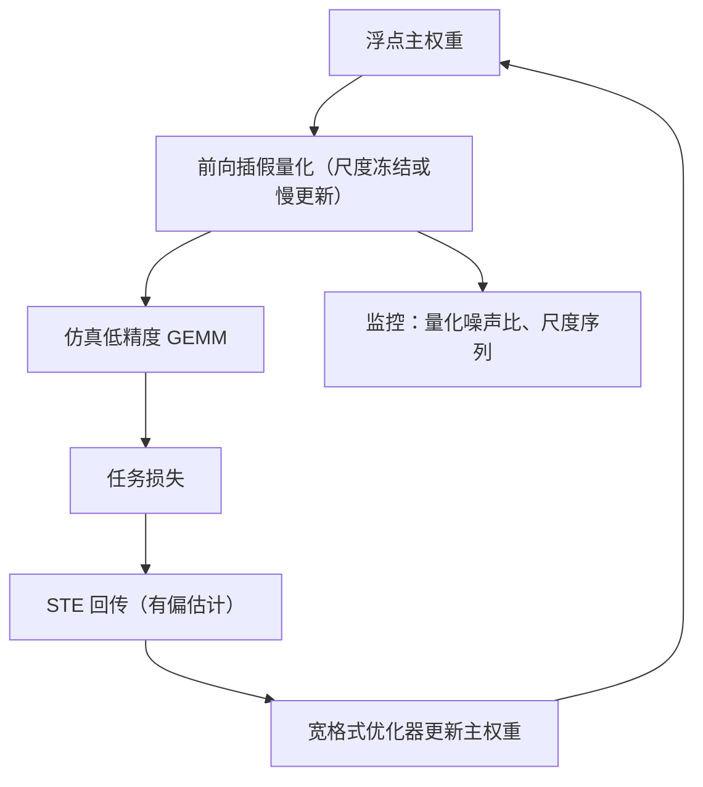
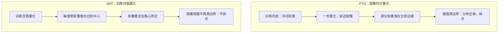

# 量化感知训练

与其部署时被量化噪声吓一跳，不如训练时就让它进场；难在反向穿过取整的那一步，只能靠估计。

<footer>—— 据 Jacob et al., Quantization and Training of Neural Networks for Efficient Integer-Arithmetic-Only Inference, CVPR 2018 整理</footer>

[上一课](/llm/num-stochastic-rounding)处理的是「真值怎么写回存储」，本课把低精度再往前推一步：前向就按低精度算。量化感知训练（QAT）把量化噪声从部署时刻搬进训练环。假量化图的完整机制——前向取整、STE 回传、整数-only 的边界——在 [QAT](/llm/qat) 已写，本课不重复推导，只从这门课的主线补三件事：量化噪声与优化器的耦合、尺度该学还是该冻、以及 QAT 在什么意义上让「训练到部署」这段路更稳。格式课的三份账（宽度、尺子、舍入）在这里收口。

## 问题

PTQ 把量化当部署后处理：权重停在格子之间，一步量化等于给每层加一份从未见过的噪声，部署敏感的模型直接掉点。QAT 的答案是让梯度把参数推到「量化后仍然好」的区域。但从训练稳定的视角看，这是把一个受控系统改成了带执行器噪声的系统：前向每层多一段台阶函数，反向的梯度是有偏估计（STE），损失的随机性变强、梯度信噪比变低。QAT 不是「更稳的训练」，是「为部署 stability 付出训练期 variance」的交易——这笔账要用这门课前四课的语言记账。

术语翻译：「假量化」就是训练时先照常算浮点，再手动把数值按到最近的格点上继续前向——存的仍是浮点数，但值已带着取整。「STE」（直通估计器）是反向的补救：取整这一步没有正常导数，就假装它不存在，让梯度原样穿过去——方向有系统偏差，但比完全断掉强。

## 方法

稳定性视角的配方，逐条对应一种噪声来源。主权重保持浮点：假量化只出现在前向仿真里，导出整数是训练结束的一次冻结——写回偏置由浮点主权重吸收（第一课的规则）。假量化只套线性层的权重与输入，softmax、归一化、损失留宽（第一课规则二的同一张清单）。尺度先按校准统计初始化，训练中慢更新或干脆冻结：尺度乱跳等于每步换一套格子，把 STE 的噪声按格宽放大（第二课的尺子合同在训练态的版本）。学习率低于原训练：STE 的偏置在细步长下漂移慢。

数字实例：尺度为什么要冻。设某层格宽 0.1，取整噪声至多 0.05，是固定地板；若尺度每步都在变，同一个权重这一步被取整到 0.3、下一步格子换了又取整到 0.6——「噪声至多半个格宽」的前提没了，STE 的偏差被逐格放大，梯度信噪比随尺度抖动一起崩。

监控面比普通微调多两项：量化噪声比（前向仿真与宽格式前向的输出差）与尺度序列的抖动幅度，这两条曲线是第四课仪表盘的 QAT 特供。

## 机制

QAT 的「稳」有两层，不能混说。第一层是部署稳：训练足够久时，权重大质量迁到台阶中心，推理取整不再跨边界——部署时刻不再有分布迁移，这是 PTQ 给不了的。第二层常被误读成「训练稳」：STE 是有偏梯度，与上一课 SR 的无偏噪声不同类，Adam 的二阶矩会把低信噪比方向的步长归一化放大，偏置不会像方差那样被 batch 平均掉。所以 QAT 训练更像在噪声地板上走路：能走，但每一步的方向都有系统误差，靠训练时长与数据量把偏置的积分效应压小。

直觉类比：量化像把连续斜坡改成一级级台阶。PTQ 是球先在斜坡上放稳，部署时突然抽走斜坡换成台阶，球滚到哪全看运气；QAT 是训练时就在台阶上滚球，久而久之球都停在每级台阶的正中，之后抽换斜坡也无所谓。

与训练侧低精度的关系是共用预算而非叠加：若训练本来就在 FP8 GEMM 上跑（第二课），QAT 的假量化目标格式应与实际核一致，否则是给同一批权重叠两套不同的量化噪声——预算翻倍而收益不叠。

从浮点全参做 QAT，与从量化检查点「再训练」不是同一实验：后者若不允许 STE 穿过整数，只是在离散点上跳，通常训不动。主权重必须浮点，直到导出那一刻。

## 边界

成本线先画清楚：70B 级全网 QAT 接近再训一遍，理性顺序仍是 PTQ 不够再对敏感层 QAT。4-bit 激活的台阶太宽，STE 的「可以滑过去」幻觉更强，常不如把激活留在宽格式只量化权重。QAT 会拟合训练分布：用通用语料做 QAT 等于重开一次对齐，安全与拒答行为都可能漂，应在下游 SFT 数据上短微调并当另一次对齐验收。最后与 [QLoRA](/llm/qlora) 分家：4-bit 冻结基座加浮点适配器不是 QAT，别叠成一句「都是 4-bit 训练」。

## 小结

- QAT 把量化噪声搬进训练环：部署稳的收益，用训练期方差与有偏梯度换。
- 配方逐条对应噪声源：浮点主权重、线性层假量化、尺度冻结或慢更新、低学习率。
- STE 的偏置与 SR 的方差不同类，不会随 batch 平均；靠时长与数据量压积分效应。
- QAT 的目标格式应与实际低精度核一致，两套噪声不叠加记账。
- 成本接近再训练，默认先 PTQ；数据域错位会破坏对齐。
- 出处：Jacob et al., CVPR 2018；本课程格式与缩放各课的记账口径。
