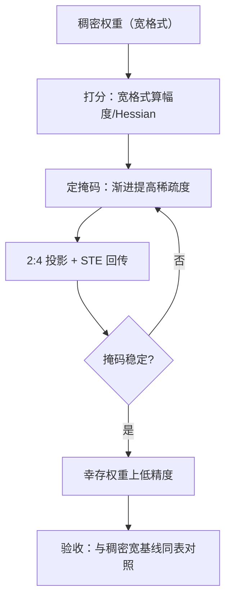
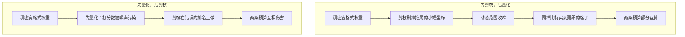

# 稀疏训练的数值基础

稀疏与低精度都在砍表示，砍的轴不同：一个删坐标，一个删比特；两条预算叠在同一份权重上时，账必须一起算。

<footer>—— 据 NVIDIA 结构化稀疏白皮书与剪枝-量化联合文献整理</footer>

[上一课](/llm/num-moe-lowprecision)写的是删计算（MoE 的条件路由），本课写删坐标：稀疏。剪枝与量化的路线对照在 [量化还是剪枝](/llm/quantization-vs-prune) 已写，激活稀疏的现象与架构条件在 [激活稀疏与 ReLU²](/llm/activation-sparsity) 已写。本课只写训练态的数值基础：打分数在哪个精度上算、掩码跳变怎么进误差账、2:4 硬件模式对训练的约束、以及稀疏与低精度叠加的次序。

## 问题

稀疏训练的数值特殊性有四条。其一，打分数失真：幅度剪枝的判据 $|w|$ 与 Hessian 类判据都在窄格式下失去分辨率——权重幅度与舍入噪声同量级时，排名是随机的，剪掉谁成了抽签。其二，掩码跳变：训练中动态重建掩码时，坐标的进出是离散事件，进出抖动让该坐标的动量与二阶矩统计断续作废，优化器状态对不上账。其三，2:4 模式的不动点问题：硬件稀疏张量核要求每四个连续权重恰两个非零，而梯度下降的更新不尊重这个模式——训练出的稠密权重多数时刻不满足模式，「训练全程 2:4」与「训练后投影到 2:4」是两个不同的问题。其四，叠加次序：先量化后剪枝与先剪枝后量化，误差预算不同。

术语翻译：2:4 结构化稀疏就是「每连续 4 个权重强制恰好 2 个非零」的固定格式。非零的位置可以由训练决定，但数量不能变；硬件的稀疏张量核认得这种格式，见到零就直接跳过计算，吞吐按表头翻倍。

## 方法

次序原则先立：**先定结构，后降精度**。剪枝的打分与掩码决策在宽格式上做；掩码稳定（或按固定周期重建）之后，再对幸存权重上低精度——理由在误差预算：剪枝已经删掉了小幅度坐标，幸存权重的幅度大、离格子远，量化压力反而小，两条预算部分互补。若反过来先量化，打分数被量化噪声污染，剪枝在错的排名上做。

数字实例：权重幅度普遍在 0.01 量级、窄格式的舍入噪声也是 0.01 量级时，「A 权重 0.012、B 权重 0.011 谁更重要」这个问题完全被噪声淹没——剪掉谁等于抽签。宽格式打分的意义就是把尺子换到噪声远小于信号的量程上，排名才有意义。

2:4 的训练做法是投影而非约束：每步把权重块投影到满足模式的最近点（缩放配对幅度最小的两个元素），梯度穿过投影用直通。这与第四课 STE 同类：离散约束下的有偏梯度。渐进式进入——从稠密热身，逐步提高稀疏度——让优化器状态有时间跟上坐标集的变化。

## 机制

两条预算为什么部分互补：量化的相对误差由「张量内动态范围」决定，剪枝删掉拖尾后范围收窄，同样比特数买到更细的格子——这是剪枝在先的机制根据。掩码跳变的机制账与路由翻转（上一课）同族：离散事件不进小扰动框架，但掩码跳变比路由温和——坐标进出只改局部的梯度统计，不动计算图的负载结构；固定重建周期能把离散事件变成周期扰动，优化器状态按周期归档即可。2:4 投影的机制代价：投影把两个最小幅度元素置零，若这两个元素仍在快速变化，投影等于每步注入一次结构化扰动，热身期最伤——所以渐进稀疏度不只是工程习惯，是给投影扰动降速率。

2:4 稀疏张量核的 2× 吞吐是**部署侧**的表头：训练时投影、掩码管理与直通的开销会把收益吃掉一大块。把表头数字直接写进训练加速的结论，是最常见的账目错误。

## 边界

训练全程稀疏对大语言模型的收益至今不是稳定结论：多数生产实践仍是「训练后剪枝 + 蒸馏回火」，本课的数值基础适用于做这个决定之前的实验。激活稀疏依赖架构：ReLU² 一类才有高激活稀疏，SwiGLU 系不算账。稀疏与量化的联合验收要同表对照：稀疏宽格式、稀疏低精度、稠密低精度、稠密宽格式四条轨，缺一条就分不清互补还是互伤。掩码本身要进检查点：掩码丢失等于模型结构丢失。

常见误区：把稀疏张量核表头的「2× 吞吐」直接当成训练提速 2 倍。那个数字是部署侧推理的；训练时还多出投影、掩码管理与直通回传的额外工作，净收益常远小于 2，规模小时甚至可能是负的。

## 小结

- 打分与掩码决策在宽格式；先定结构后降精度，次序错了排名是随机的。
- 剪枝收窄动态范围，让后续量化买到更细的格子——两条预算部分互补。
- 2:4 训练靠投影加 STE，渐进稀疏度是给离散扰动降速率。
- 掩码跳变与路由翻转同族：离散事件，用固定周期约束。
- 掩码进检查点；四条轨同表验收才分得清互补与互伤。
- 出处：NVIDIA 结构化稀疏白皮书；剪枝-量化联合文献；激活稀疏的既有课程口径。
