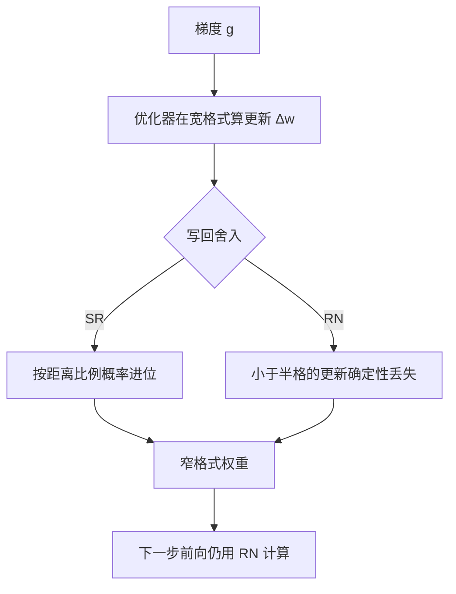

# 随机舍入与低精度优化

舍入到最近是有偏的：比半格更小的更新永远落不进格子；随机舍入拿方差换无偏，让小步长在统计上活下来。

<footer>—— 据浮点误差分析的随机舍入文献与低精度训练硬件实践整理</footer>

[上一课](/llm/num-fp8-scaling)写完 FP8 的尺子，但尺子作用在最后一个环节：把真值写回存储。写回用的舍入函数默认是舍入到最近（RN），它在第一课被当成理所当然；本课打开它。RN 有系统偏置——比半格小的更新永远丢失。随机舍入（stochastic rounding, SR）是无偏的替代。本课写它的定义、适用位置，以及它与 FP32 主权重在「保住小更新」上的分工：一个花显存，一个花方差。

## 问题

把偏置算清楚。权重更新是 $\Delta w = -\eta g$。设当前权重落在格子的某处，若 $|\Delta w|$ 小于 ULP 的一半，RN 之后 $w$ 原地不动——不是偶尔丢失，是**只要方向与幅度不变就永远丢失**。小学习率、长尾的小梯度、训练后期的精细调整，全都落在这个区间：损失停在平台上，梯度非零而权重不动。第一课的对策是主权重留在 FP32，让累积发生在细格子里；但 FP32 主权重加 FP32 动量是显存大头，窄宽度训练的动机之一恰恰是省这份钱。

不均匀的格子加深问题：浮点的 ULP 随幅度变化，权重大时小更新的相对步长更小，更容易落在半格以内。偏置不随训练平均掉——它不是噪声，是确定性丢失。

## 方法

SR 的定义：对真值 $x$ 落在相邻格子 $a \lt x \lt b$ 之间，以概率 $p = (x-a)/(b-a)$ 舍到 $b$，否则舍到 $a$。期望 $E[\mathrm{SR}(x)] = x$：单次有误差，累积无偏。半格以内的更新不再确定性丢失，而是以正确的概率偶尔前进一格，多次更新后期望走完该走的路。

用在哪比用什么更重要。全网每个算子都做 SR 既贵又没必要：误差的入口在**权重更新的写回**——每次优化器 step 的最后一舍。这一舍换 SR，前向与反向的算术仍用 RN。实现要点有二：每次舍入要新的随机数，复用同一随机流会引入相关；硬件不支持的卡上用软件模拟，模拟本身要读写随机位，收益先被开销吃掉一块。支持 SR 的硬件（部分 TPU 与研究用加速器）把它做进写回路径，才是「bf16 无主权重训练」真正跑通的地方。

## 机制

无偏不等于无害：SR 把偏置换成方差，方差进入权重轨迹，等效于给训练加了一层温度。大 batch 与长训练把方差平均掉，期望意义上更新正确积累——这与 BF16 靠大 batch 平均更新噪声是同一机制，只是换了位置。对照主权重方案：FP32 主权重是「用显存买零偏置零方差」，SR 是「用方差买零偏置」。优化器状态不在交换之列：Adam 的二阶矩 $v$ 对噪声平方敏感，窄格式存 $v$ 会把步长估计带偏，动量与 $v$ 仍应留在宽格式——SR 只豁免权重本体。

SR 与下一课的 STE 是两种不同的偏置来源：STE 是梯度方向的偏置（取整导数几乎处处为零，直通是估计），SR 是写回舍入的偏置。混在一起说「训练噪声」会归因错。

## 边界

SR 治写回，不治累加：长归约的截断误差仍要宽累加器，别指望随机舍入救 softmax。推理不需要 SR——没有更新就没有偏置可消。方差不是免费：极小 batch、超长尾的损失或对温度敏感的微调里，方差本身会伤质量，此时主权重方案更稳。最后，SR 的收益 claim 要有对照实验：同宽格式、同 schedule，开与关 SR 对比小学习率段的平台现象——「开了 SR 更稳」若没有 FP32 主权重参照轨，分不清是 SR 的功劳还是别处变了。

## 小结

- RN 舍入对小更新有确定性偏置：半格以内的更新永远丢失，表现为损失平台。
- SR 按距离比例概率进位，期望无偏，用方差换偏置；大 batch 与长训练平均掉方差。
- 用在优化器写回这一舍最有效；前向计算仍用 RN。
- 优化器状态不豁免：动量与二阶矩留在宽格式。
- 与 FP32 主权重的分工：一个花显存，一个花方差；两者都为保住小更新。
- 出处：浮点误差分析的随机舍入文献与低精度硬件实践；混合精度主权重口径见 Micikevicius et al., 2018。
