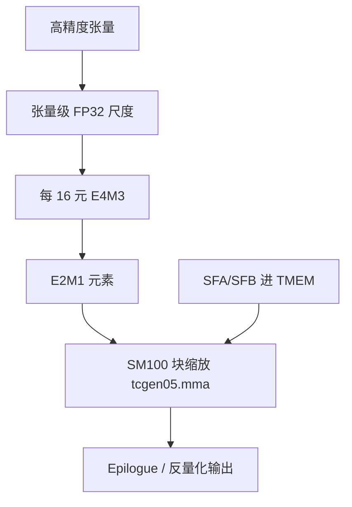

# NVFP4 Tensor Core 路径

NVFP4 对每 16 个值使用一个 E4M3 块尺度，再加张量级 FP32 尺度；硬件在 Blackwell Tensor Core 上加速这套微缩放，而不是事后在 CUDA 核里反量化。

<footer>—— NVIDIA 技术博客 *Introducing NVFP4 for Efficient and Accurate Low-Precision Inference*；Transformer Engine `NVFP4BlockScaling`</footer>

Blackwell 把 4-bit 浮点推进 MMA。NVFP4 的元素是 **E2M1**（幅度大约到 $\pm 6$，Transformer Engine 文档如此写），每 16 个元素共享一个 **E4M3** 尺度，另有可选的每张量 FP32 尺度。这与 OCP MXFP4（32 元素一块、E8M0 幂次尺度）同族但不同布局。关键不在「权重量化成 4 bit 存着」，而在 **MMA 是否以 `kind::nvf4` 一类块缩放指令直接吃 E2M1 与块尺度**。只压存储、计算升回 FP16，得到的是容量，不是第五代 Tensor Core 的算术密度。Transformer Engine 的配方名是 `NVFP4BlockScaling`；训练配方与推理校准不要混用。

## 问题

Hopper 推理的主流窄精度是每张量（或每块较大）的 FP8。权重与激活相对 BF16 减半，decode 仍要逐步扫参数与 KV。再窄到 4 bit，动态范围与量化误差成为质量墙：E2M1 的格子粗，一张量一个 amax 会把多数通道挤进少数档位。MXFP4 用 32 元一块的幂次尺度做微缩放，是多厂商标准。NVIDIA 在 Blackwell 上选择更小的块（16）和带尾数的 E4M3 尺度，再用张量级 FP32 把块尺度重新放进 E4M3 能表示的范围。没有这套两级尺度，裸 INT4 / 裸 FP4 不是同一条硬件路径。

软件栈必须把尺度作为 MMA 操作数送达 TMEM，而不是在 epilogue 里补乘。CUTLASS SM100 的块缩放 MMA、cuDNN 的 grouped+quant 融合、TE 的 `autocast(recipe=NVFP4BlockScaling())`，都是在履行这条合同。H100 没有原生 NVFP4 MMA；在 Hopper 上「NVFP4」最多是存储格式加软件反量化。

### 两级尺度各管什么

第一级：16 元微块的 E4M3，让局部动态范围分开，小而重要的差值不容易被同一块里的大值吃掉。第二级：每张量 FP32，因为 E4M3 尺度本身的范围不够覆盖任意张量的全局幅度。量化时先用张量尺度把值映进「FP4×FP8」可表示区，再在块内映进 E2M1。TE 文档还提到权重量化可用二维块（类似 DeepSeek 训练里的块缩放，但粒度细得多），以及为避免双重量化，正向需要的行缩放与反向需要的列缩放都从高精度输入各算一次。

有效比特率不是 4.00。16×4 bit 元素 + 8 bit 块尺度 = 72 bit / 16 = 4.5 bit/元素；张量级 FP32 摊到大张量上可忽略。屋顶线要把尺度流量算进去。块再细，尺度带宽会反过来伤 decode。

## 方法

推理权重量化：用 Model Optimizer / TensorRT-LLM / 框架提供的 NVFP4 校准，写出带微块尺度的检查点。运行时必须声明 Blackwell 与 NVFP4 核；只认 FP8 的引擎会反量化回高精度再乘，带宽墙回到 FP16 一侧，容量墙却按 4 bit 估——账会假。KV 缓存另算：产品可以把 KV 也走 FP8 或 FP4，质量取决于校准，不是「硬件保证无损」。

训练 / 微调：`NVFP4BlockScaling` 在 TE 里启用两级块缩放。NVIDIA 与合作者另有预训练报告（*Pretraining Large Language Models with NVFP4*，arXiv:2509.25149），把 NVFP4 与 MXFP4 对照：块 16 vs 32、E4M3 vs UE8M0、以及张量级 FP32。表中相对 BF16 的加速在 GB200 / GB300 上按格式分列（NVFP4 与 MXFP4 在他们的表里同档报 4× / 6× 一类峰值比）。那是训练算术密度，不是 decode TPOT。

### MoE 与 grouped 路径

专家 FFN 的 $M_i$ 变、权重按专家分块，正好接 SM100 的 block-scaled grouped GEMM。cuDNN 文档点名 FP4 与 FP8、按行门控、输出量化。Dispatch 的激活若仍是 BF16，通信体积不降，只降专家权重流量——decode EP 仍然划算，因为逐步扫权重是大头。若激活也量化到 NVFP4 再 dispatch，要确认 combine 路径的精度（V3 训练曾把 combine 留在 BF16）。不要假设「全网 NVFP4」已经出现在 TE 默认配方里。

校准与 amax：decode 逐步激活分布窄而跳，每张量延迟尺度（Hopper FP8 delayed scaling 那套）对 4 bit 更危险。块尺度把问题局部化，但仍需按官方 recipe 收集统计。用 FP8 的校准表直接当 NVFP4 验收，会把误差来源搞混。

## 机制

E2M1 只有极少档位。块内至少有一个值（amax）在缩放到 FP4 之前接近满格，等价于该样本以近 FP8 的相对精度被表示——预训练文把这说成块内至少 6.25%（1/16）的值近 FP8。MXFP4 的幂次尺度可能整块丢掉一个 binade。NVFP4 用 E4M3 换「尺度更准、范围更窄」，再用 FP32 张量尺度把范围买回来。这是格式设计，不是训练技巧。

MMA 侧，SFA 沿 M、SFB 沿 N，按 $K$ 方向的块步进。`tcgen05.mma` 在乘加时应用尺度，累加在 TMEM 的 FP32 格里。Epilogue 再量化回 NVFP4 或写出 BF16。没有这条 MMA，所谓 Tensor Core 路径就不存在。H100 上的 INT4 / FP8 核、软件模拟的 E2M1，都不应标成 NVFP4 Tensor Core。

MXFP4 是 OCP 多厂商标准；NVFP4 是 NVIDIA 在 Blackwell 上的选择。检查点不能假设在 AMD 上原生命中，需要重打包。TE 与 TensorRT-LLM 往往两者都支持，布局不同。发布权重时写清格式名。

### 和 FP8、和「只存 4 bit」的差

FP8 每张量或每 32 元（MXFP8）一块，格子比 E2M1 细，质量合同宽，Hopper 就能算。NVFP4 在 Blackwell 上用更粗格子换更高算术密度与更少权重字节。Decode 对质量更敏感：每步 logits 直接进采样，没有大 batch 梯度去平均误差。因此微缩放和两级尺度是推理比训练更刚需的部分——尽管预训练报告表明训练也可以走 NVFP4。

「权重 INT4 + CUDA 反量化 + FP16 GEMM」省的是盘与 HBM 容量，算术仍按 FP16 屋顶线。NVFP4 Tensor Core 路径省容量 **且** 把 $P$ 换到 4-bit MMA。验收看 SASS / profiler 的 MMA kind，以及端到端是否仍在做逐块反量化。

## 边界与工程取舍

非 Blackwell 设备上不要报 NVFP4 吞吐。SM120 是否完整暴露与 SM100 相同的 `kind::nvf4` 形状，以该 SKU 文档为准，不能从 B200 表抄到消费卡。对齐：16 元一块要求 $K$ 或量化轴能整除；MoE 小 $M$ 还要满足 grouped 核的 $M$ 对齐（SM100 文档曾写 256），两套对齐叠在一起会强制 padding。

质量回归必须分任务：困惑度平滑不代表精确记忆还在。过小的块有助于精度，但尺度流量上升。TE 的 `disable_2d_quantization`、`nvfp4_4over6` 一类开关面向特定训练 / RL 场景，默认推理路径不要随便打开。

软件版本是合同。旧 TensorRT-LLM 可能把 NVFP4 权重复原成 FP8 再走 Hopper 式核。vLLM / SGLang 要各自声明 Blackwell FP4 支持版本。同一份检查点在只认 MXFP4 的运行时里会错布局。

出处：NVIDIA 博客 *Introducing NVFP4 for Efficient and Accurate Low-Precision Inference*；Transformer Engine *Using FP8 and FP4* 与 `NVFP4BlockScaling` API；CUTLASS tcgen05 块缩放 MMA；*Pretraining Large Language Models with NVFP4*，arXiv:2509.25149。产品倍数见 GB200 NVL72 页面，规划用字节与带宽，不用营销 30×。

KV 走 NVFP4 是独立决定：缓存字节降得最明显，注意力核必须会读块尺度。质量损失单独测，不要用权重量化的榜代替。MLA 已经很窄的潜向量再量化，误差会叠，需要单独消融。

## 小结

- NVFP4 = E2M1 元素 + 每 16 元 E4M3 块尺度 + 张量级 FP32 尺度，由 SM100 块缩放 MMA 直接执行。
- 与 MXFP4 的差别是块大小与尺度类型；与「只存 4 bit」的差别是计算是否走第五代 Tensor Core。
- TE 配方 `NVFP4BlockScaling` 是训练 / 量化合同；推理栈必须发出对应核才有算术收益。
- MoE 走 grouped+quant 融合核；dispatch 激活精度与权重精度要对齐记账。
- 非 SM100、错误布局、用 FP8 校准表验收，都不是这条路径。
- 出处：NVIDIA NVFP4 博客与 Transformer Engine 文档；CUTLASS tcgen05；arXiv:2509.25149。
