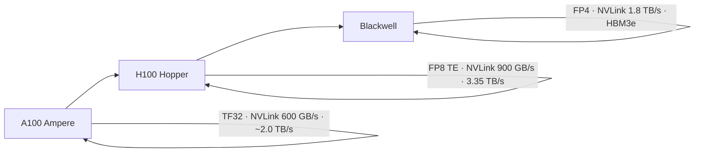

# A100 / H100 / Blackwell 差异

    
三代数据中心 GPU 的差别，不只是 TFLOPS 变大：精度、互连域、HBM 与可分割性一起改，软件工作点必须跟着换档。

    <footer>—— 对照 NVIDIA Ampere A100、Hopper H100、Blackwell 产品页与架构白皮书中的已公布规格</footer>

从 A100 到 H100 再到 Blackwell，是同一条产品线上三次「把训练和推理的屋顶线往右推」。每一代都加了新的 Tensor Core 精度、更宽的 NVLink、以及另一档 HBM。LLM 框架看到的却是：昨天还能算力打满的 prefill，今天在更低精度上变成带宽问题；昨天 TP 不超过 8，今天 NVL72 把域撑到 72。本篇按**已公布**规格对齐三代差异，只写对训练 / 推理切分有约束的那些轴。不把某一栏营销加速比当成普遍定律，不填写未出现在数据手册里的工艺节点细节或未公开的内部总线。

单代互连见 [NVLink](/llm/nvlink)；算力与带宽的几何见 [HBM 屋顶线](/llm/hbm-roofline)；MMA 细节见 [Tensor Core](/llm/tensor-core)。

## 问题

若只比较「FP16 TFLOPS」，会得出「每代大约若干倍」的单薄结论，然后在 decode 上失望：HBM 没有按同一倍数涨。若只比较显存容量，会忽略 FP8 / FP4 让同一容量能放下的参数变多、同时让拐点右移。若只比较 NVLink，会忽略 MIG、机密计算、Transformer Engine 这些改变部署形态的功能。需要一张按轴对齐的表：计算精度、HBM、互连、多实例、系统形态。

公开锚点如下（均为 NVIDIA 产品页 / 数据手册，SXM 类，除非注明）。A100 80GB：HBM2e 带宽约 2.039 TB/s；第三代 NVLink 600 GB/s；第三代 Tensor Core（含 TF32、BF16、稀疏）；MIG 最多 7 实例。H100 SXM：HBM3 80GB、3.35 TB/s；第四代 NVLink 900 GB/s；第四代 Tensor Core 与 Transformer Engine（FP8）；稀疏 FP16 1,979 TFLOPS、稀疏 FP8 3,958 TFLOPS；PCIe Gen5 128 GB/s；MIG 最多 7 个约 10GB 实例；TDP 可到 700W。Blackwell（B200 / GB200 叙事）：第五代 Tensor Core，引入 FP4 / FP6 与微缩放格式；第五代 NVLink 每 GPU 1.8 TB/s；HBM3e，公开材料约 8 TB/s 带宽、单卡容量到 192 GB 量级；GB200 NVL72 把 72 张卡收成 130 TB/s 域。H100 产品页另列 H100 NVL（PCIe 双槽）规格，与 SXM 不可混用。

### 精度轴：TF32 → FP8 → FP4

A100 把 TF32 做成 Tensor Core 可用的训练格式，降低「必须 FP16 才能吃 MMA」的门槛，并支持 2:4 稀疏。H100 的 Transformer Engine 把 FP8 推进主流混合精度：同样 HBM，流量减半相对 FP16，峰值 $P$ 再翻一档，屋顶线拐点右移。Blackwell 第二代 Transformer Engine 引入 NVFP4 / FP6 一类微缩放格式，产品页把 FP4 写成推理与 test-time scaling 的主叙事。每一档精度都要求软件栈（cuDNN、Transformer Engine、框架）真的走出对应 MMA；只改存储 dtype、计算仍在 FP16，只得到容量收益，得不到 $P$。

稀疏规格在表上常是 dense 的两倍。A100 / H100 / Blackwell 都沿用 2:4 稀疏叙事。比较代际时必须同一疏密、同一精度，否则「3 倍」来自表头而不是内核。

H100 相对 A100 的「最多若干倍」在 NVIDIA 材料里按工作负载分开写，且常含稀疏。规划用本段列出的带宽与 NVLink 绝对数，加速比只当指定条件下的厂商声明。

## 方法

换代时按工作点选轴，而不是按最高 TFLOPS 选卡。

- **Decode / 小 batch**：看 HBM $B$ 与容量。H100 3.35 TB/s 相对 A100 约 2.0 TB/s 有帮助，但小于 FP8 峰值的倍数；Blackwell 约 8 TB/s 与更大 HBM3e 对长 KV 更对症。
- **Prefill / 训练 GEMM**：看 Tensor Core 精度与 $P$。能跑 FP8 的 H100 已经把平台抬高；Blackwell 的 FP4 对推理 prefill 与大吞吐更敏感。
- **模型并行宽度**：看 NVLink 域。A100 / H100 经典 HGX 是 8 卡全互连（600 / 900 GB/s 每 GPU）。Blackwell 在 HGX 上把每 GPU NVLink 提到 1.8 TB/s，在 NVL72 上把域提到 72。TP 口诀随域改，不随 TFLOPS 改。
- **多租户**：看 MIG。三代都提供硬件分区；实例粒度与显存切片以该代用户指南为准。A100 把 MIG 做成产品关键特性，H100 / Blackwell 延续。

系统形态也换代。A100 / H100 的主流是 8 卡 HGX + InfiniBand SuperPOD。Blackwell 增加 Grace Superchip 与机柜级 NVL72：CPU–GPU 经 C2C（官方 900 GB/s 双向），柜内铜脊，柜外 SuperNIC。换代不只是插更贵的卡，而是可能换机柜、液冷与调度单位，见 [Scale-Up vs Scale-Out](/llm/scale-up-vs-scale-out)。

### 功能轴：引擎、隔离、形态

Transformer Engine 从 H100 起成为一等公民：硬件与库共同处理 FP8 缩放。Blackwell 把它推到更低精度与注意力加速；GB300 产品页写相对 Blackwell GPU 2× attention。没有 TE 路径的自写 kernel，吃不到这一列。

Hopper 引入加速器侧机密计算（产品页强调 TEE）。这改变「能不能在多租户上跑受保护权重」，与算力无关，但与云上 H100 的卖点有关。A100 无对等叙事。MIG 则三代都有：硬件切 SM 与 HBM，见 [MPS 与 MIG](/llm/mps-mig)。

封装上，A100 / H100 以单颗 GPU 芯片为主叙事；Blackwell 公开材料强调更大的加速器封装（双 reticle 一类描述出现在架构介绍中）。对软件，仍是一个 CUDA device，不必按两颗芯片编程；对供电与冷却，TDP 上到千瓦量级，风冷 8 卡机的假设失效。换代评审应同时看机房功率与液冷，而不是只看 TFLOPS 表头能否塞进现有机柜。

## 机制

每一代把 MMA 阵列加宽、把支持的数据类型变窄，于是 $P$ 涨。HBM 代数从 HBM2e 到 HBM3 到 HBM3e，引脚速率与堆叠容量涨，$B$ 与 GB 涨，但通常慢于 $P$。NVLink 代数加链路、加每条速率，A100 12 条链路级叙事给出 600 GB/s，H100 产品页 900 GB/s，Blackwell 1.8 TB/s。域的大小在 HGX 上维持 8，在 NVL72 上变成 72——这是系统级机制，不是 SM 内部机制。

软件兼容靠 CUDA 能力版本与库。旧的 FP16 GEMM 在新卡上仍能跑，只是停在旧精度的 $P$ 上。要吃新精度，必须让框架调用对应的 cuBLAS / cuDNN / TE 路径，并接受数值协议（缩放因子、微缩放块）。换代失败的常见原因不是驱动装不上，而是工作点仍按上一代精度与 8 卡拓扑切。

H100 NVL 的 NVLink 产品页写 600 GB/s，与 SXM 的 900 GB/s 不同。对比三代时不要把 PCIe 形态的 NVLink 写进 SXM 列。

### 不要跨代混用的规格

同一进程组里混 A100 与 H100 做 TP，NCCL 会落到较慢的那一档互连与较差的拓扑假设。混 H100 与 Blackwell 同理。MIG 切片数、每片显存也不跨代拷贝：H100 SXM 产品页写最多 7 个约 10GB，A100 80GB 的切片表不同。Blackwell Ultra（GB300）相对 Blackwell（GB200）是同代内的容量与注意力步进，域规模不变，见 [NVL72](/llm/gb200-nvl72)。

## 边界与工程取舍

不要用 A100 的 TF32 峰值去比 H100 的稀疏 FP8。不要在没有 NVLink 的 PCIe 机器上按 HGX 的 8 卡全互连切 TP。不要假设 Blackwell 的 FP4 可以无条件替代训练——产品叙事里 FP4 更偏推理；训练精度以你实际启用的 TE 配置为准。不要把 GTC 路线图上的下一代名称写进这一代的带宽表。

功耗与冷却是硬边界。H100 SXM 可到 700W；Blackwell 机柜是液冷超节点。电与热先于 TFLOPS 决定你能不能把规格用满。昇腾或其他厂商的代际表不能用本篇三列去填。

出处：NVIDIA A100 数据手册、H100 产品页、Blackwell / GB200 NVL72 产品页与架构介绍。带宽与 NVLink 只引用已公布数。

## 小结

- A100：TF32 / 稀疏 MMA、NVLink 600 GB/s、HBM2e 约 2.0 TB/s、MIG 7 路，8 卡域是主流。
- H100：FP8 Transformer Engine、NVLink 900 GB/s、HBM3 3.35 TB/s、机密计算；SXM 与 NVL 规格不可混。
- Blackwell：FP4/FP6、NVLink 1.8 TB/s、HBM3e 更大 $B$ 与容量；NVL72 把域扩到 72。
- 换代按工作点选轴：decode 看 $B$，prefill 看精度与 $P$，并行看域，多租户看 MIG。
- 比较必须同一精度、同一疏密、同一形态（SXM vs PCIe）。
- 出处：NVIDIA 公开产品规格；屋顶线见 [HBM 与算力墙](/llm/hbm-roofline)。
