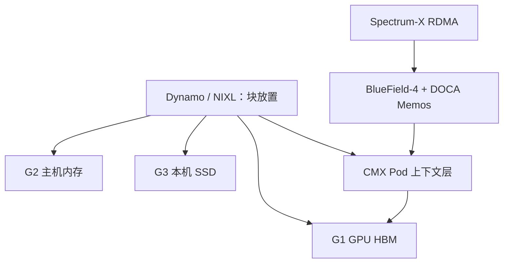

# NVIDIA Inference Context Memory

    
把 KV 当成一种 AI 数据类型，而不是 GPU 上的临时数组：在 HBM 与通用网络盘之间加一层为上下文而生的共享闪存。

    <footer>—— NVIDIA CMX 产品页与 BlueField-4 驱动的 Context Memory Storage 技术博客</footer>

NVIDIA 把这层叫做 **CMX**（Context Memory Storage），产品叙述里也写 Inference Context Memory Storage：Rubin 平台上、由 BlueField-4 存储处理器驱动的 Pod 级上下文层，专门放短暂、可复用的 KV。它不是新的 POSIX 文件系统，而是 Ethernet 挂载闪存 + RDMA + KV API。软件侧是 DOCA Memos、Dynamo、NIXL；网络侧是 Spectrum-X。本篇按 NVIDIA 公开产品页与技术博客写层级与数据路径。平台随 Vera Rubin / BlueField-4 推进，云上到货时间以当时渠道为准，不把未公布的单盘 GB/s 写成合同。

## 问题

长上下文、多轮、多智能体把 KV 体积变成与权重同级的一等公民。G1（GPU HBM）装不下并发会话；G2（主机内存）贵且不跨节点；G3（本机 SSD）不共享；G4（通用网络存储）延迟与功耗按企业存储计，不按「下一次 decode 前要把块预热进 HBM」计。结果是：要么重算 prefill，要么在通用存储上排队，GPU 空转。NVIDIA 要补的是中间档：**Pod 内共享、为 KV 块布局、由 DPU 卸下主机 CPU 的数据面**。公开材料称之为相对本机盘与企业盘之间的上下文层（业界转述里出现过 G3.5 的叫法；以 NVIDIA 自己的「pod-level context tier」为准）。

Agent 工作流还会把同一段上下文在节点间挪来挪去。没有共享层，迁移等于丢缓存。需要的语义是键值块，不是文件锁：框架决定哪些块留 HBM、哪些下主机、哪些进 CMX。

### 为什么是 BlueField-4 而不是主机 NVMe-oF

产品页写 BlueField-4 在 CMX **目标节点**上当 NVMe 控制器，做完整性、加密与数据搬运；在 Rubin **计算节点**上当发起端，用 Spectrum-X 跑 RDMA，隔离访问。DOCA Memos 在 DPU 上提供 KV 感知服务，让应用保持无状态。主机 CPU 若自己终止 NVMe-oF，会把本该给 tokenization 与调度的核烧掉，也插不进「KV I/O 平面」。这是存储处理器，不是「更快的网卡 + 软件 iSCSI」。

NVIDIA 宣称相对传统存储路径，长上下文 / agentic 负载上可持续 TPS 与能效最高约 5×。这是厂商对照「通用存储路径」的产品数字，基线与工作负载要按解决方案概述自己核对，不要当成任意集群的测量。

## 方法

层级从热到冷：GPU HBM → 主机内存 → 本机 SSD → **CMX 共享上下文** → 网络/对象存储。Dynamo 的 KV 块管理器与 NIXL 负责在层间搬块，并把 CMX 当作上下文层：decode 前把块预热到 G2/G1，减少 GPU 等 I/O。Grove 一类编排按 KV 局部性放作业，工作负载换节点时仍能复用。DOCA Memos 把 Ethernet 闪存暴露成 Pod 级缓存，API 是 key-value，不是 POSIX。

Spectrum-X 提供 RoCE：拥塞控制、自适应路由、无损以太网，目标是多租户下可预期的尾延迟。CMX 的带宽若抖动成存储阵列那样的长尾，预热窗口就盖不住一步 decode。STX 是给存储伙伴的模块化参考架构；CMX 是 STX 上第一款面向推理上下文的落地。计算节点与 CMX 目标节点成对出现，不能只买 Rubin 计算托盘却假设本机盘等于 CMX。

### 和 Mooncake / 3FS 的层位

[Mooncake Store](/llm/mooncake-store) 用 DRAM/SSD/RDMA 做近 GPU 对象池，API 是 put/get/replica，不绑定某家 DPU。[3FS](/llm/deepseek-3fs) 是并行文件，KVCache 是文件上的块加自建索引。CMX 把「KV 作为数据类型」写进 NVIDIA 的 Rubin 机柜与 DOCA：伙伴用同一套 Memos API 接入闪存。可以在概念上把 CMX 当成 G3.5，但键、一致性、加密卸载都在 DPU 固件与 DOCA 里，不是自己再写一套 CRAQ。跨厂商可移植性更弱，和 GPU 域的耦合更强。

## 机制

KV 块一旦写完只读，直到淘汰。这让闪存层不必做训练检查点那种写回协议：热路径是随机读大块、顺序写新块、按引用计数回收。Memos 的工作是路由与复用：同一前缀的块应能被 Pod 内多个计算节点 RDMA 读，避免每节点一份 NVMe 副本。完整性与加密在 BlueField 上卸载，产品页用 Vera CPU 上压缩与 CRC32C 的倍数（约 3.29× / 3.67×）说明「别把校验放回主机」。这些倍数是处理器微基准叙事，不是端到端 tokens/s。

预热（prestage）是唯一能把闪存延迟藏进 GEMM 的机制。调度器必须知道下一轮 decode 要用哪些块，否则 CMX 只是一张更贵、更远的盘。Dynamo 的 KV-aware 放置把请求送到「块已经在的地方」，和 [Ray KV-aware 路由](/llm/ray-kv-aware-routing) 同一逻辑，只是介质从引擎 HBM 扩到 Pod 闪存。没有这一层控制面，共享层会退化成全员打同一热点 SSD。

NIXL 是搬运库：注册内存、描述符、跨节点 RDMA。CMX 是介质与 DPU 服务。两者缺一，框架只能看见「又一个 blob 后端」。规划时分别问：块管理器是否把 CMX 当一等层；网卡路径是否真走 Spectrum-X 而不是主机核上的 TCP。

## 边界与工程取舍

CMX 面向 Rubin / BlueField-4 时间线。在只有主机 NVMe 的机房里，应继续用引擎分层卸载与 Mooncake / LMCache，不要假装有 G3.5。多租户隔离、密钥与块生命周期（用户删除会话必须能失效 KV）是产品页上的安全叙事，落地要按 DOCA 与伙伴阵列的实际 ACL 验收。5× TPS / 5× 能效是相对「传统存储路径」的上限表述，长上下文、高复用、预热命中的负载才可能靠近；一次性无共享文档不要指望同等倍数。

### 预热窗口与 SLO

设一步 decode 的计算时间是 $t_{\mathrm{dec}}$，要从 CMX 拉回的字节是 $M$，有效 RDMA 带宽是 $B$。若 $M/B$ 不能被前一步 GEMM 或空闲带宽盖住，CMX 就进入 TPOT。这与主机 CPU 卸载同一条不等式，只是 $B$ 从 PCIe 换成 Spectrum-X，容量从单机 DRAM 换成 Pod 闪存。多轮 agent 若每轮工具调用之间有空窗，预热容易成功；用户打字的交互 decode 空窗短，只应预热「下一层 / 下一请求已确定的块」。盲目把会话全量 KV 灌进 HBM，会把并发从容量墙打回显存墙。

不要把 CMX 当训练检查点盘。不要把 Pod 级共享理解成跨数据中心一致存储。热 decode 工作集仍必须在 HBM；CMX 补的是容量、跨节点复用和预热，不是 TPOT 的主存。伙伴阵列的耐久性、磨损与掉电语义按闪存计，KV 本就可淘汰，崩溃后未预热的块当作未命中重算即可，不必按 POSIX 日志盘去验收。

出处：https://www.nvidia.com/en-us/data-center/ai-storage/cmx/ ；NVIDIA 技术博客 *Introducing NVIDIA BlueField-4-Powered CMX Context Memory Storage Platform*。NIXL / Dynamo KVBM 设计见 NVIDIA Dynamo 文档的分层（G1–G4）。

## 小结

- CMX 是 Rubin 上由 BlueField-4 驱动的 Pod 级 KV 上下文层，不是通用 NAS。
- 软件栈是 DOCA Memos + Dynamo/NIXL，网络是 Spectrum-X RDMA。
- 价值在跨节点复用与 decode 前预热，热路径仍在 HBM。
- 厂商给出相对传统存储最高约 5× TPS / 能效，需按基线核对。
- 与开源 KV 池互补：CMX 绑 NVIDIA 机柜与 DPU API。
- 出处：NVIDIA CMX 产品页与 BlueField-4 技术博客。
