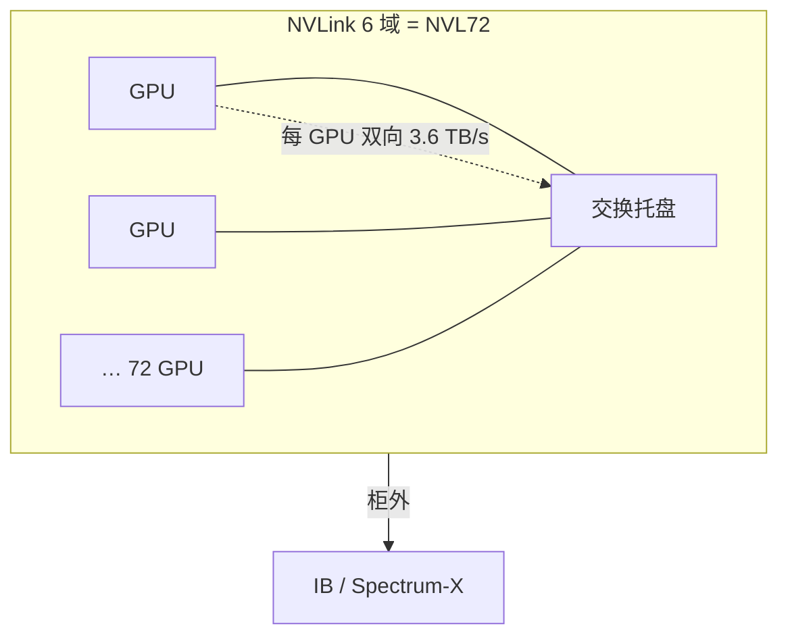

# NVLink 6：3.6 TB/s 卡间、机柜全互连

    
每张 GPU 到交换的双向带宽是 3.6 TB/s；72 张卡落在同一张全互连图上，机柜才成为一块加速器。

    <footer>—— NVIDIA 技术博客：NVLink 6 delivers 3.6 TB/s of bidirectional GPU-to-GPU bandwidth per GPU</footer>

Scale-Up 的屋顶线写在卡间，不写在以太网端口上。NVIDIA 对 **NVLink 6** 的公开规格是：**每 GPU 双向 3.6 TB/s（3600 GB/s）的 GPU–GPU 带宽**，相对 Blackwell 一代每 GPU 1.8 TB/s 翻倍。出处是 NVIDIA 技术博客 *Inside the NVIDIA Vera Rubin Platform: Six New Chips, One AI Supercomputer* 与 *Inside NVIDIA Rubin GPU Architecture* 中的互连对照表，不是本站测量。在 [Vera Rubin NVL72](/llm/vera-rubin-nvl72) 里，NVLink 6 交换托盘把 72 张 Rubin GPU 收成全互连域：任意 GPU 到任意 GPU 走机柜脊，而不是走 ToR。本篇只谈这条 Scale-Up 织物，柜外 RDMA 见 [GPUDirect](/llm/infiniband-gpudirect)。

## 问题

MoE 的专家并行、宽张量并行、长上下文的集合通信，都要求 GPU 之间频繁、突发、接近全互连的交换。8 卡 NVLink 域把这些通信关在节点内；模型再宽，就要跨以太网。跨域做逐步 decode 的 All-Reduce 或 token 路由，延迟会变成 TPOT 的主项。NVLink 6 要解决的是：把「快」的范围保持在整柜 72 卡，并把每卡注入交换的带宽抬到公开的 3.6 TB/s，使 72 路 EP 不像 9 个彼此用网卡打招呼的 8 卡箱。

全互连与「完全无阻塞的任意一对都打满 3.6 TB/s」不是同一句话。公开材料写的是每 GPU 连接到 NVLink 6 织物的双向带宽，以及交换托盘构成机柜级 all-to-all 拓扑、延迟与带宽可预期。任意一对同时打满、再叠上所有对，会受交换容量与路由约束。规划应用官方每 GPU 规格加自己的 NCCL all-to-all 微基准，不要把 72×3.6 当成任意通信模式的可达吞吐。

### 3.6 TB/s 量的是哪一段

对照表把 NVLink（GPU–GPU）与 NVLink-C2C（CPU–GPU）分列：Rubin 上前者 3600 GB/s、后者 1800 GB/s，PCIe Gen6 仍是 256 GB/s 量级。3.6 TB/s 是 **卡到 Scale-Up 织物** 的规格，不是 HBM4 的 22 TB/s，也不是 C2C 超芯链路。把三张表加在一起当「GPU 总带宽」没有物理意义——它们服务不同的对端。

双向（bi-directional）意味着发与收合计。单向有效负载通常按约一半理解，再扣集体算法开销。NCCL `busbw` 才接近训练看见的数。引用 3.6 TB/s 时必须带「每 GPU、双向、厂商规格」这几个限定。

## 方法

把需要高带宽、低延迟的进程组画在 NVLink 6 域内：TP、域内 EP、域内 CP 的频繁切片。NCCL / NVSHMEM 应走 NVLink 后端，而不是套接字。交换托盘是机柜脊：计算托盘不上 ToR 去做 TP。柜外 DP 与存储走 SuperNIC。热插拔与部分填充是公开的可运维性：维护交换托盘时，软件应能降级带宽或摘柜，而不是假设织物永远对称。

MoE 推理的 token 路由是 all-to-all。NVIDIA 公开写 NVLink 6 在 NVL72 上对 all-to-all 相对上一代有更高吞吐；具体倍数依赖模型与并行度，本篇不把营销倍数当容量定额。该用的规划方法是：专家数、每步 token、每 token 路由体积，除以域内有效带宽，得到通信时间，再与 GEMM 时间比。

### 与 SHARP、counted writes 的叠放

织物提供带宽与拓扑；[SHARP](/llm/nvlink-sharp) 在交换内做集合规约，减少 All-Reduce 一类流量的重复搬运；[counted writes](/llm/nvlink-counted-writes) 让核内发起的 NVLink 写在接收侧更便宜地确认完成。三者不是互相替代：没有 3.6 TB/s 的注入，规约再聪明也搬不动专家权重；没有核内融合，每步 decode 都要出核同步。软件要同时更新通信库，才能把这三层用上。

## 机制

NVLink 6 仍是专用加速器互连，不是以太网改名。短距、交换芯片、机柜背板 / 铜缆组件把跳数关在机柜内。全互连拓扑的软件后果是：NCCL 不必为「哪些卡没有直连」准备复杂的分级路由——分级发生在交换芯片内部，对 CUDA 呈现为一域。这与数据中心 Clos 相反：Clos 的跳数与过订阅是一等公民。

每 GPU 3.6 TB/s 来自更多更快的 NVLink 端口聚合，公开材料把它写成相对上一代翻倍。端口如何切成若干条物理 lane、单 lane 速率多少，未在本篇所引博客里逐条列出的，不编造。程序员能依赖的是：域内集合通信的屋顶线按这代 NVLink 计，而不是按 PCIe 或 400 GbE 计。

同一条 All-Reduce，域内走 NVLink 6，域外走 InfiniBand。库名可以都叫 NCCL，物理屋顶线差一档。调 TP 度之前先问：这组 rank 是否都在这个 3.6 TB/s 的域里。

### 延迟与可预期性

公开文本强调 all-to-all 下的可预期延迟，这对 MoE 路由与同步密集的推理路径是一等需求。可预期不等于「微秒数已公布」：本篇不填写未给出的 hop 延迟表。工程含义是：避免在域内再叠一层应用层重试与以太网式拥塞窗口，把突发交给织物与 SHARP。若测量到域内尾延迟像跨机，先查是否误走了网卡路径。

## 边界与工程取舍

不要在以太网 8 卡箱上用 64 路 TP「模拟 NVL72」。不要把 3.6 TB/s 抄到 H100 / B200 的规划表里——那是上一代或不同代的 NVLink。不要把 C2C 的 1.8 TB/s 与卡间 3.6 TB/s 混写成一条链路。昇腾等超节点的卡间速率以各自文档为准。公开路线图若后续改口单通道或聚合数字，以当时产品页替换本篇引用的博客表，不要用旧倍数外推。

故障上，交换托盘是公共脊：坏一块影响域，而不是只影响一对卡。容量规划保留摘柜后的副本，而不是假设 72 卡永远满员。成本账是：买 NVLink 6 买的是域内带宽与简化后的模型并行；柜外网络另买。两者的最优配比随稀疏度、序列长度和是否 decode 服务而变。

出处：NVIDIA *Inside the NVIDIA Vera Rubin Platform*「NVLink 6 Switch」节与 Rubin GPU 互连表：GPU–GPU 3600 GB/s bidirectional per GPU。聚合机柜吞吐若未在你引用的那一页出现，不要用乘法自己「发明」成官方规格。

## 小结

- NVLink 6 公开规格：每 GPU 双向 3.6 TB/s 卡间（GPU–GPU），来源为 NVIDIA 技术博客互连表。
- NVL72 用交换托盘做成 72 GPU 全互连域，机柜脊不是 ToR 以太网。
- 3.6 TB/s 不是 HBM 带宽，也不是 NVLink-C2C。
- TP / 域内 EP 必须落在该域；规划用官方每 GPU 规格加 NCCL 微基准。
- SHARP 与 counted writes 叠在这条织物上，不替代带宽本身。
- 出处：NVIDIA Vera Rubin / Rubin GPU 公开技术博客；形态见 [NVL72](/llm/vera-rubin-nvl72)。
