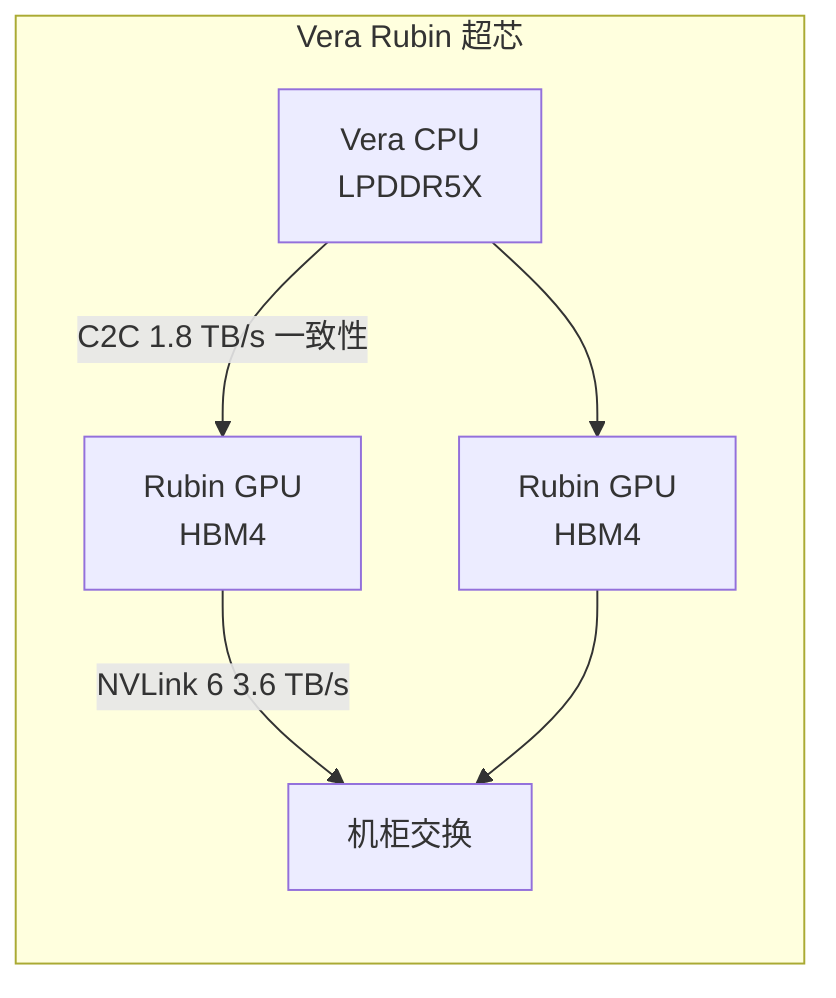

# NVLink-C2C：CPU–GPU 内存一致性超芯

    
CPU 内存与 GPU HBM 若只通过 PCIe 做拷贝，KV 卸载和数据预置永远带着一次主机往返；一致性链路把它们收成同一地址空间里的两种距离。

    <footer>—— NVIDIA：第二代 NVLink-C2C 提供 1.8 TB/s 一致性带宽，Vera Rubin 超芯 = 一颗 Vera + 两颗 Rubin</footer>

卡间织物是 [NVLink 6](/llm/nvlink-6) 的 3.6 TB/s；CPU 与 GPU 之间是另一条链路：**NVLink-C2C**（chip-to-chip）。NVIDIA 公开对照表写：Rubin 相对 Blackwell，C2C 从 900 GB/s 提到 **1.8 TB/s**（双向）。[Vera](/llm/vera-cpu-olympus) 与两颗 [Rubin](/llm/rubin-gpu-hbm4) 经这条一致性互连组成 **Vera Rubin 超芯**，作为 NVL72 计算托盘的基本砖块。软件可以把 LPDDR5X 与 HBM4 看成统一地址空间里的两个池：近的是 HBM，远一点但仍连贯的是 CPU 内存。这与「先 `cudaMemcpy` 再算」不是同一编程模型。

## 问题

长上下文与多模型并发会把 KV 和权重备件挤出 HBM。传统卸载走 PCIe：GPU 把块拷到主机 DRAM，用时再拷回。PCIe Gen6 x16 公开仍在 256 GB/s 量级，比 C2C 的 1.8 TB/s 矮一截，且没有缓存一致性——CPU 改了的字节，GPU 要靠显式同步才看见。Agent 的工具输出、tokenizer、检索结果若在 CPU 上产生，经 PCIe 喂 GPU，又是一次控制面延迟。

C2C 要解决的是：让 CPU 成为超芯里的数据引擎，而不是机箱里的另一台主机。一致性意味着 load/store 语义跨过两种物理内存，程序员用指针而不是用「拷完再 launch」。代价是：远内存的延迟与带宽仍差一档，乱甩 KV 到 LPDDR 会把 decode 送回 [显存墙](/llm/decode-memory-wall) 更差的分母上。

### 超芯不是一块硅，是一块主机处理板

公开材料把超芯写成：两颗 Rubin GPU + 一颗 Vera CPU，经内存一致性 NVLink-C2C 集成，落在同一主机处理母板上。NVL72 的计算托盘再集成两颗超芯，以及网卡、DPU、液冷。CUDA 仍然看见多颗 GPU；CPU 是宿主。没有把 2 GPU + 1 CPU 融成单个 `cudaSetDevice` 的魔法。「超芯」指封装与一致性域，不是单个 PCIe 功能号。

1.8 TB/s 是 CPU–GPU 一致性链路的厂商规格，不要与每 GPU 3.6 TB/s 的卡间 NVLink 6 混淆，也不要与 HBM4 的 22 TB/s 混淆。三张屋顶线服务三个对端：CPU、邻 GPU、本卡存储。

## 方法

把数据按访问频率放池。热 KV、热权重、正在算的激活：HBM4。刚被换出、可能很快再进 decode 的 KV 前缀、预置中的下一批数据：Vera 侧 LPDDR，经 C2C 访问或按页迁回。持久检查点、训练集：仍走 DPU / 存储平面，不要占 C2C。框架上的统一内存、NVSHMEM、以及 NVIDIA 公开提到的 KV-cache offload、多模型执行，都应显式声明对象在哪一层，而不是假设「一致性 = 免费同等快」。

双路 Vera 也可以用 C2C 做 CPU–CPU 一致性，那是另一拓扑：没有 GPU 的数据引擎节点，或更大的主机侧内存池。不要把双路 C2C 的带宽与超芯上 CPU–GPU 的 1.8 TB/s 默认画成可叠加的一条总线——端口是分开的，以平台拓扑图为准。

### KV 卸载何时划算

设 HBM 带宽 $B_{\mathrm{h}}$、C2C 带宽 $B_{\mathrm{c}}$，一次 decode 要读的 KV 中有比例 $p$ 落在 CPU 内存。墙钟粗估被

$$
T \gtrsim \frac{(1-p)\,K}{\eta_h B_{\mathrm{h}}} + \frac{p\,K}{\eta_c B_{\mathrm{c}}}
$$

卡住。$B_{\mathrm{c}}$ 公开约 1.8 TB/s，$B_{\mathrm{h}}$ 公开高达 22 TB/s，差一个数量级以上。只有当 $p$ 对应的是「否则 OOM 或抢掉热工作集」的那一段，卸载才值得。把全部 KV 默认放到 LPDDR，等于自愿用 C2C 屋顶线跑 decode。PD 分离里，若 decode 池仍在同一超芯，预置可以走 C2C 而不是柜外 RDMA；跨柜仍走 [GPUDirect](/llm/infiniband-gpudirect)。

## 机制

一致性织物维护 CPU 缓存与 GPU 页之间的所有权。GPU 直达 CPU 内存的 load，可能打到 Vera 的 SCF / L3 / LPDDR；CPU 访问映射到 HBM 的页，走反向 C2C。这比 PCIe BAR 映射更接近 NUMA，但仍是非均匀的。页大小、迁移策略、是否用 ATS / 统一寻址，以 CUDA 与驱动指南为准。本篇不发明机柜级单一页表。

超芯把 Grace Hopper 以来的「CPU 贴近 GPU」再推一代：带宽翻倍、Vera 内存容量公开到 1.5 TB 量级，使「HBM 装模型、LPDDR 装溢出租」在产品规格上说得通。机密计算被写成可跨 CPU–GPU 边界；开启后的路径是否仍走同一 1.8 TB/s，以安全文档为准。

托盘内两颗超芯之间的 GPU 通信走 NVLink 6 交换，不走 C2C。C2C 的职责是 CPU↔GPU（以及双路 CPU↔CPU），不是 72 卡全互连的替代品。把超芯理解成「托盘内的 NUMA 节点」比理解成「迷你 NVL72」更准确。

### 软件兼容与失败模式

Arm 上的宿主进程、CUDA 上下文、NCCL 通信子仍然分对象。统一地址空间减少拷贝，不消除「这段缓冲被哪边缓存」的同步。失败常见于：以为 `malloc` 在 CPU 上的缓冲 GPU 能以 HBM 速度扫；忘记预取，decode 每步都在 C2C 上随机打 KV；以及把检查点写进 C2C 能看见的池，与训练通信抢带宽。profiler 应分别显示 HBM、C2C、NVLink、PCIe 四条流量，而不是一个「GPU 利用率」。

## 边界与工程取舍

不要在 PCIe 独显工作站上假设 C2C。不要把 1.8 TB/s 抄进卡间 TP 的规划——TP 走 NVLink 6。不要为未公开的 cache line 协议、目录项数目编造数字。x86 + GPU 的 UVA / HMM 是另一套一致性，延迟与带宽不能用 Vera 的表去估。

超芯增大了故障耦合：CPU 或 C2C 故障影响这对 GPU 的数据引擎，而不只是「少一个网卡」。NVL72 的 RAS 与热插拔以托盘文档为准。多模型共驻时，一致性池会被吵闹邻居污染；要用显式配额，而不是依赖「反正都能看见」。tokenizer、采样与工具返回值可以留在 Vera 侧就近写进一致性缓冲，再由 GPU 以指针消费，这比先落到主机页缓存再经 PCIe 上传更接近超芯的设计意图。若框架仍走「CPU 序列化成字节、GPU 再反序列化」，一致性链路就被降级成了昂贵的拷贝管道。公开路线图若调整超芯配比（例如一 CPU 对几 GPU），以当时 NVIDIA 系统文档为准，不要把 1+2 写成永久物理定律。

出处：NVIDIA Vera Rubin 六芯片博客中的 NVLink-C2C 表与 superchip 节；Rubin GPU 博客中 1800 GB/s CPU–GPU 与 3600 GB/s GPU–GPU 的并列。超芯组成以官方「two Rubin GPUs with one Vera CPU」为准。

## 小结

- NVLink-C2C 是 CPU–GPU（及双路 CPU）一致性互连，Rubin 一代公开 1.8 TB/s 双向。
- Vera Rubin 超芯 = 1 Vera + 2 Rubin，是 NVL72 托盘的砖块，不是单设备。
- LPDDR 与 HBM 可统一寻址，但带宽差一档；KV 卸载必须按屋顶线算，不能默认全卸载。
- 卡间仍走 NVLink 6 的 3.6 TB/s；C2C 不替代机柜全互连。
- 四条流量（HBM / C2C / NVLink / PCIe）要分开看。
- 出处：NVIDIA Vera Rubin / Rubin GPU 公开技术博客；CPU 侧见 [Olympus](/llm/vera-cpu-olympus)。
