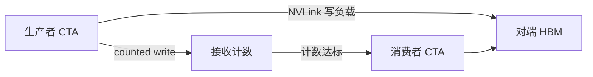

# NVLink counted writes 与核内融合通信

    
通信若必须出核、交给主机再确认「对端收齐」，逐步 decode 的每一步都会多一截同步气泡。

    <footer>—— NVIDIA：counted writes streamline synchronization for device-initiated NVLink transfers</footer>

[NVLink 6](/llm/nvlink-6) 提供 3.6 TB/s 量级的卡间屋顶线。屋顶线只回答「能搬多快」；逐步推理与融合核还要回答「对端何时可以安全地读」。传统 GPU–GPU 路径除了搬负载，还要额外的协调与同步：写完数据，再写旗标，对端轮询或再走一遍应答。**Counted writes** 是 Rubin 公开的、面向设备发起的 NVLink 传输的同步简化：接收侧用计数跟踪到达量，把「传完」和「可以读」收成更便宜的检查。它服务的编程模型是**核内融合通信**——计算核不把控制交回 CPU，边算边经 NVLink 写到另一张 GPU。

## 问题

张量并行的 decode 每步都要 All-Reduce 一小块激活；MoE decode 每步都要路由一小批 token。若每次都是「计算核结束 → 独立的 NCCL 核 → 再启动计算核」，启动与同步开销会压过负载本身。Blackwell 已有把通信融进核、以及 programmatic dependent launch 一类重叠。Rubin 要补的是互连侧的完成语义：设备发起的写，接收者如何知道「这 8 块都到了」而不走重旗标握手。

没有 cheap 的完成通知，融合核只能保守地等更粗的 barrier，气泡回到时间线上。有了计数写，生产者可以对同一计数器累加，消费者看到计数达标再消费。公开博客配图把这条路径称为 counted writes；本篇按该语义写，不编造计数器位宽、是否在交换芯片上实现、或未公布的指令助记符。

### 旗标握手为什么贵

旗标路径至少两次往返语义：数据写、旗标写、对端可见性、可能的应答。小消息上，旗标与数据争用同一条 NVLink，同步流量占比高。核内融合时，发端 CTA 还在算下一 tile，收端 CTA 空等旗标，SM 利用率掉下去。Counted writes 把「N 次写完成」收成一个单调计数，消费者只盯一个位置。这与 CPU 上的 completion count、RDMA 上的即时完成队列是同一类想法，只是落在 NVLink 的设备发起路径上。

Counted writes 不是 SHARP。SHARP 在交换里做归约运算，见 [SHARP](/llm/nvlink-sharp)。Counted writes 解决的是点对点或核内发出的写如何宣告完成。二者可以出现在同一次融合 All-Reduce 里：交换做加，计数做「这一轮到齐」。

## 方法

框架与通信库把融合通信写成计算核的一段：MMA 产出一块，TMA 或直接 store 把块写到对端，counted write 更新接收计数；对端 CTA 在计数达标后读这块做下一层。CPU 只在 launch 与全局错误路径上出现。这对 decode 的意义是：TP 的 All-Reduce 不再是核与核之间的硬屏障，而是 tile 级的生产者–消费者。Rubin 博客把核间协调从「大批量触发」细化到 tile 级，与 counted writes 同一方向：更早让消费者开工。

使用条件是拓扑仍在 NVLink 域内。跨柜 RDMA 有自己的完成队列，不要假设 counted writes 自动作用在 InfiniBand 上。NCCL / NVSHMEM / TensorRT-LLM 一类库需要版本跟上；应用代码直接写底层互连的，应等公开 CUDA / PTX 文档，而不是从技术博客的示意图反推指令。

### 与 TMA、dependent launch 的分工

[TMA](/llm/rubin-tma) 负责低开销搬砖；dependent launch / tile 级触发负责「下一个核何时启动」；counted writes 负责「远端那块内存何时有效」。缺任意一层，融合都会退化为保守同步。工程上应测量的是：融合核的 SM 空闲间隙、NVLink 事务中同步流量占比、以及 decode 一步里通信等待时间。不要只看是否开启了某个环境变量。

## 机制

设备发起意味着地址翻译、路由与完成都不经过主机门控。发送 GPU 的 store 直接进入 NVLink；接收 GPU 的内存控制器写入 HBM，并按 counted write 语义递增完成计数。消费者在本地看见计数——这是近端读，不是再发一条「你做完了吗」的消息。可见性顺序以 NVIDIA 编程模型为准；本篇不发明跨 GPU 的 C++ memory_order 映射。

融合通信把集体算法从「库核」拆进「用户核」。All-Reduce 可以变成：本地 tile 归约 → 写邻居 → 等计数 → 再算。环与树仍然存在，只是推进单位从整核变成 tile。消息很小时，计数本身仍有开销；优势出现在「本来就要写数据、顺便更新计数」而不是「数据很小、同步很大」。因此它首先服务高频、中小块、必须在关键路径上的 decode / MoE 路由，而不是一次几百 MB 的检查点。

公开材料没有给出 counted writes 相对旗标握手的微秒表。收益应写成「降低同步流量、缩短融合核气泡」，并用自己的核级 profiler 验证。把博客示意图上的「8」当成硬件限额没有依据。

### 失败与调试

计数若与实际写次数不一致，消费者会永久等或提前读到半成品。融合核的正确性比分离式 NCCL 更脆：少一次 write、重复一次 write、或 CTA 崩溃未更新计数，都会表现为静默错数或挂起。调试应能关闭融合、退回库级集体通信做对照。多租户下，一块 GPU 上的融合通信不应踩到另一作业的 NVLink 完成资源——隔离以 MIG / 进程级通信子为准，本篇不假设有未公开的硬件 QoS 计数器。

## 边界与工程取舍

不要在没有 Rubin NVLink 6 的机器上假设同一完成语义。不要把 CPU 发起的 `cudaMemcpy` 叫做 counted writes。不要为未公开的 PTX 写「示例 exploit 式」的手写同步。训练的大块梯度 All-Reduce 仍可能以库级 NCCL + [SHARP](/llm/nvlink-sharp) 更合适：消息大，启动开销被摊掉，融合的复杂度不值得。

decode 服务若 TP 度很高、每步只有很小的激活，counted writes 才是一阶；TP=1 的单卡副本根本走不到这条路径。规划时应先问并行网格，再问是否值得等通信库的融合实现。

出处：NVIDIA *Inside NVIDIA Rubin GPU Architecture*「Accelerated scale-up communications」节。完成语义以日后 CUDA 编程指南为准；博客示意图不作指令规范。

## 小结

- Counted writes 简化设备发起的 NVLink 写的完成通知，服务核内融合通信。
- 它解决同步气泡，不替代 3.6 TB/s 的带宽规格，也不是 SHARP 归约。
- 对逐步 TP / MoE decode 最有价值；大块梯度同步仍可走库级集体通信。
- 正确性比分离式 NCCL 更脆，需要能关闭融合做对照。
- 跨柜 RDMA 不自动享受同一语义。
- 出处：NVIDIA Rubin GPU 公开技术博客；织物见 [NVLink 6](/llm/nvlink-6)。
