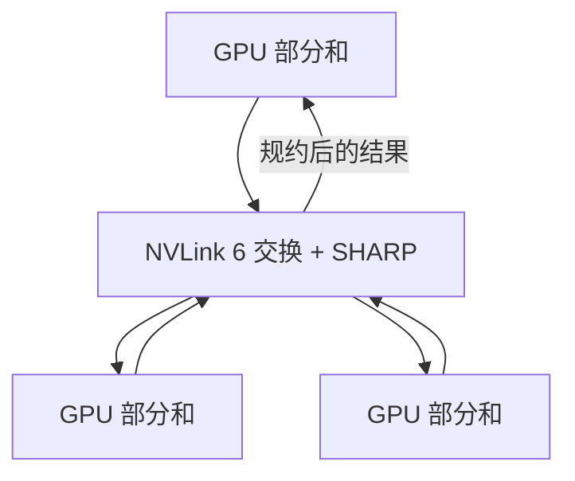

# SHARP 在交换内做集合规约

    
All-Reduce 的加不必全部在 GPU 上做完再发出去；交换芯片若能在端口上归约，重复搬运就可以少一截。

    <footer>—— NVIDIA：NVLink 6 集成 SHARP in-network compute，部分 all-reduce / reduce-scatter / all-gather 在织物内执行</footer>

集合通信的朴素实现是：每张 GPU 把向量发给别人，在端上做加，再把结果发回去。树上同一段数据会被搬多次。**SHARP**（Scalable Hierarchical Aggregation and Reduction Protocol）把归约推进网络。它先出现在 InfiniBand 交换机上，服务跨节点梯度；Vera Rubin 把同类能力做到 [NVLink 6](/llm/nvlink-6) 交换里，服务机柜内的张量并行与集合通信。NVIDIA 公开写：NVLink 6 交换托盘提供 FP8 网内计算，部分 All-Reduce、Reduce-Scatter、All-Gather 在织物内执行，从而减少重复数据运动与 GPU 同步。本篇讲机制与边界，厂商给出的「流量最多减半、TP 时间最多改善两成」是**有条件的产品表述**，依赖模型、并行度、参与者和 NCCL 配置，不是本站测出的定律。

## 问题

宽 TP 的每一层都有激活或梯度的 All-Reduce。72 卡域上，若仍用纯环，字节在环上走多跳，延迟随参与者涨。若用树，根附近链路过热，且同一加数被搬运多次。GPU 本可以去做 GEMM，却在为集体通信跑归约核、占 HBM 带宽。SHARP 要回答的问题是：归约这种可结合运算，能否在交换端口上做掉，让 GPU 只看见「已经加好的结果」。

不是所有集体操作都能同样卸载。All-to-All 是置换，没有可加的中间结果，SHARP 帮不上 MoE 路由的主体——那要靠 NVLink 6 的全互连带宽。All-Reduce / Reduce-Scatter / All-Gather 这类带归约或复制结构的，才是网内计算的对象。把 SHARP 写成「所有 NCCL 调用都加速」会在 EP 规划上误判。

### 端上归约与网上归约

端上：GPU 核读入多方缓冲，做 add，写回。流量是完整向量的若干份，再加一份结果。网上：交换机在端口收到多方片段，在交换内加，向下流只转发部分和。理想树形 All-Reduce 可把链路字节从「每边两份完整向量」降到接近「一份」。NVIDIA 对 NVLink 6 SHARP 的公开口径包括「可将 all-reduce 通信流量减少最多 50%」——这是上界式产品语言，对应的是减少重复搬运，不是把任意工作负载的 NCCL 时间砍半。

SHARP 与 GPUDirect 正交。GPUDirect 让字节别绕主机，见 [InfiniBand](/llm/infiniband-gpudirect)。SHARP 让该做加的字节在交换里加完。没有直达，网上归约也先被主机拷贝卡住；没有归约，直达只是更快地搬重复数据。

## 方法

打开路径的是通信库，不是模型代码里的一行注解。NCCL 在探测到 NVLink 交换支持 SHARP 时，可为合格的集体操作选择网内算法。作业仍提交同样的 `ncclAllReduce`；差别在协议是否把部分 chunk 标成「请交换机加」。精度必须是交换能算的格式：公开材料点名 FP8 网内计算与每交换托盘的 TFLOPS 规格。训练若梯度仍是 BF16 / FP32，能否走 SHARP、是否先量化再归约，以当时 NCCL 与平台文档为准，不要假设「有 SHARP 就一定用训练精度在交换里加」。

拓扑上，SHARP 只覆盖它能看见的交换域。NVL72 域内的 TP 组是主场。跨柜 All-Reduce 若走 InfiniBand SHARP，那是另一代交换机上的另一段协议，数字不可与 NVLink 托盘的 14.4 TFLOPS FP8 混加。层次化集体通信仍然成立：域内可 SHARP，域间再走 IB。

### 与 counted writes、融合核

[Counted writes](/llm/nvlink-counted-writes) 宣告「写到齐」；SHARP 宣告「加完了」。融合核可以在 tile 级把部分和交给织物，等完成计数后再继续 MMA。也可以仍用库级 NCCL，让 SHARP 在不可见处工作——这对大块梯度更简单。选择标准是消息大小：大块、可重叠的 DP 梯度，库级 + SHARP；小块、关键路径上的 TP decode，融合 + 完成计数，SHARP 能用则用，但不能指望交换里的 FP8 加法去救一个本该留在 NVLink 域却被拆到以太网上的进程组。

## 机制

网内归约要求运算可结合、可交换（浮点上只是近似），且交换机有足够的算术单元与缓冲。NVIDIA 为 NVLink 6 交换托盘给出 14.4 TFLOPS FP8 的网内计算规格——这是交换侧的峰值算术，用来理解「归约有专用算力」，不是 GPU 的 50 PFLOPS。归约流量相对 GEMM 通常小得多，这块 TFLOPS 够不够取决于同时有多少集体操作、chunk 多大。公开文本写结果随模型架构、并行策略、参与者数量和 NCCL 配置而变。

树的内部节点在交换芯片上，而不在某张「根 GPU」上。于是根 GPU 不再成为 HBM 热点，这也是网上归约除了减字节之外的第二个好处。失败模式是：交换算术与 GPU 算术的精度协议不一致，导致与纯 GPU All-Reduce 的 bit 不一致。确定性训练、需要逐 bit 复现的调试，应能关闭 SHARP 对照。

「最多 50% 流量、最多 20% TP 时间」出自 NVIDIA 对 NVLink 6 SHARP 的公开表述，并附带依赖条件。容量规划把它们当成上界提示，用 nccl-tests 与真实层形状自己测。不要把 20% 写进 SLA。

### InfiniBand SHARP 与 NVLink SHARP

IB 交换机上的 SHARP 服务 Scale-Out：数据并行、跨柜树。NVLink SHARP 服务 Scale-Up：域内 TP。协议族同名，作用域不同。一个作业可以两层都开：域内先网上归约，每柜一份结果再上 IB SHARP。也可以只开一层。调参时应分别看域内 busbw 与跨柜 busbw，不要用一个 NCCL 环境变量解释两种墙。

## 边界与工程取舍

不要对 All-to-All 指望 SHARP。不要在没有 NVLink 6 交换的 8 卡 PCIe 箱上假设网内 FP8 归约。不要把交换托盘的 14.4 TFLOPS 加进模型 FLOPS 去报 MFU。数值上，FP8 归约有缩放与饱和问题，与 Transformer Engine 的 FP8 配方不是自动同一套。关闭 SHARP 必须作为运行时可选项，供数值对照与故障隔离。

昇腾等平台的网内集合若存在，以各自文档为准，不能抄 SHARP 这个缩写的百分比。检查点与存储流量不要进 SHARP 路径。

出处：NVIDIA *Inside the NVIDIA Vera Rubin Platform*「In-network compute for collective operations」；IB 侧 SHARP 见 NVIDIA 网络文档。流量与时间改善以官方有条件表述引用，不作独立基准。

## 小结

- SHARP 在交换内做集合规约，减少 All-Reduce 一类操作的重复搬运。
- NVLink 6 把 SHARP 做到机柜脊上，服务域内 TP；IB SHARP 服务柜外，同名不同层。
- All-to-All / MoE 路由主要吃带宽，不是吃网内加法。
- 厂商「最多 50% / 20%」是有条件上界，规划用微基准。
- 需要 bit 级复现时应能关闭 SHARP。
- 出处：NVIDIA Vera Rubin 公开技术博客；织物见 [NVLink 6](/llm/nvlink-6)。
